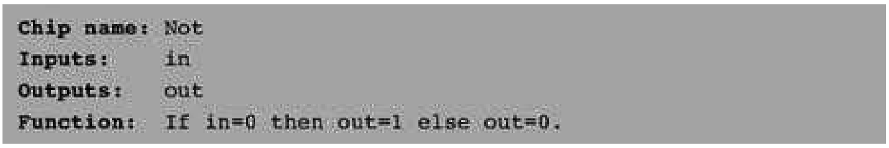
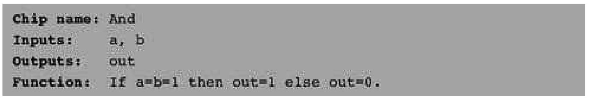
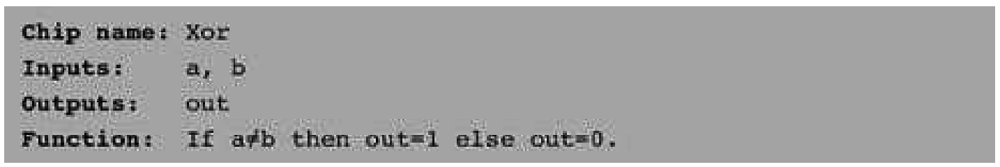
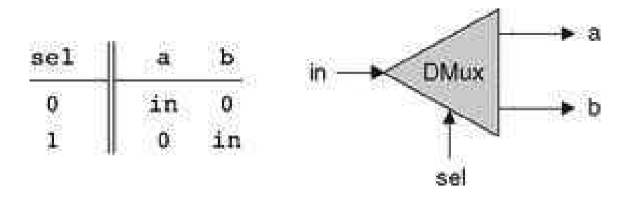
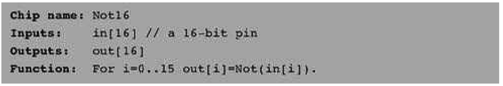
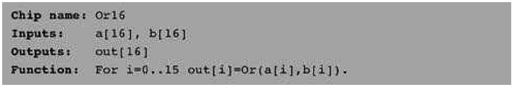
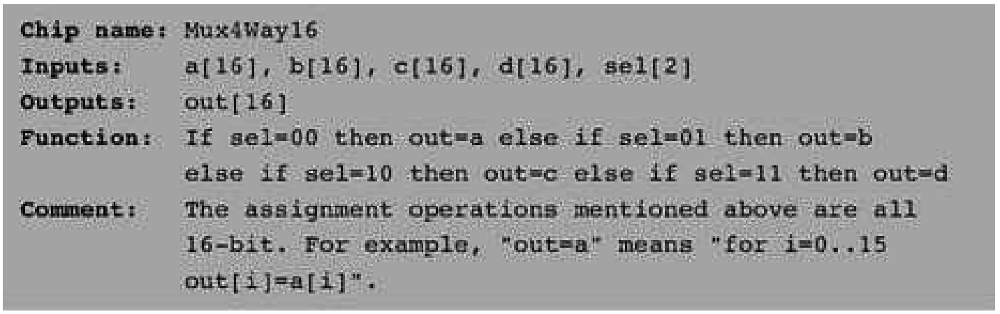
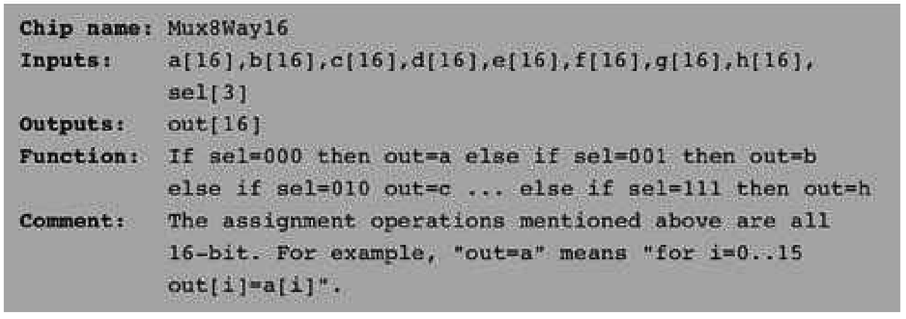
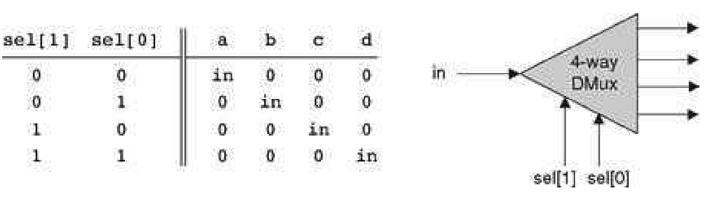

### 1.2 Specification
---

&emsp;&emsp;This section specifies a typical set of gates, each designed to carry out a common Boolean operation. These gates will be used in the chapters that follow to construct the full architecture of a typical modern computer. Our starting point is a single primitive Nand gate, from which all other gates will be derived recursively. Note that we provide only the gates’ specifications, or interfaces, delaying implementation details until a subsequent section. Readers who wish to construct the specified gates in HDL are encouraged to do so, referring to appendix A as needed. All the gates can be built and simulated on a personal computer, using the hardware simulator supplied with the book.

&emsp;&emsp;**Figure 1.7** A screen shot of simulating an Xor chip on the hardware simulator. The simulator state i shown just after the test script has completed running. The pin values correspond to the last simulatio step (a = b = 1). Note that the output file generated by the simulation is consistent with the Xor truth table indicating that the loaded HDL program delivers a correct Xor functionality. The compare file, not show in the figure and typically specified by the chip’s client, has exactly the same structure and contents as tha of the output file. The fact that the two files agree with each other is evident from the status messag displayed at the bottomof the screen.

#### 1.2.1 The NandGate

&emsp;&emsp;The starting point of our computer architecture is the Nand gate, from which all other gates and chips are built. The Nand gate is designed to compute the following Boolean function:

&emsp;&emsp;Throughout the book, we use “chip API boxes” to specify chips. For each chip, the API specifies the chip name, the names of its input and output pins, the function or operation that the chip effects, and an optional comment.

#### 1.2.2 Basic Logic Gates

&emsp;&emsp;Some of the logic gates presented here are typically referred to as “elementary” or “basic.” At the same time, every one of them can be composed from Nand gates alone. Therefore, they need not be viewed as primitive.

&emsp;&emsp;**Not** The single-input Not gate, also known as “converter,” converts its input from 0 to 1 and vice versa. The gate API is as follows:

&emsp;&emsp;**And** The And function returns 1 when both its inputs are 1, and 0 otherwise.

&emsp;&emsp;**Or** The Or function returns 1 when at least one of its inputs is 1, and 0 otherwise.

&emsp;&emsp;**Xor** The Xor function, also known as “exclusive or,” returns 1 when its two inputs have opposing values, and 0 otherwise.

&emsp;&emsp;**Multiplexor** A multiplexor (figure 1.8) is a three-input gate that uses one of the inputs, called “selectio bit,” to select and output one of the other two inputs, called “data bits.” Thus, a better name for thi device might have been selector. The name multiplexor was adopted from communications systems where similar devices are used to serialize (multiplex) several input signals over a single output wire.

&emsp;&emsp;**Figure 1.8** Multiplexor. The table at the top right is an abbreviated version of the truth table on the left.

&emsp;&emsp;**Figure 1.9** Demultiplexor.

#### 1.2.3 Multi-Bit Versions of Basic Gates

&emsp;&emsp;Computer hardware is typically designed to operate on multi-bit arrays called “buses.” For example, a basic requirement of a 32-bit computer is to be able to compute (bit-wise) an And function on two given 32-bit buses. To implement this operation, we can build an array of 32 binary And gates, each operating separately on a pair of bits. In order to enclose all this logic in one package, we can encapsulate the gates array in a single chip interface consisting of two 32-bit input buses and one 32-bit output bus.

&emsp;&emsp;This section describes a typical set of such multi-bit logic gates, as needed for the construction of a typical 16-bit computer. We note in passing that the architecture of n-bit logic gates is basically the same irrespective of n’s value.

&emsp;&emsp;When referring to individual bits in a bus, it is common to use an array syntax. For example, to refer to individual bits in a 16-bit bus named data, we use the notation data [0], data [1],..., data[15].

&emsp;&emsp;**Multi-Bit Not** An n-bit Not gate applies the Boolean operation Not to every one of the bits in its n-bit input bus:

&emsp;&emsp;**Multi-Bit And** An n-bit And gate applies the Boolean operation And to every one of the n bit-pairs arrayed in its two n-bit input buses:

&emsp;&emsp;**Multi-Bit Or** An n-bit Or gate applies the Boolean operation Or to every one of the n bit-pairs arrayed in its two n-bit input buses:

&emsp;&emsp;**Multi-Bit Multiplexor** An n-bit multiplexor is exactly the same as the binary multiplexor described in figure 1.8, except that the two inputs are each n-bit wide; the selector is a single bit.

#### 1.2.4 Multi-Way Versions of Basic Gates

&emsp;&emsp;Many 2-way logic gates that accept two inputs have natural generalization to multi-way variants that accept an arbitrary number of inputs. This section describes a set of multi-way gates that will be used subsequently in various chips in our computer architecture. Similar generalizations can be developed for other architectures, as needed.

&emsp;&emsp;**Multi-Way Or** An n-way Or gate outputs 1 when at least one of its n bit inputs is 1, and 0 otherwise. Here is the 8-way variant of this gate:

&emsp;&emsp;**Multi-Way/Multi-Bit Multiplexor** An m-way n-bit multiplexor selects one of m n-bit input buses and outputs it to a single n-bit output bus. The selection is specified by a set of k control bits, where k = log2m. Figure 1.10 depicts a typical example.

&emsp;&emsp;The computer platform that we develop in this book requires two variations of this chip: A 4-way 16-bit multiplexor and an 8-way 16-bit multiplexor:

&emsp;&emsp;**Figure 1.10** 4-way multiplexor. The width of the input and output buses may vary.

&emsp;&emsp;**Multi-Way/Multi-Bit Demultiplexor** An m-way n-bit demultiplexor (figure 1.11) channels a single n-bit input into one of m possible n-bit outputs. The selection is specified by a set of k control bits, where k = log2m.

&emsp;&emsp;The specific computer platform that we will build requires two variations of this chip: A 4-way 1-bit demultiplexor and an 8-way 1-bit multiplexor, as follows.

&emsp;&emsp;**Figure 1.11** 4-way demultiplexor.

