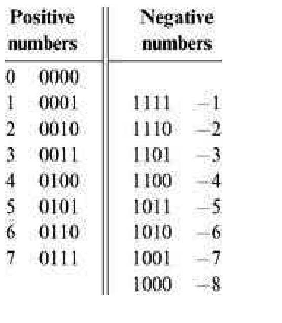

### 2.1 Background
---

&emsp;&emsp;**Binary Numbers** Unlike the decimal system, which is founded on base 10, the binary system is founded on base 2. When we are given a certain binary pattern, say “10011,” and we are told that this pattern is supposed to represent an integer number, the decimal value of this number is computed by convention as follows:

(1) In general, let x = xnxn-1 ...x0 be a string of digits. The value of x in base b, denoted (x)b, is defined as follows:

(2) The reader can verify that in the case of (10011)two, rule (2) reduces to calculation (1). The result of calculation (1) happens to be 19. Thus, when we press the keyboard keys labeled ‘1’, ‘9’ and ENTER while running, say, a spreadsheet program, what ends up in some register in the computer’s memory is the binary code 10011. More precisely, if the computer happens to be a 32-bit machine, what gets stored in the register is the bit pattern 00000000000000000000000000010011.

&emsp;&emsp;**Binary Addition** A pair of binary numbers can be added digit by digit from right to left, according to the same elementary school method used in decimal addition. First, we add the two right-most digits, also called the least significant bits (LSB) of the two binary numbers. Next, we add the resulting carry bit (which is either 0 or 1) to the sum of the next pair of bits up the significance ladder. We continue the process until the two most significant bits (MSB) are added. If the last bit-wise addition generates a carry of 1, we can report overflow; otherwise, the addition completes successfully:

&emsp;&emsp;We see that computer hardware for binary addition of two n-bit numbers can be built from logic gates designed to calculate the sum of three bits (pair of bits plus carry bit). The transfer of the resulting carry bit forward to the addition of the next significant pair of bits can be easily accomplished by proper wiring of the 3-bit adder gates.

&emsp;&emsp;**Signed Binary** Numbers A binary system with n digits can generate a set of 2n different bit patterns. If we have to represent signed numbers in binary code, a natural solution is to split this space into two equal subsets. One subset of codes is assigned to represent positive numbers, and the other negative numbers. Ideally, the coding scheme should be chosen in such a way that the introduction of signed numbers would complicate the hardware implementation as little as possible. This challenge has led to the development of several coding schemes for representing signed numbers in binary code. The method used today by almost all computers is called the 2’s complement method, also known as radix complement. In a binary system with n digits, the 2’s complement of the number x is defined as follows:

&emsp;&emsp;For example, in a 5-bit binary system, the 2’s complement representation of–2 or “minus(00010)two” is 25–(00010)two = (32)ten–(2)ten = (30)ten = (11110)two. To check the calculation, the reader can verify that (00010)two + (11110)two = (00000)two. Note that in the latter computation, the sum is actually (100000)two, but since we are dealing with a 5-bit binary system, the left-most sixth bit is simply ignored. As a rule, when the 2’s complement method is applied to n-bit numbers, x + (–x) always sums up to 2n (i.e., 1 followed by n 0’s)—a property that gives the method its name. Figure 2.1 illustrates a 4-bit binary systemwith the 2’s complement method.

&emsp;&emsp;An inspection of figure 2.1 suggests that an n-bit binary system with 2’s complement representation has the following properties:

&emsp;&emsp;**Figure 2.1** 2’s complement representation of signed numbers in a 4-bit binary system.

&emsp;&emsp;■ The systemcan code a total of 2n signed numbers, of which the maximal and minimal numbers are 2n-1–1 and–2n-1, respectively.

&emsp;&emsp;■ The codes of all positive numbers begin with a 0.

&emsp;&emsp;■ The codes of all negative numbers begin with a 1.

&emsp;&emsp;■ To obtain the code of–x fromthe code of x, leave all the trailing (least significant) 0’s and the first least significant 1 intact, then flip all the remaining bits (convert 0’s to 1’s and vice versa). An equivalent shortcut, which is easier to implement in hardware, is to flip all the bits of x and add 1 to the result.

&emsp;&emsp;A particularly attractive feature of this representation is that addition of any two signed numbers in 2’s complement is exactly the same as addition of positive numbers. Consider, for example, the addition operation (–2) + (–3). Using 2’s complement (in a 4-bit representation), we have to add, in binary, (1110)two + (1101)two. Without paying any attention to which numbers (positive or negative) these codes represent, bit-wise addition will yield 1011 (after throwing away the overflow bit). As figure 2.1 shows, this indeed is the 2’s complement representation of -5.

&emsp;&emsp;In short, we see that the 2’s complement method facilitates the addition of any two signed numbers without requiring special hardware beyond that needed for simple bit-wise addition. What about subtraction? Recall that in the 2’s complement method, the arithmetic negation of a signed number x, that is, computing–x, is achieved by negating all the bits of x and adding 1 to the result. Thus subtraction can be easily handled by x–y = x + (–y). Once again, hardware complexity is kept to a minimum.

&emsp;&emsp;The material implications of these theoretical results are significant. Basically, they imply that a single chip, called Arithmetic Logical Unit, can be used to encapsulate all the basic arithmetic and logical operators performed in hardware. We now turn to specify one suchALU, beginning with the specification of an adder chip.
