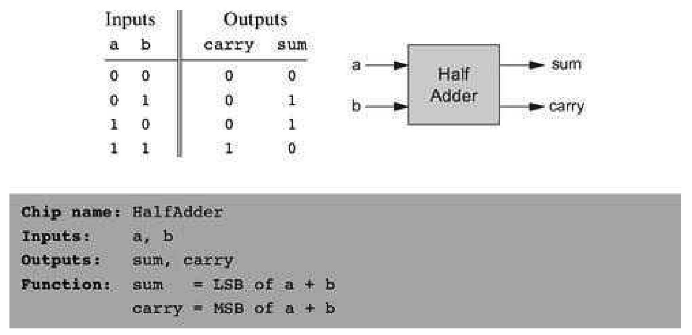
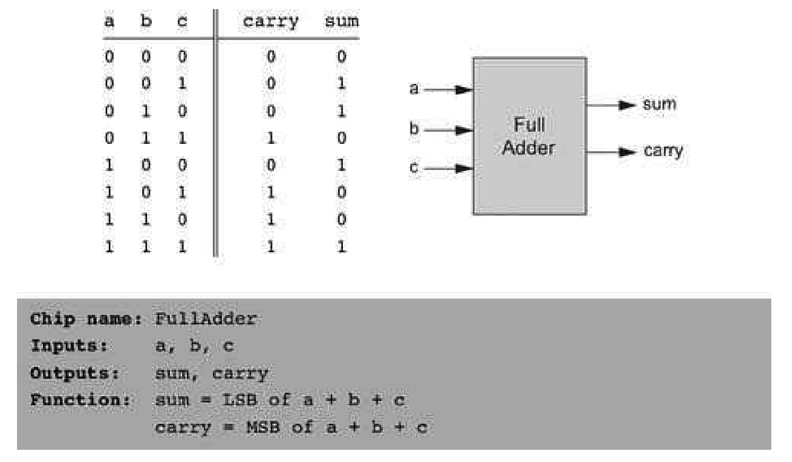
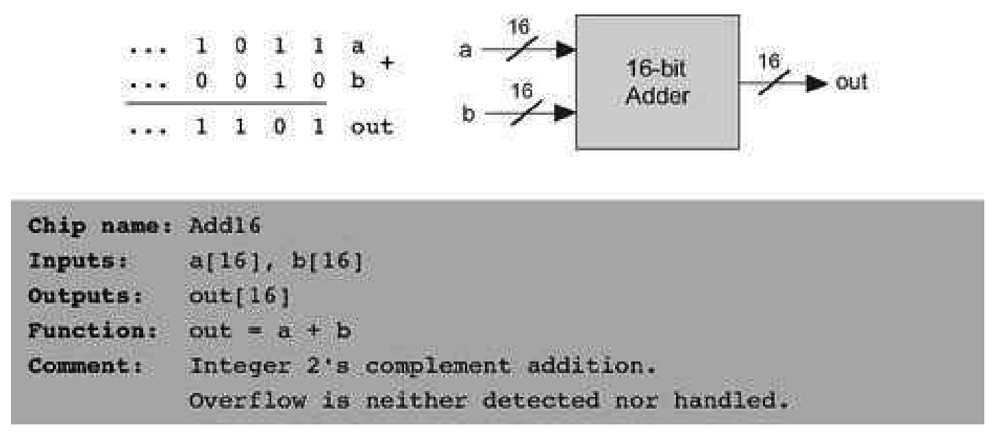
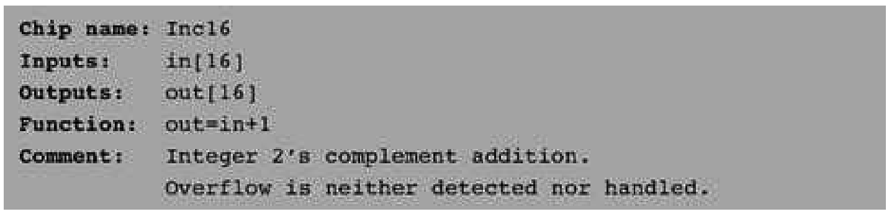
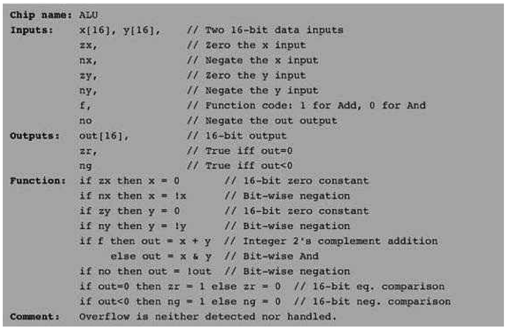

### 2.2 Specification
---

#### 2.2.1 Adders

&emsp;&emsp;We present a hierarchy of three adders, leading to a multi-bit adder chip:
  - Half-adder: designed to add two bits
  - Full-adder: designed to add three bits
  - Adder: designed to add two n-bit numbers

&emsp;&emsp;**Figure 2.2** Half-adder, designed to add 2 bits.

&emsp;&emsp;We also present a special-purpose adder, called incrementer, designed to add 1 to a given number.

&emsp;&emsp;**Half-Adder** The first step on our way to adding binary numbers is to be able to add two bits. Let us call the least significant bit of the addition sum, and the most significant bit carry. Figure 2.2 presents a chip, called half-adder, designed to carry out this operation.

&emsp;&emsp;**Full-Adder** Now that we know how to add two bits, figure 2.3 presents a full-adder chip, designed to add three bits. Like the half-adder case, the full-adder chip produces two outputs: the least significant bit of the addition, and the carry bit.

&emsp;&emsp;**Adder** Memory and register chips represent integer numbers by n-bit patterns, n being 16, 32, 64, and so forth—depending on the computer platform. The chip whose job is to add such numbers is called a multibit adder, or simply adder. Figure 2.4 presents a 16-bit adder, noting that the same logic and specifications scale up as is to any n-bit adder.

&emsp;&emsp;**Incrementer** It is convenient to have a special-purpose chip dedicated to adding the constant 1 to a given
number. Here is the specification of a 16-bit incrementer:

&emsp;&emsp;**Figure 2.3** Full-adder, designed to add 3 bits.

&emsp;&emsp;**Figure 2.4** 16-bit adder. Addition of two n-bit binary numbers for any n is “more of the same.”

#### 2.2.2 The Arithmetic Logic Unit (ALU)

&emsp;&emsp;The specifications of the adder chips presented so far were generic, meaning that they hold for any computer. In contrast, this section describes an ALU that will later become the centerpiece of a specific computer platform called Hack. At the same time, the principles underlying the design of our ALU are rather general. Further, our ALU architecture achieves a great deal of functionality using a minimal set of internal parts. In that respect, it provides a good example of an efficient and elegant logic design.

&emsp;&emsp;The Hack ALU computes a fixed set of functions out = fi(x, y) where x and y are the chip’s two 16-bit inputs, out is the chip’s 16-bit output, and fi is an arithmetic or logical function selected from a fixed repertoire of eighteen possible functions. We instruct the ALU which function to compute by setting six input bits, called control bits, to selected binary values. The exact input-output specification is given in figure 2.5, using pseudo-code.

&emsp;&emsp;Note that each one of the six control bits instructs the ALU to carry out a certain elementary operation. Taken together, the combined effects of these operations cause the ALU to compute a variety of useful functions. Since the overall operation is driven by six control bits, the ALU can potentially compute 26 = 64 different functions. Eighteen of these functions are documented in figure 2.6.

&emsp;&emsp;We see that programming our ALU to compute a certain function f(x, y) is done by setting the six control bits to the code of the desired function. From this point on, the internal ALU logic specified in figure 2.5 should cause the ALU to output the value f(x, y) specified in figure 2.6. Of course, this does not happen miraculously, it’s the result of careful design.

&emsp;&emsp;For example, let us consider the twelfth row of figure 2.6, where the ALU is instructed to compute the function x-1. The zx and nx bits are 0, so the x input is neither zeroed nor negated. The zy and ny bits are 1, so the y input is first zeroed, and then negated bit-wise. Bit-wise negation of zero, (000 ...00)two , gives (111 ...11)two , the 2’s complement code of -1. Thus the ALU inputs end up being x and -1. Since the f-bit is 1, the selected operation is arithmetic addition, causing the ALU to calculate x+ (-1). Finally, since the no bit is 0, the output is not negated but rather left as is. To conclude, the ALU ends up computing x-1, which was our goal.

&emsp;&emsp;**Figure 2.5** The Arithmetic Logic Unit.

&emsp;&emsp;**Figure 2.6** The ALU truth table. Taken together, the binary operations coded by the first six columns effect the function listed in the right column (we use the symbols !, &, and | to represent the operators Not, And, and Or, respectively, performed bit-wise). The complete ALU truth table consists of sixty-four rows, of which only the eighteen presented here are of interest.

&emsp;&emsp;Does the ALU logic described in figure 2.6 compute every one of the other seventeen functions listed in the figure’s right column? To verify that this is indeed the case, the reader can pick up some other rows in the table and prove their respective ALU operation. We note that some of these computations, beginning with the function f(x, y) = 1, are not trivial. We also note that there are some other useful functions computed by the ALU but not listed in the figure.

&emsp;&emsp;It may be instructive to describe the thought process that led to the design of this particular ALU. First, we made a list of all the primitive operations that we wanted our computer to be able to perform (right column in figure 2.6). Next, we used backward reasoning to figure out how x, y, and out can be manipulated in binary fashion in order to carry out the desired operations. These processing requirements, along with our objective to keep the ALU logic as simple as possible, have led to the design decision to use six control bits, each associated with a straightforward binary operation. The resultingALU is simple and elegant. And in the hardware business, simplicity and elegance imply inexpensive and powerful computer systems.
