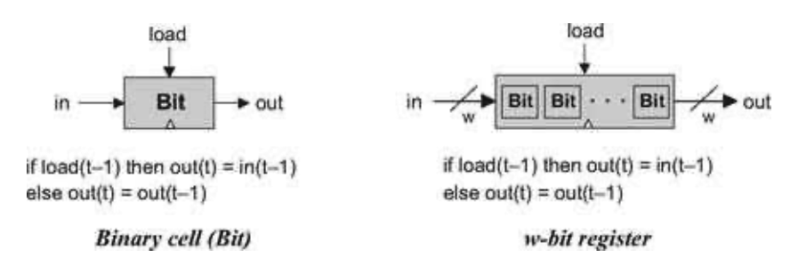
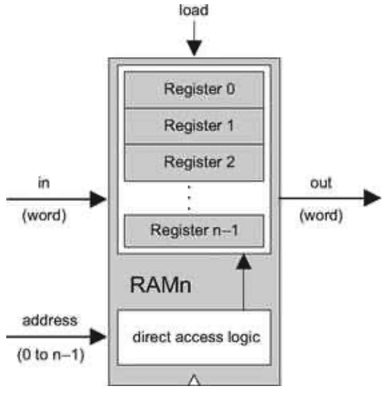

### 2.1 Background
---

&emsp;&emsp;The act of “remembering something” is inherently time-dependent: You remember now what has been committed to memory before. Thus, in order to build chips that “remember” information, we must first develop some standard means for representing the progression of time.

&emsp;&emsp;**The Clock** In most computers, the passage of time is represented by a master clock that delivers a continuous train of alternating signals. The exact hardware implementation is usually based on an oscillator that alternates continuously between two phases labeled 0-1, low-high, tick-tock, etc. The elapsed time between the beginning of a “tick” and the end of the subsequent “tock” is called cycle, and each clock cycle is taken to model one discrete time unit. The current clock phase (<em>tick</em> or <em>tock</em>) is represented by a binary signal. Using the hardware’s circuitry, this signal is simultaneously broadcast to every sequential chip throughout the computer platform.

&emsp;&emsp;**Flip-Flops** The most elementary sequential element in the computer is a device called a flip-flop, of which there are several variants. In this book we use a variant called a data flip-flop, or DFF, whose interface consists of a single-bit data input and a single-bit data output. In addition, the DFF has a clock input that continuously changes according to the master clock’s signal. Taken together, the data and the clock inputs enable the DFF to implement the time-based behavior <em>out(t) = in(t - 1)</em>, where in and out are the gate’s input and output values and t is the current clock cycle. In other words, the DFF simply outputs the input value from the previous time unit.

&emsp;&emsp;As we now show, this elementary behavior can form the basis of all the hardware devices that computers use to maintain state, from binary cells to registers to arbitrarily large random access memory (RAM) units.

&emsp;&emsp;**Registers** A register is a storage device that can “store,” or “remember,” a value over time, implementing the classical storage behavior <em>out(t) = out(t - 1)</em>. A DFF, on the other hand, can only output its previous input, namely, <em>out(t) = in(t - 1)</em>. This suggests that a register can be implemented from a DFF by simply feeding the output of the latter back into its input, creating the device shown in the middle of figure 3.1. Presumably, the output of this device at any time <em>t</em> will echo its output at time <em>t</em> - 1, yielding the classical function expected from a storage unit.

&emsp;&emsp;**Figure 3.1** From a DFF to a single-bit register. The small triangle represents the clock input. This icon is used to state that the marked chip, as well as the overall chip that encapsulates it, is time-dependent.

&emsp;&emsp;Well, not so. The device shown in the middle of figure 3.1 is invalid. First, it is not clear how we’ll ever be able to load this device with a new data value, since there are no means to tell the DFF when to draw its input from the in wire and when from the out wire. More generally, the rules of chip design dictate that internal pins must have a fan-in of 1, meaning that they can be fed from a single source only.

&emsp;&emsp;The good thing about this thought experiment is that it leads us to the correct and elegant solution shown in the right side of figure 3.1. In particular, a natural way to resolve our input ambiguity is to introduce a multiplexor into the design. Further, the “select bit” of this multiplexor can become the “load bit” of the overall register chip: If we want the register to start storing a new value, we can put this value in the in input and set the load bit to 1; if we want the register to keep storing its internal value until further notice, we can set the load bit to 0.

&emsp;&emsp;Once we have developed the basic mechanism for remembering a single bit over time, we can easily construct arbitrarily wide registers. This can be achieved by forming an array of as many single-bit registers as needed, creating a register that holds multi-bit values (figure 3.2). The basic design parameter of such a register is its <em>width</em>—the number of bits that it holds—e.g., 16, 32, or 64. The multi-bit contents of such registers are typically referred to as words.

&emsp;&emsp;**Memories** Once we have the basic ability to represent words, we can proceed to build memory banks of arbitrary length. As figure 3.3 shows, this can be done by stacking together many registers to form a Random Access Memory RAM unit. The term random access memory derives from the requirement that read/write operations on a RAM should be able to access randomly chosen words, with no restrictions on the order in which they are accessed. That is to say, we require that any word in the memory— irrespective of its physical location—be accessed directly, in equal speed.

&emsp;&emsp;**Figure 3.2** From single-bit to multi-bit registers. A multi-bit register of width w can be constructed from an array of w 1-bit chips. The operating functions of both chips is exactly the same, except that the “=” assignments are single-bit and multi-bit, respectively.

&emsp;&emsp;**Figure 3.3** RAM chip (conceptual). The width and length of the RAM can vary.

&emsp;&emsp;This requirement can be satisfied as follows. First, we assign each word in the n-register RAM a unique address (an integer between 0 to <em>n</em> - 1), according to which it will be accessed. Second, in addition to building an array of n registers, we build a gate logic design that, given an address <em>j</em>, is capable of selecting the individual register whose address is <em>j</em>. Note however that the notion of an “address” is not an explicit part of the RAM design, since the registers are not “marked” with addresses in any physical sense. Rather, as we will see later, the chip is equipped with direct access logic that implements the notion of addressing using logical means.

&emsp;&emsp;In sum, a classical RAM device accepts three inputs: a data input, an address input, and a load bit. The address specifies which RAM register should be accessed in the current time unit. In the case of a read operation (load=0), the RAM’s output immediately emits the value of the selected register. In the case of a write operation (load=1), the selected memory register commits to the input value in the next time unit, at which point the RAM’s output will start emitting it.

&emsp;&emsp;The basic design parameters of a RAM device are its data <em>width</em>—the width of each one of its words, and its <em>size</em>—the number of words in the RAM. Modern computers typically employ 32- or 64-bit-wide RAMs whose sizes are up to hundreds of millions.

&emsp;&emsp;**Counters** A counter is a sequential chip whose state is an integer number that increments every time unit, effecting the function <em>out(t) = out(t - 1)</em> + c, where c is typically 1. Counters play an important role in digital architectures. For example, a typical CPU includes a program counter whose output is interpreted as the address of the instruction that should be executed next in the current program.

A counter chip can be implemented by combining the input/output logic of a standard register with the combinatorial logic for adding a constant. Typically, the counter will have to be equipped with some additional functionality, such as possibilities for resetting the count to zero, loading a new counting base, or decrementing instead of incrementing.

&emsp;&emsp;**Time Matters** All the chips described so far in this chapter are sequential. Simply stated, a sequential chip is a chip that embeds one or more DFF gates, either directly or indirectly. Functionally speaking, the DFF gates endow sequential chips with the ability to either maintain state (as in memory units) or operate on state (as in counters). Technically speaking, this is done by forming feedback loops inside the sequential chip (see figure 3.4). In combinational chips, where time is neither modeled nor recognized, the introduction of feedback loops is problematic: The output would depend on the input, which itself would depend on the output, and thus the output would depend on itself. On the other hand, there is no difficulty in feeding the output of a sequential chip back into itself, since the DFFs introduce an inherent time delay: The output at time <em>t</em> does not depend on itself, but rather on the output at time <em>t</em> - 1. This property guards against the uncontrolled “data races” that would occur in combinational chips with feedback loops.

&emsp;&emsp;**Figure 3.4** Combinational versus sequential logic (in and out stand for one or more input and output variables). Sequential chips always consist of a layer of DFFs sandwiched between optional combinational logic layers.

&emsp;&emsp;Recall that the outputs of combinational chips change when their inputs change, irrespective of time. In contrast, the inclusion of the DFFs in the sequential architecture ensures that their outputs change only at the point of transition from one clock cycle to the next, and not within the cycle itself. In fact, we allow sequential chips to be in unstable states during clock cycles, requiring only that at the beginning of the next cycle they output correct values.

&emsp;&emsp;This “discretization” of the sequential chips’ outputs has an important side effect: It can be used to synchronize the overall computer architecture. To illustrate, suppose we instruct the arithmetic logic unit (ALU) to compute <em>x + y</em> where x is the value of a nearby register and y is the value of a remote RAM register. Because of various physical constraints (distance, resistance, interference, random noise, etc.) the electric signals representing <em>x</em> and <em>y</em> will likely arrive at the ALU at different times. However, being a combinational chip, the ALU is insensitive to the concept of time—it continuously adds up whichever data values happen to lodge in its inputs. Thus, it will take some time before the ALU’s output stabilizes to the correct <em>x + y</em> result. Until then, the ALU will generate garbage.

&emsp;&emsp;How can we overcome this difficulty? Well, since the output of the ALU is always routed to some sort of a sequential chip (a register, a RAM location, etc.), we don’t really care. All we have to do is ensure, when we build the computer’s clock, that the length of the clock cycle will be slightly longer that the time it takes a bit to travel the longest distance from one chip in the architecture to another. This way, we are guaranteed that by the time the sequential chip updates its state (at the beginning of the next clock cycle), the inputs that it receives from the ALU will be valid. This, in a nutshell, is the trick that synchronizes a set of stand-alone hardware components into a well-coordinated system, as we shall see in chapter 5.
