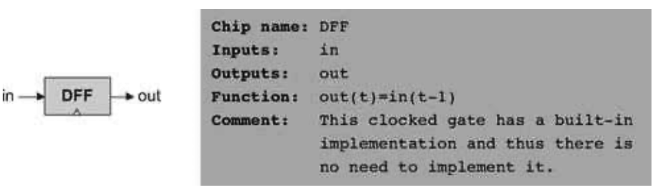

### 3.2 Specification
---

&emsp;&emsp;This section specifies a hierarchy of sequential chips:

  &emsp;&emsp;• Data-flip-flops (DFFs)

  &emsp;&emsp;• Registers (based on DFFs)

  &emsp;&emsp;• Memory banks (based on registers)

  &emsp;&emsp;• Counter chips (also based on registers)

#### 3.2.1 Data-Flip-Flop

&emsp;&emsp;The most elementary sequential device that we present—the basic component from which all memory elements will be designed—is the data <em>flip-flop</em> gate. A DFF gate has a single-bit input and a single-bit output, as follows:

&emsp;&emsp;Like Nand gates, DFF gates enter our computer archtecture at a very low level. Specifically, all the sequential chips in the computer (registers, memory, and counters) are based on numerous DFF gates. All these DFFs are connected to the same master clock, forming a huge distributed “chorus line.” At the beginning of each clock cycle, the outputs of all the DFFs in the computer commit to their inputs during the previous time unit. At all other times, the DFFs are “latched,” meaning that changes in their inputs have no immediate effect on their outputs. This conduction operation effects any one of the millions of DFF gates that make up the system, about a billion times per second (depending on the computer’s clock frequency).

&emsp;&emsp;Hardware implementations achieve this time dependency by simultaneously feeding the master clock signal to all the DFF gates in the platform. Hardware simulators emulate the same effect in software. As far as the computer architect is concerned, the end result is the same: The inclusion of a DFF gate in the design of any chip ensures that the overall chip, as well as all the chips up the hardware hierarchy that depend on it, will be inherently time-dependent. These chips are called sequential, by definition.

&emsp;&emsp;The physical implementation of a DFF is an intricate task, and is based on connecting several elementary logic gates using feedback loops (one classic design is based on Nand gates alone). In this book we have chosen to abstract away this complexity, treating DFFs as primitive building blocks. Thus, our hardware simulator provides a built-in DFF implementation that can be readily used by other chips.

#### 3.2.2 Registers

&emsp;&emsp;A single-bit register, which we call Bit, or binary cell, is designed to store a single bit of information (0 or 1). The chip interface consists of an input pin that carries a data bit, a load pin that enables the cell for writes, and an output pin that emits the current state of the cell. The interface diagram and API of a binary cell are as follows:

&emsp;&emsp;The API of the Register chip is essentially the same, except that the input and output pins are designed to handle multi-bit values:

&emsp;&emsp;<em>Read</em>: To read the contents of a register, we simply probe its output.

&emsp;&emsp;<em>Write</em>: To write a new data value d into a register, we put d in the in input and assert (set to 1) the load input. In the next clock cycle, the register commits to the new data value, and its output starts emitting d.

#### 3.2.3 Memory

&emsp;&emsp;A direct-access memory unit, also called RAM, is an array of n w-bit registers, equipped with direct access circuitry. The number of registers (<em>n</em>) and the width of each register (<em>w</em>) are called the memory’s size and width, respectively. We will now set out to build a hierarchy of such memory devices, all 16 bits wide, but with varying sizes: RAM8, RAM64, RAM512, RAM4K, and RAM16K units. All these memory chips have precisely the same API, and thus we describe them in one parametric diagram:

&emsp;&emsp;<em>Read</em>: To read the contents of register number m, we put m in the address input. The RAM’s direct-access logic will select register number m, which will then emit its output value to the RAM’s output pin. This is a combinational operation, independent of the clock.

&emsp;&emsp;<em>Write</em>: To write a new data value d into register number m, we put m in the address input, d in the in input, and assert the load input bit. This causes the RAM’s direct-access logic to select register number m, and the load bit to enable it. In the next clock cycle, the selected register will commit to the new value (<em>d</em>), and the RAM’s output will start emitting it.

#### 3.2.4 Counter

&emsp;&emsp;Although a <em>counter</em> is a stand-alone abstraction in its own right, it is convenient to motivate its specification by saying a few words about the context in which it is normally used. For example, consider a counter chip designed to contain the address of the instruction that the computer should fetch and execute next. In most cases, the counter has to simply increment itself by 1 in each clock cycle, thus causing the computer to fetch the next instruction in the program. In other cases, for example, in “jump to execute instruction number <em>n</em>,” we want to be able to set the counter to n, then have it continue its default counting behavior with n + 1, n + 2, and so forth. Finally, the program’s execution can be restarted anytime by resetting the counter to 0, assuming that that’s the address of the program’s first instruction. In short, we need a loadable and resettable counter.

&emsp;&emsp;With that in mind, the interface of our Counter chip is similar to that of a register, except that it has two additional control bits labeled reset and inc. When inc=1, the counter increments its state in every clock cycle, emitting the value out(t)= out (t-1)+1. If we want to reset the counter to 0, we assert the reset bit; if we want to initialize it to some other counting base <em>d</em>, we put d in the in input and assert the load bit. The details are given in the counter API, and an example of its operation is depicted in figure 3.5.
