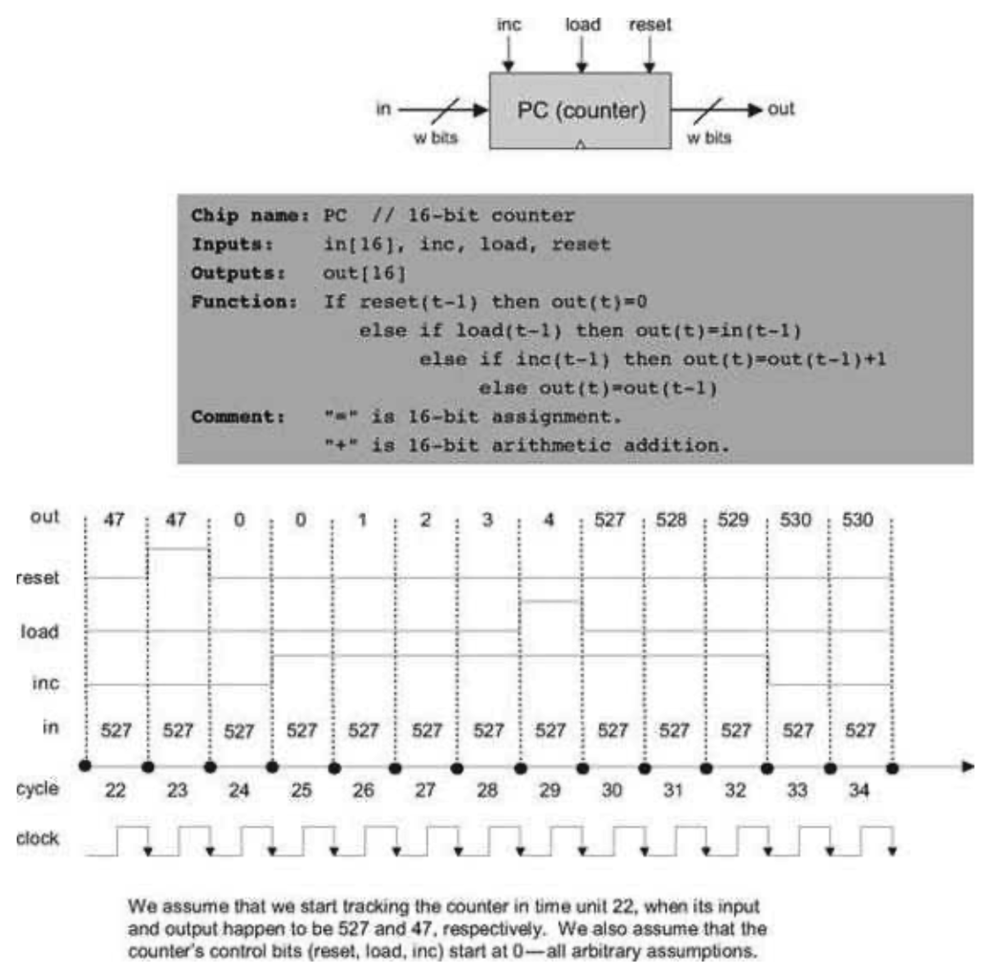

### 3.3 Implementation
---

&emsp;&emsp;**Flip-Flop** DFF gates can be implemented from lower-level logic gates like those built in chapter 1. However, in this book we treat DFFs as primitive gates, and thus they can be used in hardware construction projects without worrying about their internal implementation.

&emsp;&emsp;**Figure 3.5** Counter simulation. At time 23 a reset signal is issued, causing the counter to emit 0 in the following time unit. The 0 persists until an inc signal is issued at time 25, causing the counter to start incrementing, one time unit later. The counting continues until, at time 29, the load bit is asserted. Since the counter’s input holds the number 527, the counter is reset to that value in the next time unit. Since inc is still asserted, the counter continues incrementing until time 33, when inc is de-asserted.

&emsp;&emsp;**1-Bit Register (Bit)** The implementation of this chip was given in figure 3.1.

&emsp;&emsp;**Register** The construction of a w-bit Register chip from 1-bit registers is straightforward. All we have to do is construct an array of w Bit gates and feed the register’s load input to every one of them.

&emsp;&emsp;**8-Register Memory (RAM8)** An inspection of figure 3.3 may be useful here. To implement a RAM8 chip, we line up an array of eight registers. Next, we have to build combinational logic that, given a certain address value, takes the RAM8’s in input and loads it into the selected register. In a similar fashion, we have to build combinational logic that, given a certain address value, selects the right register and pipes its out value to the RAM8’s out output. Tip: This combinational logic was already implemented in chapter 1.

&emsp;&emsp;**<em>n</em>-Register Memory** A memory bank of arbitrary length (a power of 2) can be built recursively from smaller memory units, all the way down to the single register level. This view is depicted in figure 3.6. Focusing on the right-hand side of the figure, we note that a 64-register RAM can be built from an array of eight 8-register RAM chips. To select a particular register from the RAM64 memory, we use a 6-bit address, say xxxyyy. The MSB xxx bits select one of the RAM8 chips, and the LSB yyy bits select one of the registers within the selected RAM8. The RAM64 chip should be equipped with logic circuits that effect this hierarchical addressing scheme.

&emsp;&emsp;**Counter** A <em>w</em>-bit counter consists of two main elements: a regular w-bit register, and combinational logic. The combinational logic is designed to (a) compute the counting function, and (b) put the counter in the right operating mode, as mandated by the values of its three control bits. Tip: Most of this logic was already built in chapter 2.
