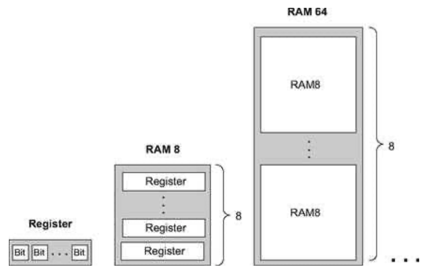

### 3.4 Perspective
---

&emsp;&emsp;The cornerstone of all the memory systems described in this chapter is the flip-flop—a gate that we treated here as an atomic, or primitive, building block. The usual approach in hardware textbooks is to construct flip-flops from elementary combinatorial gates (e.g., Nand gates) using appropriate feedback loops. The standard construction begins by building a simple (non-clocked) flip-flop that is bi-stable, namely, that can be set to be in one of two states. Then a clocked flip-flop is obtained by cascading two such simple flip-flops, the first being set when the clock ticks and the second when the clock tocks. This “master-slave” design endows the overall flip-flop with the desired clocked synchronization functionality.

&emsp;&emsp;**Figure 3.6** Gradual construction of memory banks by recursive ascent. A w-bit register is an array of w binary cells, an 8-register RAM is an array of eight w-bit registers, a 64-register RAM is an array of eight RAM8 chips, and so on. Only three more similar construction steps are necessary to build a 16K RAM chip.

&emsp;&emsp;These constructions are rather elaborate, requiring an understating of delicate issues like the effect of feedback loops on combinatorial circuits, as well as the implementation of clock cycles using a two- phase binary clock signal. In this book we have chosen to abstract away these low-level considerations by treating the flip-flop as an atomic gate. Readers who wish to explore the internal structure of flip-flop gates can find detailed descriptions in most logic design and computer architecture textbooks.

&emsp;&emsp;In closing, we should mention that memory devices of modern computers are not always constructed from standard flip-flops. Instead, modern memory chips are usually very carefully optimized, exploiting the unique physical properties of the underlying storage technology. Many such alternative technologies are available today to computer designers; as usual, which technology to use is a cost-performance issue.

&emsp;&emsp;Aside from these low-level considerations, all the other chip constructions in this chapter—the registers and memory chips that were built on top of the flip-flop gates—were standard.
