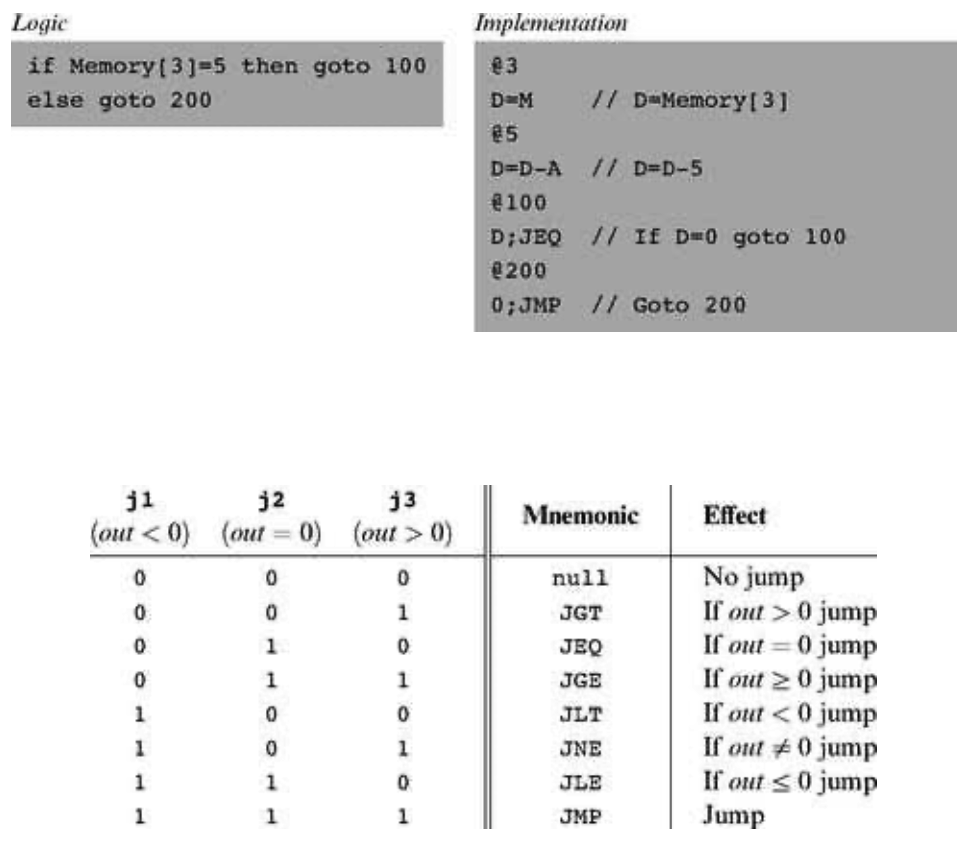
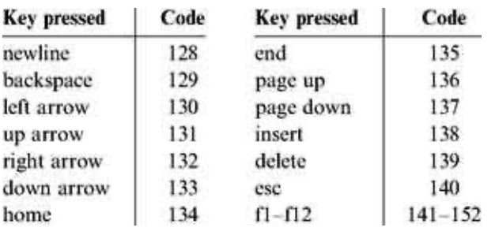

### 4.2 Hack Machine Language Specification
---


#### 4.2.1 Overview

&emsp;&emsp;The Hack computer is a von Neumann platform. It is a 16-bit machine, consisting of a CPU, two separate memory modules serving as instruction memory and data memory, and two memory-mapped I/O devices: a screen and a keyboard.

&emsp;&emsp;**Memory Address** Spaces The Hack programmer is aware of two distinct address spaces: an instruction memory and a data memory. Both memories are 16-bit wide and have a 15-bit address space, meaning that the maximum addressable size of each memory is 32K 16-bit words.

&emsp;&emsp;The CPU can only execute programs that reside in the instruction memory. The instruction memory is a read-only device, and programs are loaded into it using some exogenous means. For example, the instruction memory can be implemented in a ROM chip that is pre-burned with the required program. Loading a new program is done by replacing the entire ROM chip, similar to replacing a cartridge in a game console. In order to simulate this operation, hardware simulators of the Hack platform must provide a means to load the instruction memory from a text file containing a machine language program.

&emsp;&emsp;**Registers** The Hack programmer is aware of two 16-bit registers called D and A. These registers can be manipulated explicitly by arithmetic and logical instructions like A=D-1 or D=!A (where “!” means a 16- bit Not operation). While D is used solely to store data values, A doubles as both a data register and an address register. That is to say, depending on the instruction context, the contents of A can be interpreted either as a data value, or as an address in the data memory, or as an address in the instruction memory, as we now explain.

&emsp;&emsp;First, the A register can be used to facilitate direct access to the data memory (which, from now on, will be often referred to as “memory”). Since Hack instructions are 16-bit wide, and since addresses are specified using 15 bits, it is impossible to pack both an operation code and an address in one instruction. Thus, the syntax of the Hack language mandates that memory access instructions operate on an implicit memory location labeled “M”, for example, D=M+1. In order to resolve this address, the convention is that M always refers to the memory word whose address is the current value of the A register. For example, if we want to effect the operation D = Memory[516] - 1, we have to use one instruction to set the A register to 516, and a subsequent instruction to specify D=M-1.

&emsp;&emsp;In addition, the hardworking A register is also used to facilitate direct access to the instruction memory. Similar to the memory access convention, Hack jump instructions do not specify a particular address. Instead, the convention is that any jump operation always effects a jump to the instruction located in the memory word addressed by A. Thus, if we want to effect the operation goto 35, we use one instruction to set A to 35, and a second instruction to code a goto command, without specifying an address. This sequence causes the computer to fetch the instruction located in InstructionMemory[35] in the next clock cycle.

&emsp;&emsp;**Example** Since the Hack language is self-explanatory, we start with an example. The only non-obvious command in the language is @value, where value is either a number or a symbol representing a number. This command simply stores the specified value in the A register. For example, if sum refers to memory location 17, then both @17 and @sum will have the same effect: A←17.

&emsp;&emsp;And now to the example: Suppose we want to add the integers 1 to 100, using repetitive addition. Figure 4.2 gives a C language solution and a possible compilation into the Hack language.

&emsp;&emsp;Although the Hack syntax is more accessible than that of most machine languages, it may still look obscure to readers who are not familiar with low-level programming. In particular, note that every operation involving a memory location requires two Hack commands: One for selecting the address on which we want to operate, and one for specifying the desired operation. Indeed, the Hack language consists of two generic instructions: an address instruction, also called <em>A</em>-instruction, and a compute instruction, also called <em>C</em>-instruction. Each instruction has a binary representation, a symbolic representation, and an effect on the computer, as we now specify.


#### 4.2.2 The <em>A</em>-Instruction

&emsp;&emsp;The <em>A</em>-instruction is used to set the A register to a 15-bit value:

<div align="center"></div>

&emsp;&emsp;This instruction causes the computer to store the specified value in the A register. For example, the instruction @ 5, which is equivalent to 0000000000000101, causes the computer to store the binary representation of 5 in the A register.

&emsp;&emsp;The <em>A</em>-instruction is used for three different purposes. First, it provides the only way to enter a constant into the computer under program control. Second, it sets the stage for a subsequent <em>C</em>-instruction designed to manipulate a certain data memory location, by first setting A to the address of that location. Third, it sets the stage for a subsequent <em>C</em>-instruction that specifies a jump, by first loading the address of the jump destination to the A register. These uses are demonstrated in figure 4.2.

<div align="center"></div>

&emsp;&emsp;**Figure 4.2** C and assembly versions of the same program. The infinite loop at the program’s end is our standard way to “terminate” the execution of Hack programs.


#### 4.2.3 The <em>C</em>-Instruction

&emsp;&emsp;The <em>C</em>-Instruction is the programming workhorse of the Hack platform—the instruction that gets almost everything done. The instruction code is a specification that answers three questions: (a) what to compute, (b) where to store the computed value, and (c) what to do next? Along with the <em>A</em>-Instruction, these specifications determine all the possible operations of the computer.

<div align="center"></div>

&emsp;&emsp;The leftmost bit is the <em>C</em>-Instruction code, which is 1. The next two bits are not used. The remaining bits form three fields that correspond to the three parts of the instruction’s symbolic representation. The overall semantics of the symbolic instruction dest = comp;jump is as follows. The comp field instructs the ALU what to compute. The dest field instructs where to store the computed value (ALU output). The jump field specifies a jump condition, namely, which command to fetch and execute next. We now describe the format and semantics of each of the three fields.

&emsp;&emsp;**The Computation Specification** The Hack ALU is designed to compute a fixed set of functions on the D, A, and M registers (where M stands for Memory[A]). The computed function is specified by the a-bit and the six c-bits comprising the instruction’s comp field. This 7-bit pattern can potentially code 128 different functions, of which only the 28 listed in figure 4.3 are documented in the language specification.

&emsp;&emsp;Recall that the format of the <em>C</em>-Instruction is 111a cccc ccdd djjj. Suppose we want to have the ALU compute D-1, the current value of the D register minus 1. According to figure 4.3, this can be done by issuing the instruction 1110 0011 1000 0000 (the 7-bit operation code is in bold). To compute the value of D|M, we issue the instruction 1111 0101 0100 0000. To compute the constant-1, we issue the instruction 1110 1110 1000 0000, and so on.

&emsp;&emsp;**The Destination Specification** The value computed by the comp part of the <em>C</em>-Instruction can be stored in several destinations, as specified by the instruction’s 3-bit dest part (see figure 4.4). The first and second d-bits code whether to store the computed value in the A register and in the D register, respectively. The third d-bit codes whether to store the computed value in M (i.e., in Memory[A]). One, more than one, or none of these bits may be asserted.

<div align="center"></div>

&emsp;&emsp;**Figure 4.3** The compute field of the <em>C</em>-Instruction. D and A are names of registers. M refers to the memory location addressed by A, namely, to Memory[A]. The symbols + and - denote 16-bit 2’s complement addition and subtraction, while !, |, and & denote the 16-bit bit-wise Boolean operators Not, Or, and And, respectively. Note the similarity between this instruction set and the ALU specification given in figure 2.6.

&emsp;&emsp;**Recall that the format of the <em>C</em>-Instruction is 111a cccc ccdd djjj. Suppose we want the computer to increment the value of Memory[7] by 1 and to also store the result in the D register. According to figures 4.3 and 4.4, this can be accomplished by the following instructions:

<div align="center"></div>

&emsp;&emsp;**Figure 4.4** The dest field of the <em>C</em>-Instruction.

&emsp;&emsp;The first instruction causes the computer to select the memory register whose address is 7 (the so- called M register). The second instruction computes the value of M + 1 and stores the result in both M and D.

&emsp;&emsp;**The Jump Specification** The <em>jump</em> field of the <em>C</em>-Instruction tells the computer what to do next. There are two possibilities: The computer should either fetch and execute the next instruction in the program, which is the default, or it should fetch and execute an instruction located elsewhere in the program. In the latter case, we assume that the A register has been previously set to the address to which we have to jump.

&emsp;&emsp;Whether or not a jump should actually materialize depends on the three j-bits of the jump field and on the ALU output value (computed according to the comp field). The first j-bit specifies whether to jump in case this value is negative, the second j-bit in case the value is zero, and the third j-bit in case it is positive. This gives eight possible jump conditions, shown in figure 4.5.

&emsp;&emsp;The following example illustrates the jump commands in action:

<div align="center"></div>

&emsp;&emsp;**Figure 4.5** The <em>jump</em> field of the <em>C</em>-Instruction. Out refers to the ALU output (resulting from the instruction’s comp part), and jump implies “continue execution with the instruction addressed by the A register.”

&emsp;&emsp;The last instruction (0; JMP) effects an unconditional jump. Since the <em>C</em>-Instruction syntax requires that we always effect some computation, we instruct the ALU to compute 0 (an arbitrary choice), which is ignored.

&emsp;&emsp;**Conflicting Uses of the A Register** As was just illustrated, the programmer can use the A register to select either a data memory location for a subsequent <em>C</em>-Instruction involving M, or an instruction memory location for a subsequent <em>C</em>-Instruction involving a jump. Thus, to prevent conflicting use of the A register, in well-written programs a <em>C</em>-Instruction that may cause a jump (i.e., with some non-zero j bits) should not contain a reference to M, and vice versa.


#### 4.2.4 Symbols

&emsp;&emsp;Assembly commands can refer to memory locations (addresses) using either constants or symbols. Symbols are introduced into assembly programs in the following three ways:

&emsp;&emsp;■ <em>Predefined symbols:</em> A special subset of RAM addresses can be referred to by any assembly program using the following predefined symbols:

  &emsp;&emsp;● <em>Virtual registers:</em> To simplify assembly programming, the symbols R0 to R15 are predefined to refer to RAM addresses 0 to 15, respectively.

  &emsp;&emsp;● <em>Predefined pointers:</em> The symbols SP, LCL, ARG, THIS, and THAT are predefined to refer to RAM addresses 0 to 4, respectively. Note that each of these memory locations has two labels. For example, address 2 can be referred to using either R2 or ARG. This syntactic convention will come to play in the implementation of the virtual machine, discussed in chapters 7 and 8.

  &emsp;&emsp;● <em>I/O pointers:</em> The symbols SCREEN and KBD are predefined to refer to RAM addresses 16384 (0x4000) and 24576 (0x6000), respectively, which are the base addresses of the screen and keyboard memory maps. The use of these I/O devices is explained later.

&emsp;&emsp;■ <em>Label symbols:</em> These user-defined symbols, which serve to label destinations of goto commands, are declared by the pseudo-command “(Xxx)”. This directive defines the symbol Xxx to refer to the instruction memory location holding the next command in the program. A label can be defined only once and can be used anywhere in the assembly program, even before the line in which it is defined.

&emsp;&emsp;■ <em>Variable symbols:</em> Any user-defined symbol Xxx appearing in an assembly program that is not predefined and is not defined elsewhere using the “(Xxx)” command is treated as a variable, and is assigned a unique memory address by the assembler, starting at RAM address 16 (0x0010).


#### 4.2.5 Input/Output Handling

&emsp;&emsp;The Hack platform can be connected to two peripheral devices: a screen and a keyboard. Both devices interact with the computer platform through memory maps. This means that drawing pixels on the screen is achieved by writing binary values into a memory segment associated with the screen. Likewise, listening to the keyboard is done by reading a memory location associated with the keyboard. The physical I/O devices and their memory maps are synchronized via continuous refresh loops.

&emsp;&emsp;**Screen** The Hack computer includes a black-and-white screen organized as 256 rows of 512 pixels per row. The screen’s contents are represented by an 8K memory map that starts at RAM address 16384 (0x4000). Each row in the physical screen, starting at the screen’s top left corner, is represented in the RAM by 32 consecutive 16-bit words. Thus the pixel at row r from the top and column c from the left is mapped on the c%16 bit (counting from LSB to MSB) of the word located at RAM[16384 + r · 32 + c/16]. To write or read a pixel of the physical screen, one reads or writes the corresponding bit in the RAM-resident memory map (1 = black, 0 = white). Example:

```
// Draw a single black dot at the screen's top left corner:
@SCREEN   // Set the A register to point to the memory
          // word that is mapped to the 16 left-most
          // pixels of the top row of the screen.
M=1       // Blacken the left-most pixel.
```

&emsp;&emsp;**Keyboard** The Hack computer interfaces with the physical keyboard via a single-word memory map located in RAM address 24576 (0x6000). Whenever a key is pressed on the physical keyboard, its 16-bit ASCII code appears in RAM[24576]. When no key is pressed, the code 0 appears in this location. In addition to the usual ASCII codes, the Hack keyboard recognizes the keys shown in figure 4.6.


#### 4.2.6 Syntax Conventions and File Format

&emsp;&emsp;**Binary Code Files** A binary code file is composed of text lines. Each line is a sequence of sixteen “0” and “1” ASCII characters, coding a single machine language instruction. Taken together, all the lines in the file represent a machine language program. The contract is such that when a machine language program is loaded into the computer’s instruction memory, the binary code represented by the file’s nth line is stored in address n of the instruction memory (the count of both program lines and memory addresses starts at 0). By convention, machine language programs are stored in text files with a “hack” extension, for example, Prog. hack.

&emsp;&emsp;**Assembly Language Files** By convention, assembly language programs are stored in text files with an “asm” extension, for example, Prog.asm. An assembly language file is composed of text lines, each representing either an instruction or a symbol <em>declaration</em>:

<div align="center"></div>

&emsp;&emsp;**Figure 4.6** Special keyboard codes in the Hack platform.

&emsp;&emsp;■ <em>Instruction</em>: an A-instruction or a C-instruction.

&emsp;&emsp;■ (<em>Symbol</em>): This pseudo-command causes the assembler to assign the label Symbol to the memory location in which the next command of the program will be stored. It is called “pseudo-command” since it generates no machine code.

&emsp;&emsp;(The remaining conventions in this section pertain to assembly programs only.)

&emsp;&emsp;**Constants and Symbols** <em>Constants</em> must be non-negative and are always written in decimal notation. A user-defined symbol can be any sequence of letters, digits, underscore (_), dot (.), dollar sign ($), and colon (:) that does not begin with a digit.

&emsp;&emsp;**Comments** Text beginning with two slashes (//) and ending at the end of the line is considered a comment and is ignored.

&emsp;&emsp;**White Space** Space characters are ignored. Empty lines are ignored.

&emsp;&emsp;**Case Conventions** All the assembly mnemonics must be written in uppercase. The rest (user-defined labels and variable names) is case sensitive. The convention is to use uppercase for labels and lowercase for variable names.
