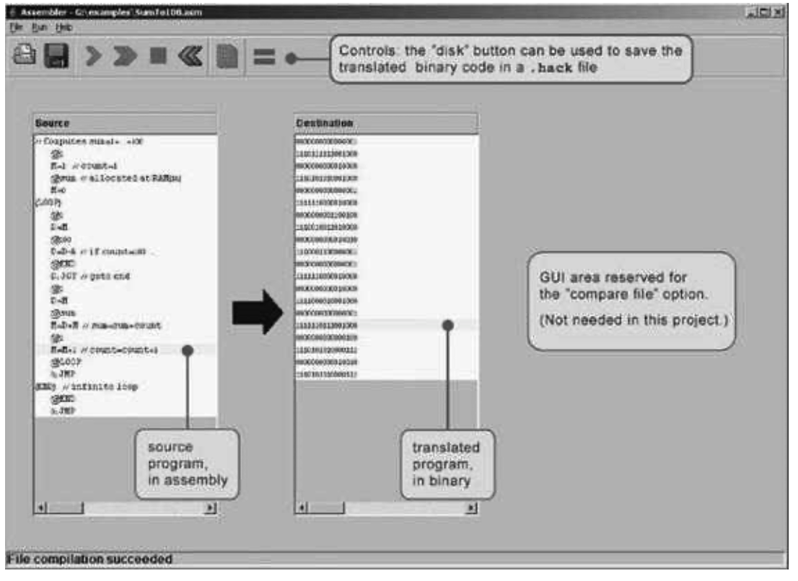
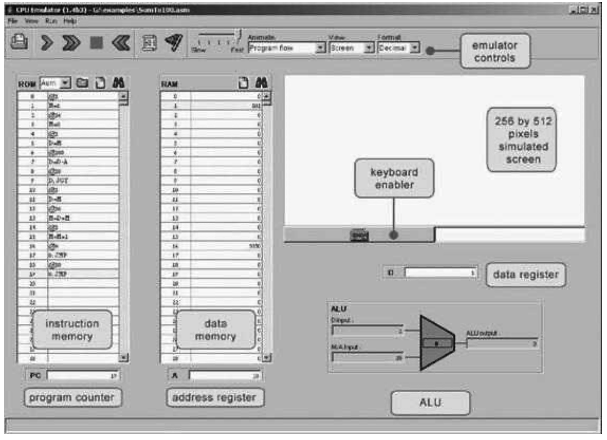

### 4.4 Project
---

&emsp;&emsp;**Objective** Get a taste of low-level programming in machine language, and get acquainted with the Hack computer platform. In the process of working on this project, you will also become familiar with the assembly process, and you will appreciate visually how the translated binary code executes on the target hardware.

&emsp;&emsp;**Resources** In this project you will use two tools supplied with the book: An assembler, designed to translate Hack assembly programs into binary code, and a CPU emulator, designed to run binary programs on a simulated Hack platform.

&emsp;&emsp;**Contract** Write and test the two programs described in what follows. When executed on the CPU emulator, your programs should generate the results mandated by the test scripts supplied in the project directory.

&emsp;&emsp;■ <em>Multiplication Program</em> (Mult.asm): The inputs of this program are the current values stored in R0 and R1 (i.e., the two top RAM locations). The program computes the product R0&ast;R1 and stores the result in R2. We assume (in this program) that R0>=0, R1>=0, and R0&ast;R1<32768. Your program need not test these conditions, but rather assume that they hold. The supplied Mult.tst and Mult.cmp scripts will test your program on several representative data values.

&emsp;&emsp;■ <em>I/O-Handling Program</em> (Fill.asm): This program runs an infinite loop that listens to the keyboard input. When a key is pressed (any key), the program blackens the screen, namely, writes “black” in every pixel. When no key is pressed, the screen should be cleared. You may choose to blacken and clear the screen in any spatial order, as long as pressing a key continuously for long enough will result in a fully blackened screen and not pressing any key for long enough will result in a cleared screen. This program has a test script (Fill.tst) but no compare file—it should be checked by visibly inspecting the simulated screen.

&emsp;&emsp;**Steps** We recommend proceeding as follows:

  &emsp;&emsp;0. The assembler and CPU emulator programs needed for this project are available in the tools directory of the book’s software suite. Before using them, go through the assembler tutorial and the CPU emulator tutorial.

  &emsp;&emsp;1. Use a plain text editor to write the first program in assembly, and save it as projects/04/mult/Mult.asm.

  &emsp;&emsp;2. Use the supplied assembler (in either batch or interactive mode) to translate your program. If you get syntax errors, go to step 1. If there are no syntax errors, the assembler will produce a file called projects/04/mult/Mult.hack, containing binary machine instructions.

  &emsp;&emsp;3. Use the supplied CPU emulator to test the resulting Mult.hack code. This can be done either interactively, or batch-style using the supplied Mult.tst script. If you get run-time errors, go to step 1.

  &emsp;&emsp;4. Repeat stages 1-3 for the second program (Fill.asm), using the projects/04/ fill directory.

&emsp;&emsp;**Figure 4.7** The visual assembler supplied with the book.

&emsp;&emsp;**Debugging Tip** The Hack language is case sensitive. A common error occurs when one writes, say, @foo and @Foo in different parts of the program, thinking that both commands refer to the same variable. In fact, the assembler treats these symbols as two completely different identifiers.

&emsp;&emsp;**The Supplied Assembler** The book’s software suite includes a Hack assembler that can be used in either command mode or GUI mode. The latter mode of operation allows observing the translation process in a visual and step-wise fashion, as shown in figure 4.7.

&emsp;&emsp;The machine language programs produced by the assembler can be tested in two different ways. First, one can run the .hack program in the CPU emulator. Alternatively, one can run the same program directly on the hardware, by loading it into the computer’s instruction memory using the hardware simulator. Since we will finish building the hardware platform only in the next chapter, the former option makes more sense at this stage.

&emsp;&emsp;**Figure 4.8** The CPU emulator supplied with the book. The loaded program can be displayed either in symbolic notation (as shown in this screen shot) or in binary code. The screen and the keyboard are not used by this particular program.

&emsp;&emsp;**The Supplied CPU Emulator** This program simulates the Hack computer platform. It allows loading a Hack program into the simulated ROM and visually observing its execution on the simulated hardware, as shown in figure 4.8.

&emsp;&emsp;For ease of use, the CPU emulator enables loading binary .hack files as well as symbolic .asm files. In the latter case, the emulator translates the assembly program into binary code on the fly. This utility seems to render the supplied assembler unnecessary, but this is not the case. First, the supplied assembler shows the translation process visually, for instructive purposes. Second, the binary files generated by the assembler can be executed directly on the hardware platform. To do so, load the Computer chip (built in chapter 5’s project) into the hardware simulator, then load the .hack file generated by the assembler into the computer’s ROM chip.
