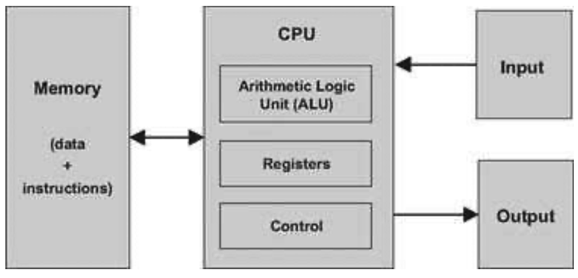

### 5.1 Background
---

#### 5.1.1 The Stored Program Concept

&emsp;&emsp;Compared to all the other machines around us, the most unique feature of the digital computer is its amazing versatility. Here is a machine with finite hardware that can perform a practically infinite array of tasks, from interactive games to word processing to scientific calculations. This remarkable flexibility—a boon that we have come to take for granted—is the fruit of a brilliant idea called the <em>stored program</em> concept. Formulated independently by several mathematicians in the 1930s, the stored program concept is still considered the most profound invention in, if not the very foundation of, modern computer science.

&emsp;&emsp;Like many scientific breakthroughs, the basic idea is rather simple. The computer is based on a fixed hardware platform, capable of executing a fixed repertoire of instructions. At the same time, these instructions can be used and combined like building blocks, yielding arbitrarily sophisticated programs. Moreover, the logic of these programs is not embedded in the hardware, as it was in mechanical computers predating 1930. Instead, the program’s code is stored and manipulated in the computer memory, just like data, becoming what is known as “software.” Since the computer’s operation manifests itself to the user through the currently executing software, the same hardware platform can be made to behave completely differently each time it is loaded with a different program.

#### 5.1.2 The von Neumann Architecture

&emsp;&emsp;The stored program concept is a key element of many abstract and practical computer models, most notably the universal Turing machine (1936) and the von Neumann machine (1945). The Turing machine —an abstract artifact describing a deceptively simple computer—is used mainly to analyze the logical foundations of computer systems. In contrast, the von Neumann machine is a practical architecture and the conceptual blueprint of almost all computer platforms today.

&emsp;&emsp;**Figure 5.1** The von Neumann architecture (conceptual). At this level of detail, this model describes the architecture of almost all digital computers. The program that operates the computer resides in its memory, in accordance with the “stored program” concept.

&emsp;&emsp;The von Neumann architecture is based on a central processing unit (CPU), interacting with a memory device, receiving data from some input device, and sending data to some output device (figure 5.1). At the heart of this architecture lies the stored program concept: The computer’s memory stores not only the data that the computer manipulates, but also the very instructions that tell the computer what to do. Let us explore this architecture in some detail.

#### 5.1.3 Memory

&emsp;&emsp;The memory of a von Neumann machine holds two types of information: data items and programming instructions. The two types of information are usually treated differently, and in some computers they are stored in separate memory units. In spite of their different functions though, both types of information are represented as binary numbers that are stored in the same generic random-access structure: a continuous array of cells of some fixed width, also called words or locations, each having a unique address. Hence, an individual word (representing either a data item or an instruction) is specified by supplying its address.

&emsp;&emsp;**Data Memory** High-level programs manipulate abstract artifacts like variables, arrays, and objects. When translated into machine language, these data abstractions become series of binary numbers, stored in the computer’s data memory. Once an individual word has been selected from the data memory by specifying its address, it can be either read or written to. In the former case, we retrieve the word’s value. In the latter case, we store a new value into the selected location, erasing the old value.

&emsp;&emsp;**Instruction Memory** When translated into machine language, each high-level command becomes a series of binary words, representing machine language instructions. These instructions are stored in the computer’s instruction memory. In each step of the computer’s operation, the CPU fetches (i.e., reads) a word from the instruction memory, decodes it, executes the specified instruction, and figures out which instruction to execute next. Thus, changing the contents of the instruction memory has the effect of completely changing the computer’s operation.

&emsp;&emsp;The instructions that reside in the instruction memory are written in an agreed-upon formalism called machine language. In some computers, the specification of each operation and the codes representing its operands are represented in a single-word instruction. Other computers split this specification over several words.

#### 5.1.4 Central Processing Unit

&emsp;&emsp;The CPU—the centerpiece of the computer’s architecture—is in charge of executing the instructions of the currently loaded program. These instructions tell the CPU to carry out various calculations, to read and write values from and into the memory, and to conditionally jump to execute other instructions in the program. The CPU executes these tasks using three main hardware elements: an Arithmetic-Logic Unit (ALU), a set of registers, and a control unit.

&emsp;&emsp;**Arithmetic Logic Unit** The ALU is built to perform all the low-level arithmetic and logical operations featured by the computer. For instance, a typical ALU can add two numbers, test whether a number is positive, manipulate the bits in a word of data, and so on.

&emsp;&emsp;**Registers** The CPU is designed to carry out simple calculations quickly. In order to boost performance, it is desirable to store the results of these calculations locally, rather than ship them in and out of memory. Thus, every CPU is equipped with a small set of high-speed registers, each capable of holding a single word.

&emsp;&emsp;**Control Unit** A computer instruction is represented as a binary code, typically 16, 32, or 64 bits wide. Before such an instruction can be executed, it must be decoded, and the information embedded in it must be used to signal various hardware devices (ALU, registers, memory) how to execute the instruction. The instruction decoding is done by some control unit, which is also responsible for figuring out which instruction to fetch and execute next.

&emsp;&emsp;The CPU operation can now be described as a repeated loop: fetch an instruction (word) from memory; decode it; execute it, fetch the next instruction, and so on. The instruction execution may involve one or more of the following micro tasks: have the ALU compute some value, manipulate internal registers, read a word from the memory, and write a word to the memory. In the process of executing these tasks, the CPU also figures out which instruction to fetch and execute next.

#### 5.1.5 Registers

&emsp;&emsp;Memory access is a slow affair. When the CPU is instructed to retrieve the contents of address j of the memory, the following process ensues: (a) j travels from the CPU to the RAM; (b) the RAM’s direct- access logic selects the memory register whose address is <em>j</em>; (c) the contents of RAM[<em>j</em>] travel back to the CPU. Registers provide the same service—data retrieval and storage—without the round-trip travel and search expenses. First, the registers reside physically inside the CPU chip, so accessing them is almost instantaneous. Second, there are typically only a handful of registers, compared to millions of memory cells. Therefore, machine language instructions can specify which registers they want to manipulate using just a few bits, resulting in thinner instruction formats.

&emsp;&emsp;Different CPUs employ different numbers of registers, of different types, for different purposes. In some computer architectures each register can serve more than one purpose:

&emsp;&emsp;<em>Data registers:</em> These registers give the CPU short-term memory services. For example, when calculating the value of <em>(a - b) · c</em>, we must first compute and remember the value of (a - b). Although this result can be temporarily stored in some memory location, a better solution is to store it locally inside the CPU—in a data register.

&emsp;&emsp;<em>Addressing registers:</em> The CPU has to continuously access the memory in order to read data and write data. In every one of these operations, we must specify which individual memory word has to be accessed, namely, supply an address. In some cases this address appears as part of the current instruction, while in others it depends on the execution of a previous instruction. In the latter case, the address should be stored in a register whose contents can be later treated as a memory address—an <em>addressing register</em>.

&emsp;&emsp;<em>Program counter register:</em> When executing a program, the CPU must always keep track of the address of the next instruction that must be fetched from the instruction memory. This address is kept in a special register called program counter, or PC. The contents of the PC are then used as the address for fetching instructions from the instruction memory. Thus, in the process of executing the current instruction, the CPU updates the PC in one of two ways. If the current instruction contains no goto directive, the PC is incremented to point to the next instruction in the program. If the current instruction includes a goto n directive that should be executed, the CPU loads <em>n</em> into the PC.

#### 5.1.6 Input and Output

&emsp;&emsp;Computers interact with their external environments using a diverse array of input and output (I/O) devices. These include screens, keyboards, printers, scanners, network interface cards, CD-ROMs, and so forth, not to mention the bewildering array of proprietary components that embedded computers are called to control in automobiles, weapon systems, medical equipment, and so on. There are two reasons why we do not concern ourselves here with the anatomy of these various devices. First, every one of them represents a unique piece of machinery requiring a unique knowledge of engineering. Second, and for this very same reason, computer scientists have devised various schemes to make all these devices look exactly the same to the computer. The simplest trick in this art is called memory-mapped I/O.

&emsp;&emsp;The basic idea is to create a binary emulation of the I/O device, making it “look” to the CPU like a normal memory segment. In particular, each I/O device is allocated an exclusive area in memory, becoming its “memory map.” In the case of an input device (keyboard, mouse, etc.), the memory map is made to continuously reflect the physical state of the device; in the case of an output device (screen, speakers, etc.), the memory map is made to continuously drive the physical state of the device. When external events affect some input devices (e.g., pressing a key on the keyboard or moving the mouse), certain values are written in their respective memory maps. Likewise, if we want to manipulate some output devices (e.g., draw something on the screen or play a tune), we write some values in their respective memory maps. From the hardware point of view, this scheme requires each I/O device to provide an interface similar to that of a memory unit. From a software point of view, each I/O device is required to define an interaction contract, so that programs can access it correctly. As a side comment, given the multitude of available computer platforms and I/O devices, one can appreciate the crucial role that standards play in designing computer architectures.

&emsp;&emsp;The practical implications of a memory-mapped I/O architecture are significant: The design of the CPU and the overall platform can be totally independent of the number, nature, or make of the I/O devices that interact, or will interact, with the computer. Whenever we want to connect a new I/O device to the computer, all we have to do is allocate to it a new memory map and “take note” of its base address (these one-time configurations are typically done by the operating system). From this point onward, any program that wants to manipulate this I/O device can do so—all it needs to do is manipulate bits in memory.
