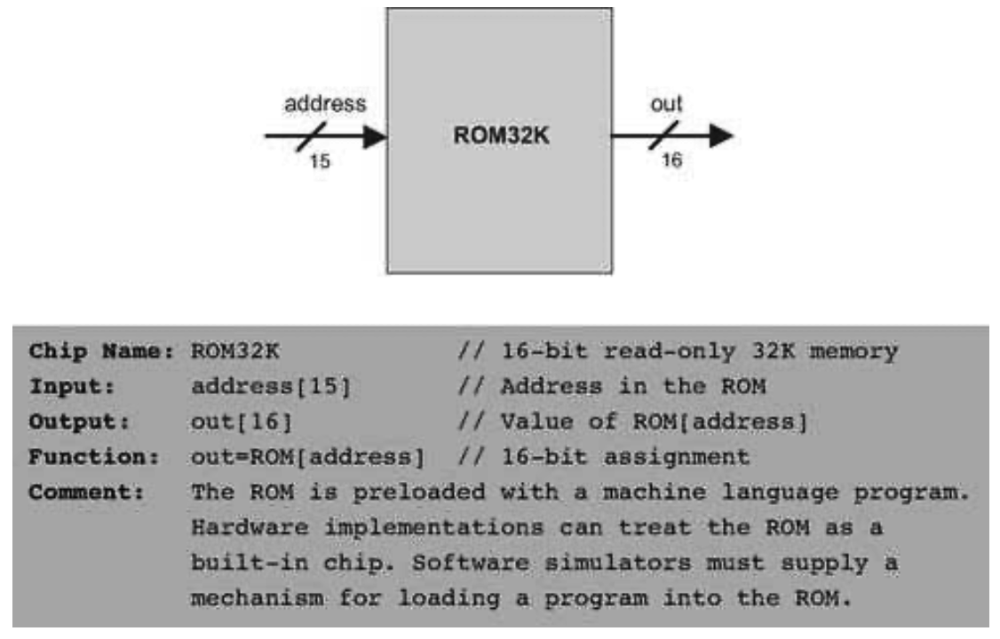

### 5.2 The Hack Hardware Platform Specification
---

#### 5.2.1 Overview

&emsp;&emsp;The Hack platform is a 16-bit von Neumann machine, consisting of a CPU, two separate memory modules serving as instruction memory and data memory, and two memory-mapped I/O devices: a screen and a keyboard. Certain parts of this architecture—especially its machine language—were presented in chapter 4. A summary of this discussion is given here, for ease of reference.

&emsp;&emsp;The Hack computer executes programs that reside in its instruction memory. The instruction memory is a read-only device, and thus programs are loaded into it using some exogenous means. For example, the instruction memory can be implemented in a ROM chip that is preburned with the required program. Loading a new program can be done by replacing the entire ROM chip. In order to simulate this operation, hardware simulators of the Hack platform must provide a means for loading the instruction memory from a text file containing a program written in the Hack machine language. (From now on, we will refer to Hack’s data memory and instruction memory as RAM and ROM, respectively.)

&emsp;&emsp;The Hack CPU consists of the ALU specified in chapter 2 and three registers called data register (D), address register (A), and program counter (PC). D and A are general-purpose 16-bit registers that can be manipulated by arithmetic and logical instructions like A=D-1, D=D|A, and so on, following the Hack machine language specified in chapter 4. While the D-register is used solely to store data values, the contents of the A-register can be interpreted in three different ways, depending on the instruction’s context: as a data value, as a RAM address, or as a ROM address.

&emsp;&emsp;The Hack machine language is based on two 16-bit command types. The address instruction has the format 0vvvvvvvvvvvvvvv, each v being 0 or 1. This instruction causes the computer to load the 15-bit constant vvv...v into the A-register. The compute instruction has the format 111accccccdddjjj. The a- and c-bits instruct the ALU which function to compute, the d-bits instruct where to store the ALU output, and the j-bits specify an optional jump condition, all according to the Hack machine language specification.

&emsp;&emsp;The computer architecture is wired in such a way that the output of the program counter (PC) chip is connected to the address input of the ROM chip. This way, the ROM chip always emits the word ROM[PC], namely, the contents of the instruction memory location whose address is “pointed at” by the PC. This value is called the current instruction. With that in mind, the overall computer operation during each clock cycle is as follows:

&emsp;&emsp;<em>Execute:</em> Various bit parts of the current instruction are simultaneously fed to various chips in the computer. If it’s an address instruction (most significant bit = 0), the A-register is set to the 15-bit constant embedded in the instruction. If it’s a compute instruction (MSB = 1), its underlying a-, c-, d- and j-bits are treated as control bits that cause the ALU and the registers to execute the instruction.

&emsp;&emsp;<em>Fetch:</em> Which instruction to fetch next is determined by the jump bits of the current instruction and by the ALU output. Taken together, these values determine whether a jump should materialize. If so, the PC is set to the value of the A-register; otherwise, the PC is incremented by 1. In the next clock cycle, the instruction that the program counter points at emerges from the ROM’s output, and the cycle continues.

&emsp;&emsp;This particular fetch-execute cycle implies that in the Hack platform, elementary operations involving memory access usually require two instructions: an address instruction to set the A register to a particular address, and a subsequent compute instruction that operates on this address (a read/write operation on the RAM or a jump operation into the ROM).

&emsp;&emsp;We now turn to formally specify the Hack hardware platform. Before starting, we wish to point out that this platform can be assembled from previously built components. The CPU is based on the ALU built in chapter 2. The registers and the program counter are identical copies of the 16-bit register and 16-bit counter, respectively, built in chapter 3. Likewise, the ROM and the RAM chips are versions of the memory units built in chapter 3. Finally, the screen and the keyboard devices will interface with the hardware platform through memory maps, implemented as built-in chips that have the same interface as RAM chips.

#### 5.2.2 Central Processing Unit (CPU)

&emsp;&emsp;The CPU of the Hack platform is designed to execute 16-bit instructions according to the Hack machine language specified in chapter 4. It expects to be connected to two separate memory modules: an instruction memory, from which it fetches instructions for execution, and a data memory, from which it can read, and into which it can write, data values. Figure 5.2 gives the specification details.

&emsp;&emsp;**Figure 5.2** The Central Processing Unit. Assembled from the ALU and the registers built in chapters 2 and 3, respectively.

#### 5.2.3 Instruction Memory

&emsp;&emsp;The Hack instruction memory is implemented in a direct-access Read-Only Memory device, also called ROM. The Hack ROM consists of 32K addressable 16-bit registers, as shown in figure 5.3.

&emsp;&emsp;**Figure 5.3** Instruction memory.

#### 5.2.4 Data Memory

&emsp;&emsp;Hack’s <em>data memory</em> chip has the interface of a typical RAM device, like that built in chapter 3 (see, e.g., figure 3.3). To read the contents of register n, we put n in the memory’s address input and probe the memory’s out output. This is a combinational operation, independent of the clock. To write a value v into register n, we put v in the in input, n in the address input, and assert the memory’s load bit. This is a sequential operation, and so register n will commit to the new value v in the next clock cycle.

&emsp;&emsp;In addition to serving as the computer’s general-purpose data store, the data memory also interfaces between the CPU and the computer’s input/output devices, using <em>memory maps</em>.

&emsp;&emsp;**Memory Maps** In order to facilitate interaction with a user, the Hack platform can be connected to two peripheral devices: screen and keyboard. Both devices interact with the computer platform through memory-mapped buffers. Specifically, screen images can be drawn and probed by writing and reading, respectively, words in a designated memory segment called screen memory map. Similarly, one can check which key is presently pressed on the keyboard by probing a designated memory word called keyboard memory map. The memory maps interact with their respective I/O devices via peripheral logic that resides outside the computer. The contract is as follows: Whenever a bit is changed in the screen’s memory map, a respective pixel is drawn on the physical screen. Whenever a key is pressed on the physical keyboard, the respective code of this key appears in the keyboard’s memory map.

&emsp;&emsp;We specify first the built-in chips that interface between the hardware interface and the I/O devices, then the complete memory module that embeds these chips.

&emsp;&emsp;**Screen** The Hack computer can interact with a black-and-white screen organized as 256 rows of 512 pixels per row. The computer interfaces with the physical screen via a memory map, implemented by a chip called Screen. This chip behaves like regular memory, meaning that it can be read and written to. In addition, it features the side effect that any bit written to it is reflected as a pixel on the physical screen (1 = black, 0 = white). The exact mapping between the memory map and the physical screen coordinates is given in figure 5.4.

&emsp;&emsp;**Figure 5.4** Screen interface.

&emsp;&emsp;**Keyboard** The Hack computer can interact with a standard keyboard, like that of a personal computer. The computer interfaces with the physical keyboard via a chip called Keyboard (figure 5.5). Whenever a key is pressed on the physical keyboard, its 16-bit ASCII code appears as the output of the Keyboard chip. When no key is pressed, the chip outputs 0. In addition to the usual ASCII codes, the Keyboard chip recognizes, and responds to, the keys listed in figure 5.6.

&emsp;&emsp;**Figure 5.5** Keyboard interface.

&emsp;&emsp;**Figure 5.6** Special keyboard keys in the Hack platform.

&emsp;&emsp;Now that we’ve described the internal parts of the data memory, we are ready to specify the entire data memory address space.

&emsp;&emsp;**Overall Memory** The overall address space of the Hack platform (i.e., its entire data memory) is provided by a chip called Memory. The memory chip includes the RAM (for regular data storage) and the screen and keyboard memory maps. These modules reside in a single address space that is partitioned into four sections, as shown in figure 5.7.

#### 4.2.5 Computer

&emsp;&emsp;The topmost chip in the Hack hardware hierarchy is a complete computer system designed to execute programs written in the Hack machine language. This abstraction is described in figure 5.8. The Computer chip contains all the hardware devices necessary to operate the computer including a CPU, a data memory, an instruction memory (ROM), a screen, and a keyboard, all implemented as internal parts. In order to execute a program, the program’s code must be preloaded into the ROM. Control of the screen and the keyboard is achieved via their memory maps, as described in the Screen and Keyboard chip specifications.
