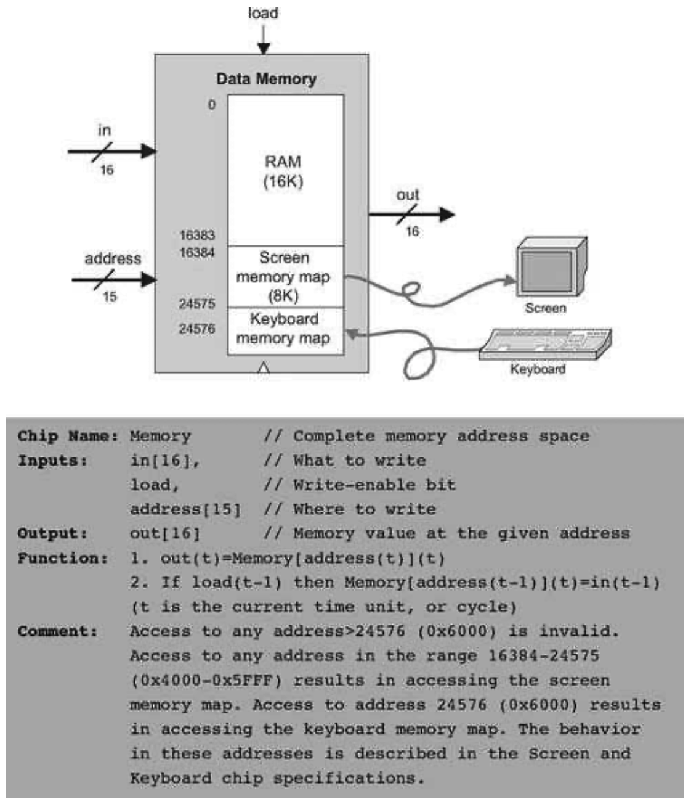
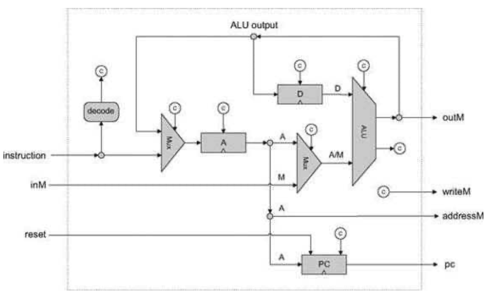

### 5.3 Implementation
---


&emsp;&emsp;This section gives general guidelines on how the Hack computer platform can be built to deliver the various services described in its specification (section 5.2). As usual, we don’t give exact building instructions, expecting readers to come up with their own designs. All the chips can be built in HDL and simulated on a personal computer using the hardware simulator that comes with the book. As usual, technical details are given in the final Project section of this chapter.

<div align="center"></div>

&emsp;&emsp;**Figure 5.7** Data memory.

<div align="center"></div>

&emsp;&emsp;**Figure 5.8** Computer. Topmost chip of the Hack hardware platform.

&emsp;&emsp;Since most of the action in the Hack platform occurs in its Central Processing Unit, the main implementation challenge is building the CPU. The construction of the rest of the computer platform is straightforward.


#### 5.3.1 The Central Processing Unit

&emsp;&emsp;The CPU implementation objective is to create a logic gate architecture capable of executing a given Hack instruction and fetching the next instruction to be executed. Naturally, the CPU will include an ALU capable of executing Hack instructions, a set of registers, and some control logic designed to fetch and decode instructions. Since almost all these hardware elements were already built in previous chapters, the key question here is how to connect them in order to effect the desired CPU operation. One possible solution is illustrated in figure 5.9.

<div align="center"></div>

&emsp;&emsp;**Figure 5.9** Proposed CPU implementation. The diagram shows only data and address paths, namely, wires that carry data and addresses from one place to another. The diagram does not show the CPU’s <em>control logic</em>, except for inputs and outputs of control bits, labeled with a circled “c”. Thus it should be viewed as an incomplete chip diagram.

&emsp;&emsp;The key element missing in figure 5.9 is the CPU’s <em>control logic</em>, designed to perform the following tasks:

&emsp;&emsp;■ <em>Instruction decoding:</em> Figure out what the instruction means (a function of the instruction).

&emsp;&emsp;■ <em>Instruction execution:</em> Signal the various parts of the computer what they should do in order to execute the instruction (a function of the instruction).

&emsp;&emsp;■ <em>Next instruction fetching:</em> Figure out which instruction to execute next (a function of the instruction and the ALU output).

&emsp;&emsp;(In what follows, the term <em>proposed</em> CPU implementation refers to figure 5.9.)

&emsp;&emsp;**Instruction Decoding** The 16-bit word located in the CPU’s instruction input can represent either an <em>A</em>- instruction or a <em>C</em>-instruction. In order to figure out what this 16-bit word means, it can be broken into the fields “i xx a cccccc ddd jjj”. The i-bit codes the instruction type, which is 0 for an <em>A</em>-instruction and 1 for a <em>C</em>-instruction. In case of a <em>C</em>-instruction, the a-bit and the c-bits code the comp part, the d-bits code the dest part, and the j-bits code the jump part of the instruction. In case of an <em>A</em>-instruction, the 15 bits other than the i-bit should be interpreted as a 15-bit constant.

&emsp;&emsp;**Instruction Execution** The various fields of the instruction (i-, a-, c-, d-, and j-bits) are routed simultaneously to various parts of the architecture, where they cause different chips to do what they are supposed to do in order to execute either the <em>A</em>-instruction or the <em>C</em>-instruction, as mandated by the machine language specification. In particular, the a-bit determines whether the ALU will operate on the A register input or on the Memory input, the c-bits determine which function the ALU will compute, and the d-bits enable various locations to accept the ALU result.

&emsp;&emsp;**Next Instruction** Fetching As a side effect of executing the current instruction, the CPU also determines the address of the next instruction and emits it via its pc output. The “driver” of this task is the <em>program counter</em>—an internal part of the CPU whose output is fed directly to the CPU’s pc output. This is precisely the PC chip built in chapter 3 (see figure 3.5).

&emsp;&emsp;Most of the time, the programmer wants the computer to fetch and execute the next instruction in the program. Thus if t is the current time-unit, the default program counter operation should be PC(t) = PC(t - 1) + 1. When we want to effect a <em>goto</em> n operation, the machine language specification requires to first set the A register to n (via an <em>A</em>-instruction) and then issue a jump directive (coded by the j-bits of a subsequent <em>C</em>-instruction). Hence, our challenge is to come up with a hardware implementation of the following logic:

```
If jump(t) then PC(t) = A(t-1)
else PC(t) = PC(t-1) + 1
```

&emsp;&emsp;Conveniently, and actually by careful design, this jump control logic can be easily effected by the proposed CPU implementation. Recall that the PC chip interface (figure 3.5) has a load control bit that enables it to accept a new input value. Thus, to effect the desired jump control logic, we start by connecting the output of the A register to the input of the PC. The only remaining question is when to enable the PC to accept this value (rather than continuing its steadfast counting), namely, when does a jump need to occur. This is a function of two signals: (a) the j-bits of the current instruction, specifying on which condition we are supposed to jump, and (b) the ALU output status bits, indicating whether the condition is satisfied. If we have a jump, the PC should be loaded with A’s output. Otherwise, the PC should increment by 1.

&emsp;&emsp;Additionally, if we want the computer to restart the program’s execution, all we have to do is reset the program counter to 0. That’s why the proposed CPU implementation feeds the CPU’s reset input directly into the reset pin of the PC chip.


#### 5.3.2 Memory

&emsp;&emsp;According to its specification, the Memory chip of the Hack platform is essentially a package of three lower-level chips: RAM16K, Screen, and Keyboard. At the same-time, users of the Memory chip must see a single logical address space, spanning from location 0 to 24576 (0x0000 to 0x6000—see figure 5.7). The implementation of the Memory chip should create this continuum effect. This can be done by the same technique used to combine small RAM units into larger ones, as we have done in chapter 3 (see figure 3.6 and the discussion of n-register memory that accompanies it).


#### 5.3.3 Computer

&emsp;&emsp;Once the CPU and the Memory chips have been implemented and tested, the construction of the overall computer is straightforward. Figure 5.10 depicts a possible implementation.Once the CPU and the Memory chips have been implemented and tested, the construction of the overall computer is straightforward. Figure 5.10 depicts a possible implementation.

<div align="center"></div>

&emsp;&emsp;**Figure 5.10** Proposed implementation of the topmost Computer chip.
