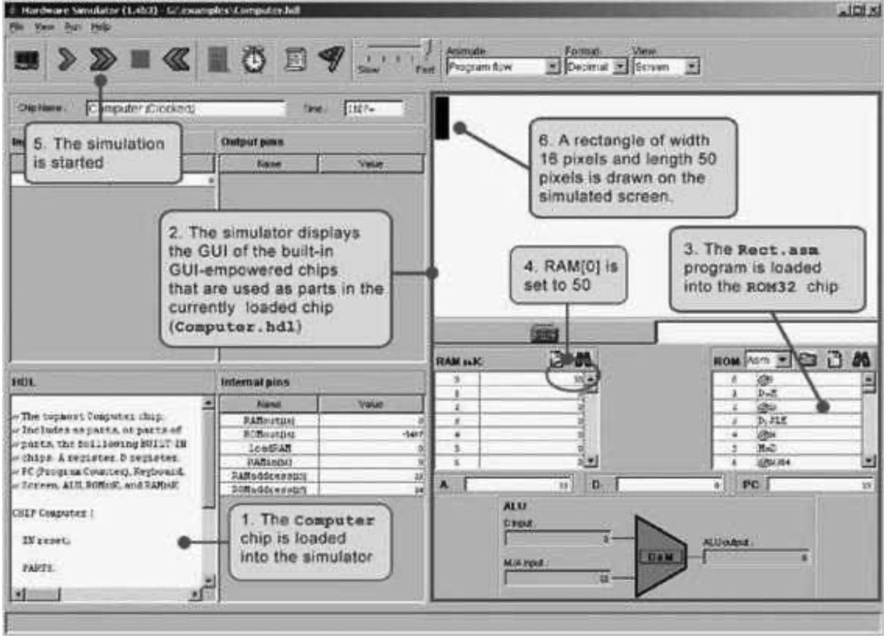

### 5.5 Project
---

&emsp;&emsp;**Objective** Build the Hack computer platform, culminating in the topmost Computer chip.

&emsp;&emsp;**Resources** The only tools that you need for completing this project are the hardware simulator supplied with the book and the test scripts described here. The computer platform should be implemented in the HDL language specified in appendix A.

&emsp;&emsp;**Contract** The computer platform built in this project should be capable of executing programs written in the Hack machine language, specified in chapter 4. Demonstrate this capability by having your Computer chip run the three programs given here.

&emsp;&emsp;**Component Testing** We supply test scripts and compare files for unit-testing the Memory and CPU chips in isolation. It’s important to complete the testing of these chips before building and testing the overall Computer chip.

&emsp;&emsp;**Test Programs** A natural way to test the overall Computer chip implementation is to have it execute some sample programs written in the Hack machine language. In order to run such a test, one can write a test script that loads the Computer chip into the hardware simulator, loads a program from an external text file into its ROM chip, and then runs the clock enough cycles to execute the program. We supply all the files necessary to run three such tests, as follows:

  &emsp;&emsp;1. Add.hack: Adds the two constants 2 and 3 and writes the result in RAM[0].

  &emsp;&emsp;2. Max.hack: Computes the maximum of RAM[0] and RAM[1] and writes the result in RAM[2].

  &emsp;&emsp;3. Rect.hack: Draws a rectangle of width 16 pixels and length RAM[0] at the top left of the screen.

&emsp;&emsp;Before testing your Computer chip on any one of the above programs, read the test script associated with the program and be sure to understand the instructions given to the simulator. Appendix B may be a useful reference here.

&emsp;&emsp;**Steps** Build the computer in the following order:

  &emsp;&emsp;■ <em>Memory:</em> Composed from three chips: RAM16K, Screen, and Keyboard. The Screen and the Keyboard are available as built-in chips and there is no need to build them. Although the RAM16K chip was built in the project in chapter 3, we recommend using its built-in version, as it provides a debugging-friendly GUI.

  &emsp;&emsp;■ <em>CPU:</em> Can be composed according to the proposed implementation given in figure 5.9, using the ALU and register chips built in chapters 2 and 3, respectively. We recommend using the built-in versions of these chips, in particular ARegister and DRegister. These chips have exactly the same functionality of the Register chip specified in chapter 3, plus GUI side effects.

  &emsp;&emsp;In the course of implementing the CPU, it is allowed (but not necessarily recommended) to specify and build some internal chips of your own. This is up to you. If you choose to create new chips not mentioned in the book, be sure to document and test them carefully before you plug them into the architecture.

  &emsp;&emsp;■ <em>Instruction Memory:</em> Use the built-in ROM32K chip.

  &emsp;&emsp;■ <em>Computer:</em> The topmost Computer chip can be composed from the chips mentioned earlier, using figure 5.10 as a blueprint.

&emsp;&emsp;**The Hardware Simulator** As in the projects in chapters 1-3, all the chips in this project (including the topmost Computer chip) can be implemented and tested using the hardware simulator supplied with the book. Figure 5.11 is a screen shot of testing the Rect.hack program on a Computer chip implementation.

&emsp;&emsp;**Figure 5.11** Testing the Computer chip on the hardware simulator. The Rect program draws a rectangle of width 16 pixels and length RAM[0] at the top left of the screen. Note that the program is correct. Thus, if it does not work properly, it means that the computer platform on which it runs (Computer.hdl and/or some of its lower-level parts) is buggy.
