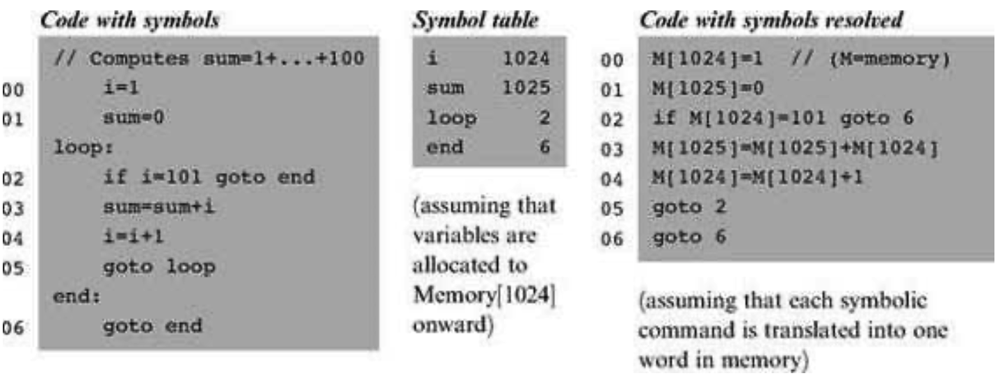

### 6.1 Background
---

&emsp;&emsp;Machine languages are typically specified in two flavors: symbolic and binary. The binary codes—for example, 110000101000000110000000000000111—represent actual machine instructions, as understood by the underlying hardware. For example, the instruction’s leftmost 8 bits can represent an operation code, say LOAD, the next 8 bits a register, say R3, and the remaining 16 bits an address, say 7. Depending on the hardware’s logic design and the agreed-upon machine language, the overall 32-bit pattern can thus cause the hardware to effect the operation “load the contents of Memory[7] into register R3.” Modern computer platforms support dozens if not hundreds of such elementary operations. Thus, machine languages can be rather complex, involving many operation codes, different memory addressing modes, and various instruction formats.

&emsp;&emsp;One way to cope with this complexity is to document machine instructions using an agreed-upon syntax, say LOAD R3,7 rather than 110000101000000110000000000000111. And since the translation from symbolic notation to binary code is straightforward, it makes sense to allow low-level programs to be written in symbolic notation and to have a computer program translate them into binary code. The symbolic language is called assembly, and the translator program assembler. The assembler parses each assembly command into its underlying fields, translates each field into its equivalent binary code, and assembles the generated codes into a binary instruction that can be actually executed by the hardware.

&emsp;&emsp;**Symbols** Binary instructions are represented in binary code. By definition, they refer to memory addresses using actual numbers. For example, consider a program that uses a variable to represent the weight of various things, and suppose that this variable has been mapped on location 7 in the computer’s memory. At the binary code level, instructions that manipulate the weight variable must refer to it using the explicit address 7. Yet once we step up to the assembly level, we can allow writing commands like LOAD R3,weight instead of LOAD R3,7. In both cases, the command will effect the same operation: “set R3 to the contents of Memory[7].” In a similar fashion, rather than using commands like goto 250, assembly languages allow commands like goto loop, assuming that somewhere in the program the symbol loop is made to refer to address 250. In general then, symbols are introduced into assembly programs from two sources:

&emsp;&emsp;■ <em>Variables:</em> The programmer can use symbolic variable names, and the translator will “automatically” assign them to memory addresses. Note that the actual values of these addresses are insignificant, so long as each symbol is resolved to the same address throughout the program’s translation.

&emsp;&emsp;■ <em>Labels:</em> The programmer can mark various locations in the program with symbols. For example, one can declare the label loop to refer to the beginning of a certain code segment. Other commands in the program can then goto loop, either conditionally or unconditionally.

&emsp;&emsp;The introduction of symbols into assembly languages suggests that assemblers must be more sophisticated than dumb text processing programs. Granted, translating agreed-upon symbols into agreed- upon binary codes is not a complicated task. At the same time, the mapping of user-defined variable names and symbolic labels on actual memory addresses is not trivial. In fact, this symbol resolution task is the first nontrivial translation challenge in our ascent up the software hierarchy from the hardware level. The following example illustrates the challenge and the common way to address it.

&emsp;&emsp;**Symbol Resolution** Consider figure 6.1, showing a program written in some self-explanatory low-level language. The program contains four user-defined symbols: two variable names (i and sum) and two labels (loop and end). How can we systematically convert this program into a symbol-less code?

&emsp;&emsp;We start by making two arbitrary game rules: The translated code will be stored in the computer’s memory starting at address 0, and variables will be allocated to memory locations starting at address 1024 (these rules depend on the specific target hardware platform). Next, we build a symbol table, as follows. For each new symbol xxx encountered in the source code, we add a line (xxx, n) to the symbol table, where n is the memory address associated with the symbol according to the game rules. After completing the construction of the symbol table, we use it to translate the program into its symbol-less version.

&emsp;&emsp;Note that according to the assumed game rules, variables i and sum are allocated to addresses 1024 and 1025, respectively. Of course any other two addresses will be just as good, so long as all references to i and sum in the program resolve to the same physical addresses, as indeed is the case. The remaining code is self-explanatory, except perhaps for instruction 6. This instruction terminates the program’s execution by putting the computer in an infinite loop.

&emsp;&emsp;**Figure 6.1** Symbol resolution using a symbol table. The line numbers are not part of the program—they simply count all the lines in the program that represent real instructions, namely, neither comments nor label declarations. Note that once we have the symbol table in place, the symbol resolution task is straightforward.

&emsp;&emsp;Three comments are in order here. First, note that the variable allocation assumption implies that the largest program that we can run is 1,024 instructions long. Since realistic programs (like the operating system) are obviously much larger, the base address for storing variables will normally be much farther. Second, the assumption that each source command is mapped on one word may be naïve. Typically, some assembly commands (e.g., if i=101 goto end) may translate into several machine instructions and thus will end up occupying several memory locations. The translator can deal with this variance by keeping track of how many words each source command generates, then updating its “instruction memory counter” accordingly.

&emsp;&emsp;Finally, the assumption that each variable is represented by a single memory location is also naïve. Programming languages feature variables of different types, and these occupy different memory spaces on the target computer. For example, the C language data types short and double represent 16-bit and 64-bit numbers, respectively. When a C program is run on a 16-bit machine, these variables will occupy a single memory address and a block of four consecutive addresses, respectively. Thus, when allocating memory space for variables, the translator must take into account both their data types and the word width of the target hardware.

&emsp;&emsp;**The Assembler** Before an assembly program can be executed on a computer, it must be translated into the computer’s binary machine language. The translation task is done by a program called the assembler. The assembler takes as input a stream of assembly commands and generates as output a stream of equivalent binary instructions. The resulting code can be loaded as is into the computer’s memory and executed by the hardware.

&emsp;&emsp;We see that the assembler is essentially a text-processing program, designed to provide translation services. The programmer who is commissioned to write the assembler must be given the full documentation of the assembly syntax, on the one hand, and the respective binary codes, on the other. Following this contract—typically called machine language <em>specification</em>—it is not difficult to write a program that, for each symbolic command, carries out the following tasks (not necessarily in that order):

  &emsp;&emsp;■ Parse the symbolic command into its underlying fields.

  &emsp;&emsp;■ For each field, generate the corresponding bits in the machine language.

  &emsp;&emsp;■ Replace all symbolic references (if any) with numeric addresses of memory locations.

  &emsp;&emsp;■ Assemble the binary codes into a complete machine instruction.

&emsp;&emsp;Three of the above tasks (parsing, code generation, and final assembly) are rather easy to implement. The fourth task—symbols handling—is more challenging, and considered one of the main functions of the assembler. This function was described in the previous section. The next two sections specify the Hack assembly language and propose an assembler implementation for it, respectively.
