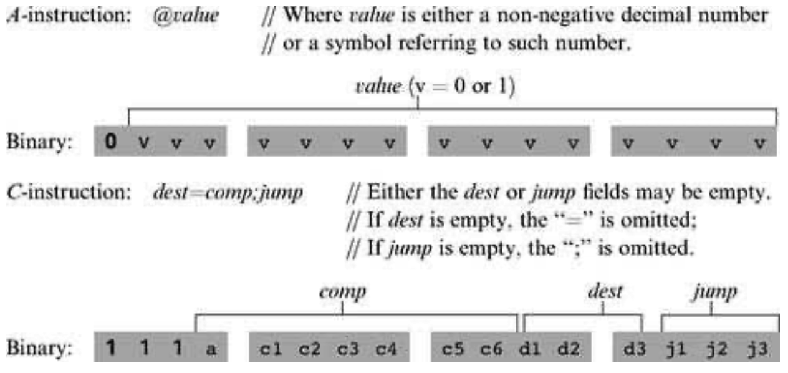
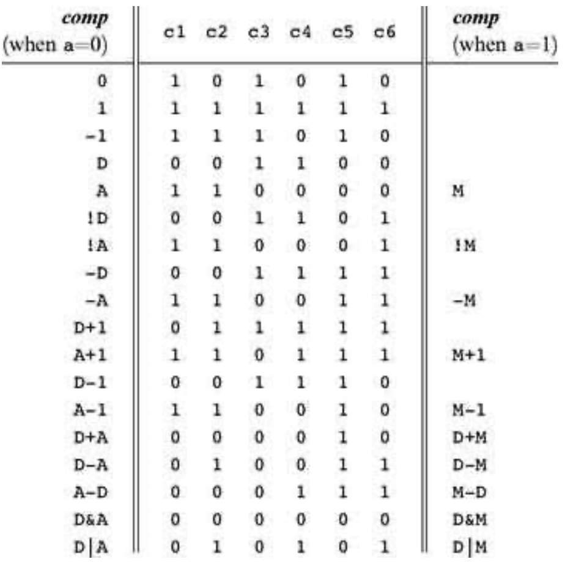
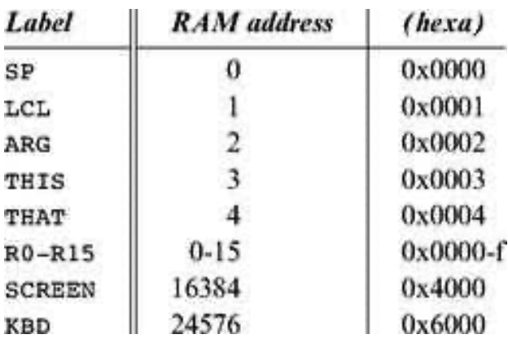
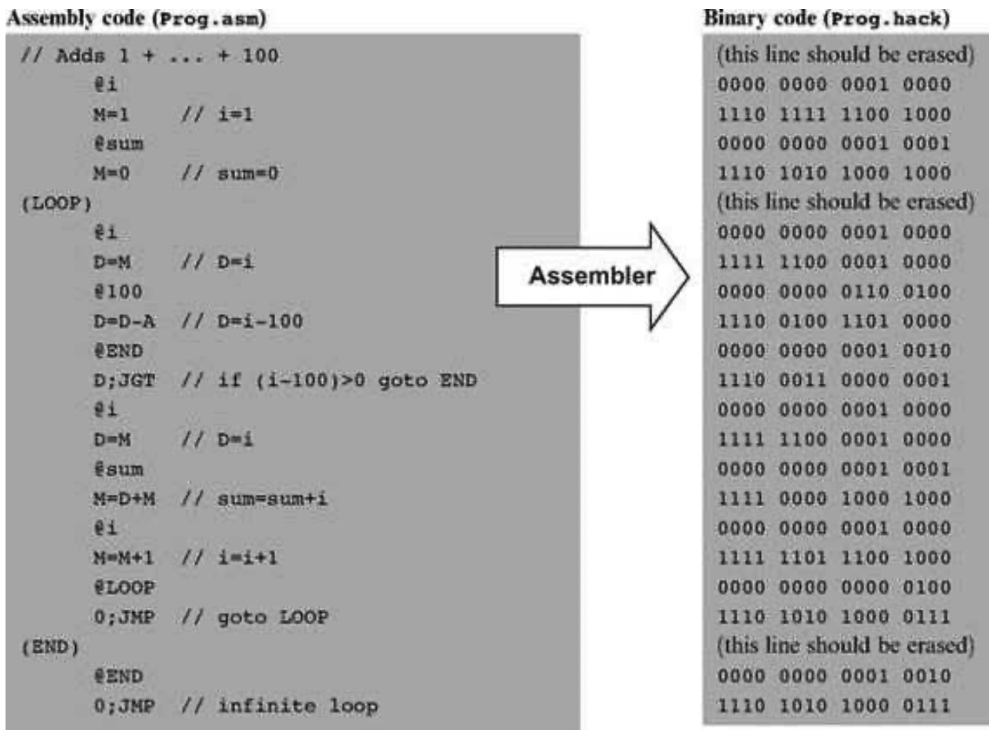

### 6.2 Hack Assembly-to-Binary Translation Specification
---

&emsp;&emsp;The Hack assembly language and its equivalent binary representation were specified in chapter 4. A compact and formal version of this language specification is repeated here, for ease of reference. This specification can be viewed as the contract that Hack assemblers must implement, one way or another.

#### 6.2.1 Syntax Conventions and File Formats

&emsp;&emsp;**File Names** By convention, programs in binary machine code and in assembly code are stored in text files with “hack” and “asm” extensions, respectively. Thus, a Prog.asm file is translated by the assembler into a Prog.hack file.

&emsp;&emsp;**Binary Code (.hack) Files** A binary code file is composed of text lines. Each line is a sequence of 16 “0” and “1” ASCII characters, coding a single 16-bit machine language instruction. Taken together, all the lines in the file represent a machine language program. When a machine language program is loaded into the computer’s instruction memory, the binary code represented by the file’s nth line is stored in address n of the instruction memory (the count of both program lines and memory addresses starts at 0).

&emsp;&emsp;**Assembly Language (.asm) Files** An assembly language file is composed of text lines, each representing either an instruction or a symbol declaration:

  &emsp;&emsp;■ <em>Instruction:</em> an <em>A</em>-instruction or a <em>C</em>-instruction, described in section 6.2.2.

  &emsp;&emsp;■ (Symbol): This pseudo-command binds the Symbol to the memory location into which the next command in the program will be stored. It is called “pseudocommand” since it generates no machine code.

  &emsp;&emsp;(The remaining conventions in this section pertain to assembly programs only.)

&emsp;&emsp;**Constants and Symbols** <em>Constants</em> must be non-negative and are written in decimal notation. A user-defined symbol can be any sequence of letters, digits, underscore (_), dot (.), dollar sign ($), and colon (:) that does not begin with a digit.

&emsp;&emsp;**Comments** Text beginning with two slashes (//) and ending at the end of the line is considered a comment and is ignored.

&emsp;&emsp;**White Space** Space characters are ignored. Empty lines are ignored.

&emsp;&emsp;**Case Conventions** All the assembly mnemonics must be written in uppercase. The rest (user-defined labels and variable names) is case sensitive. The convention is to use uppercase for labels and lowercase for variable names.

#### 6.2.2 Instructions

&emsp;&emsp;The Hack machine language consists of two instruction types called addressing instruction (<em>A</em>-instruction) and compute instruction (<em>C</em>-instruction). The instruction format is as follows.

&emsp;&emsp;The translation of each of the three fields comp, dest, jump to their binary forms is specified in the following three tables.

#### 6.2.3 Symbols

&emsp;&emsp;Hack assembly commands can refer to memory locations (addresses) using either constants or symbols. Symbols in assembly programs arise from three sources.

&emsp;&emsp;**Predefined Symbols** Any Hack assembly program is allowed to use the following predefined symbols.

&emsp;&emsp;Note that each one of the top five RAM locations can be referred to using two predefined symbols. For example, either R2 or ARG can be used to refer to RAM[2].

&emsp;&emsp;**Label Symbols** The pseudo-command (Xxx) defines the symbol Xxx to refer to the instruction memory location holding the next command in the program. A label can be defined only once and can be used anywhere in the assembly program, even before the line in which it is defined.

&emsp;&emsp;**Variable Symbols** Any symbol Xxx appearing in an assembly program that is not predefined and is not defined elsewhere using the (Xxx) command is treated as a variable. Variables are mapped to consecutive memory locations as they are first encountered, starting at RAM address 16 (0x0010).

#### 6.2.4 Example

&emsp;&emsp;Chapter 4 presented a program that sums up the integers 1 to 100. Figure 6.2 repeats this example, showing both its assembly and binary versions.

&emsp;&emsp;**Figure 6.2** Assembly and binary representations of the same program.
