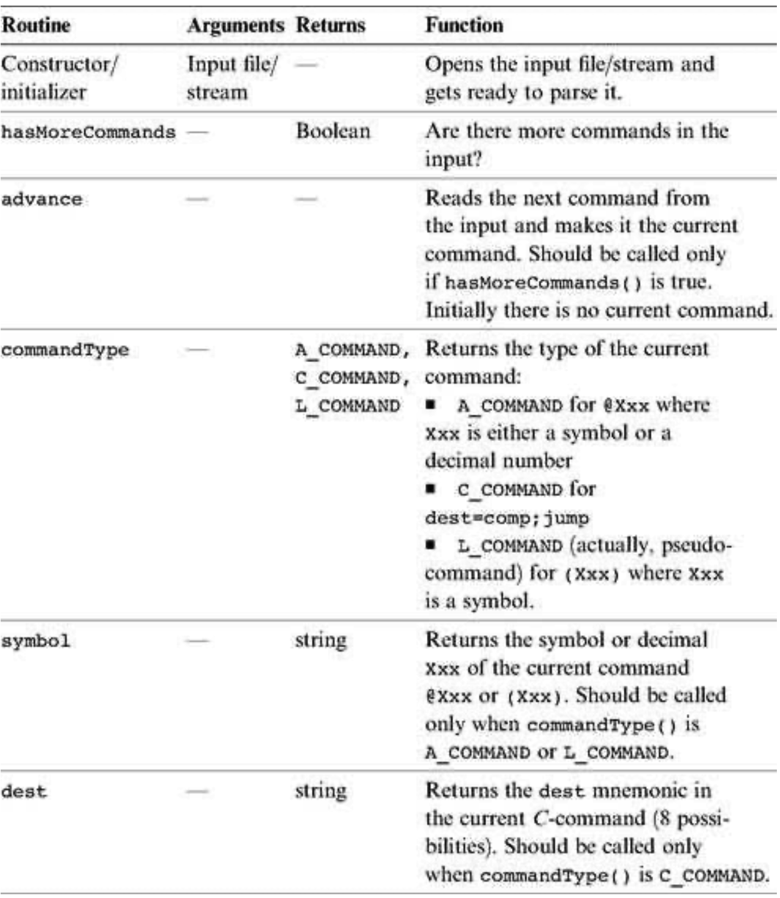
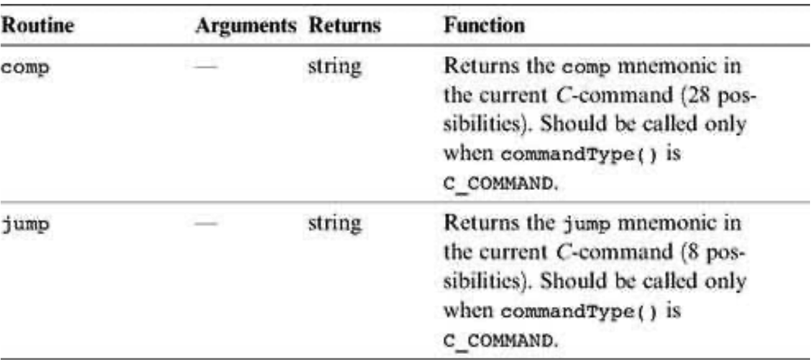
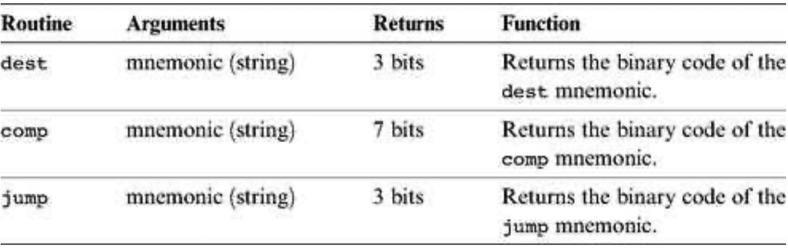
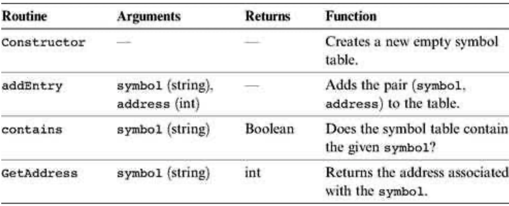

### 6.3 Implementation
---


&emsp;&emsp;The Hack assembler reads as input a text file named Prog.asm, containing a Hack assembly program, and produces as output a text file named Prog.hack, containing the translated Hack machine code. The name of the input file is supplied to the assembler as a command line argument:

```
  prompt> Assembler Prog.asm
```

&emsp;&emsp;The translation of each individual assembly command to its equivalent binary instruction is direct and one-to-one. Each command is translated separately. In particular, each mnemonic component (field) of the assembly command is translated into its corresponding bit code according to the tables in section 6.2.2, and each symbol in the command is resolved to its numeric address as specified in section 6.2.3.

&emsp;&emsp;We propose an assembler implementation based on four modules: a Parser module that parses the input, a <em>Code</em> module that provides the binary codes of all the assembly mnemonics, a <em>SymbolTable</em> module that handles symbols, and a main program that drives the entire translation process.

&emsp;&emsp;**A Note about API Notation** The assembler development is the first in a series of five software construction projects that build our hierarchy of translators (<em>assembler, virtual machine, and compiler</em>). Since readers can develop these projects in the programming language of their choice, we base our proposed implementation guidelines on language independent APIs. A typical project API describes several modules, each containing one or more routines. In object-oriented languages like Java, C++, and C#, a module usually corresponds to a class, and a routine usually corresponds to a method. In procedural languages, routines correspond to functions, subroutines, or procedures, and modules correspond to collections of routines that handle related data. In some languages (e.g., Modula-2) a module may be expressed explicitly, in others implicitly (e.g., a <em>file</em> in the C language), and in others (e.g., Pascal) it will have no corresponding language construct, and will just be a conceptual grouping of routines.


#### 6.3.1 The <em>Parser</em> Module

&emsp;&emsp;The main function of the parser is to break each assembly command into its underlying components (fields and symbols). The API is as follows.

&emsp;&emsp;**Parser:** Encapsulates access to the input code. Reads an assembly language command, parses it, and provides convenient access to the command’s components (fields and symbols). In addition, removes all white space and comments.

<div align="center"></div>

<div align="center"></div>


#### 6.3.2 The <em>Code</em> Module

<div align="center"></div>

&emsp;&emsp;**Code:** Translates Hack assembly language mnemonics into binary codes.


#### 6.3.3 Assembler for Programs with No Symbols

&emsp;&emsp;We suggest building the assembler in two stages. In the first stage, write an assembler that translates assembly programs without symbols. This can be done using the Parser and Code modules just described. In the second stage, extend the assembler with symbol handling capabilities, as we explain in the next section.

&emsp;&emsp;The contract for the first symbol-less stage is that the input Prog.asm program contains no symbols. This means that (a) in all address commands of type @Xxx the Xxx constants are decimal numbers and not symbols, and (b) the input file contains no label commands, namely, no commands of type (Xxx).

&emsp;&emsp;The overall symbol-less assembler program can now be implemented as follows. First, the program opens an output file named Prog.hack. Next, the program marches through the lines (assembly instructions) in the supplied Prog.asm file. For each <em>C</em>-instruction, the program concatenates the translated binary codes of the instruction fields into a single 16-bit word. Next, the program writes this word into the Prog.hack file. For each <em>A</em>-instruction of type @Xxx, the program translates the decimal constant returned by the parser into its binary representation and writes the resulting 16-bit word into the Prog.hack file.


#### 6.3.4 The <em>SymbolTable</em> Module

&emsp;&emsp;Since Hack instructions can contain symbols, the symbols must be resolved into actual addresses as part of the translation process. The assembler deals with this task using a symbol table, designed to create and maintain the correspondence between symbols and their meaning (in Hack’s case, RAM and ROM addresses). A natural data structure for representing such a relationship is the classical hash table. In most programming languages, such a data structure is available as part of a standard library, and thus there is no need to develop it from scratch. We propose the following API.

<div align="center"></div>

&emsp;&emsp;**SymbolTable:** Keeps a correspondence between symbolic labels and numeric addresses.


#### 6.3.5 Assembler for Programs with Symbols

&emsp;&emsp;Assembly programs are allowed to use symbolic labels (destinations of goto commands) before the symbols are defined. This convention makes the life of assembly programmers easier and that of assembler developers harder. A common solution to this complication is to write a two-pass assembler that reads the code twice, from start to end. In the first pass, the assembler builds the symbol table and generates no code. In the second pass, all the label symbols encountered in the program have already been bound to memory locations and recorded in the symbol table. Thus, the assembler can replace each symbol with its corresponding meaning (numeric address) and generate the final binary code.

&emsp;&emsp;Recall that there are three types of symbols in the Hack language: predefined symbols, labels, and variables. The symbol table should contain and handle all these symbols, as follows.

&emsp;&emsp;**Initialization** Initialize the symbol table with all the predefined symbols and their pre-allocated RAM addresses, according to section 6.2.3.

&emsp;&emsp;**First Pass** Go through the entire assembly program, line by line, and build the symbol table without generating any code. As you march through the program lines, keep a running number recording the ROM address into which the current command will be eventually loaded. This number starts at 0 and is incremented by 1 whenever a <em>C</em>-instruction or an <em>A</em>-instruction is encountered, but does not change when a label pseudocommand or a comment is encountered. Each time a pseudocommand (Xxx) is encountered, add a new entry to the symbol table, associating Xxx with the ROM address that will eventually store the next command in the program. This pass results in entering all the program’s labels along with their ROM addresses into the symbol table. The program’s variables are handled in the second pass.

&emsp;&emsp;**Second Pass** Now go again through the entire program, and parse each line. Each time a symbolic A- instruction is encountered, namely, @Xxx where Xxx is a symbol and not a number, look up Xxx in the symbol table. If the symbol is found in the table, replace it with its numeric meaning and complete the command’s translation. If the symbol is not found in the table, then it must represent a new variable. To handle it, add the pair (Xxx, n) to the symbol table, where n is the next available RAM address, and complete the command’s translation. The allocated RAM addresses are consecutive numbers, starting at address 16 (just after the addresses allocated to the predefined symbols).

&emsp;&emsp;This completes the assembler’s implementation.
