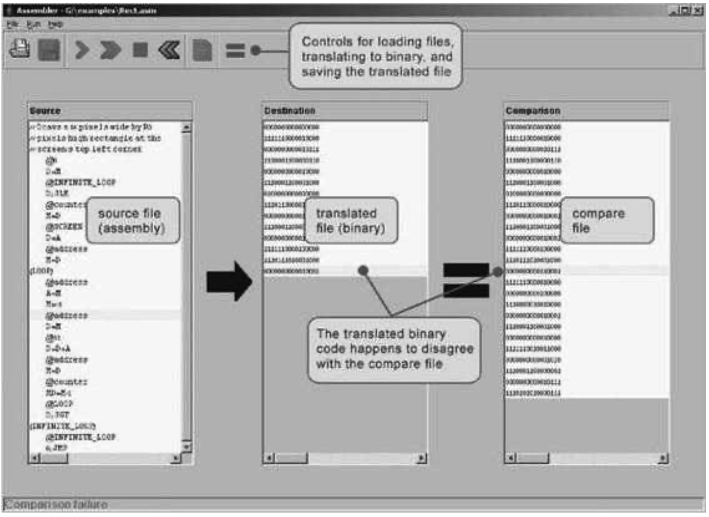

### 6.5 Project
---

&emsp;&emsp;**Objective** Develop an assembler that translates programs written in Hack assembly language into the binary code understood by the Hack hardware platform. The assembler must implement the translation specification described in section 6.2.

&emsp;&emsp;**Resources** The only tool needed for completing this project is the programming language in which you will implement your assembler. You may also find the following two tools useful: the assembler and CPU emulator supplied with the book. These tools allow you to experiment with a working assembler before you set out to build one yourself. In addition, the supplied assembler provides a visual line-by-line translation GUI and allows online code comparisons with the outputs that your assembler will generate. For more information about these capabilities, refer to the assembler tutorial (part of the book’s software suite).

&emsp;&emsp;**Contract** When loaded into your assembler, a Prog.asm file containing a valid Hack assembly language program should be translated into the correct Hack binary code and stored in a Prog.hack file. The output produced by your assembler must be identical to the output produced by the assembler supplied with the book.

&emsp;&emsp;**Building Plan** We suggest building the assembler in two stages. First write a symbol-less assembler, namely, an assembler that can only translate programs that contain no symbols. Then extend your assembler with symbol handling capabilities. The test programs that we supply here come in two such versions (without and with symbols), to help you test your assembler incrementally.

&emsp;&emsp;**Test Programs** Each test program except the first one comes in two versions: ProgL.asm is symbol-less, and Prog.asm is with symbols.

  &emsp;&emsp;<em>Add:</em> Adds the constants 2 and 3 and puts the result in R0.

  &emsp;&emsp;<em>Max:</em> Computes max(R0, R1) and puts the result in R2.

  &emsp;&emsp;<em>Rect:</em> Draws a rectangle at the top left corner of the screen. The rectangle is 16 pixels wide and R0 pixels high.

  &emsp;&emsp;<em>Pong:</em> A single-player Ping-Pong game. A ball bounces constantly off the screen’s “walls.” The player attempts to hit the ball with a bat by pressing the left and right arrow keys. For every successful hit, the player gains one point and the bat shrinks a little to make the game harder. If the player misses the ball, the game is over. To quit the game, press ESC.

&emsp;&emsp;The <em>Pong</em> program was written in the Jack programming language (chapter 9) and translated into the supplied assembly program by the Jack compiler (chapters 10-11). Although the original Jack program is only about 300 lines of code, the executable Pong application is about 20,000 lines of binary code, most of which being the Jack operating system (chapter 12). Running this interactive program in the CPU emulator is a slow affair, so don’t expect a high-powered Pong game. This slowness is actually a virtue, since it enables your eye to track the graphical behavior of the program. In future projects in the book, this game will run much faster.

&emsp;&emsp;**Steps** Write and test your assembler program in the two stages described previously. You may use the assembler supplied with the book to compare the output of your assembler to the correct output. This testing procedure is described next. For more information about the supplied assembler, refer to the assembler tutorial.

&emsp;&emsp;**The Supplied Assembler** The practice of using the supplied assembler (which produces correct binary code) to test another assembler (which is not necessarily correct) is illustrated in figure 6.3. Let Prog.asm be some program written in Hack assembly. Suppose that we translate this program using the supplied assembler, producing a binary file called Prog.hack. Next, we use another assembler (e.g., the one that you wrote) to translate the same program into another file, say Prog1.hack. Now, if the latter assembler is working correctly, it follows that Prog.hack = Prog1.hack. Thus, one way to test a newly written assembler is to load Prog.asm into the supplied assembler program, load Prog1.hack as a compare file, then translate and compare the two binary files (see figure 6.3). If the comparison fails, the assembler that produced Prog1.hack must be buggy; otherwise, it may be error-free.

&emsp;&emsp;**Figure 6.3** Using the supplied assembler to test the code generated by another assembler.
