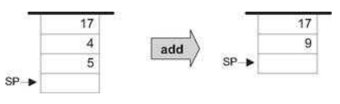

### 7.1 Background
---

#### 7.1.1 The Virtual Machine Paradigm

&emsp;&emsp;Before a high-level program can run on a target computer, it must be translated into the computer’s machine language. This translation—known as <em>compilation</em>—is a rather complex process. Normally, a separate compiler is written specifically for any given pair of high-level language and target machine language. This leads to a proliferation of many different compilers, each depending on every detail of both its source and destination languages. One way to decouple this dependency is to break the overall compilation process into two nearly separate stages. In the first stage, the high-level program is parsed and its commands are translated into intermediate processing steps—steps that are neither “high” nor “low.” In the second stage, the intermediate steps are translated further into the machine language of the target hardware.

&emsp;&emsp;This decomposition is very appealing from a software engineering perspective: The first stage depends only on the specifics of the source high-level language, and the second stage only on the specifics of the target machine language. Of course, the interface between the two compilation stages—the exact definition of the intermediate processing steps—must be carefully designed. In fact, this interface is sufficiently important to merit its own definition as a stand-alone language of an abstract machine. Specifically, one can formulate a virtual machine whose instructions are the intermediate processing steps into which high-level commands are decomposed. The compiler that was formerly a single monolithic program is now split into two separate programs. The first program, still termed compiler, translates the high-level code into intermediate VM instructions, while the second program translates this VM code into the machine language of the target platform.

&emsp;&emsp;This two-stage compilation model has been used—one way or another—in many compiler construction projects. Some developers went as far as defining a formal and stand-alone virtual machine language, most notably the p-code generated by several Pascal compilers in the 1970s. Java compilers are also two-tiered, generating a bytecode language that runs on the JVM virtual machine (also called the Java Runtime <em>Environment</em>). More recently, the approach has been adopted by the .NET infrastructure. In particular, .NET requires compilers to generate code written in an intermediate language (IL) that runs on a virtual machine called CLR (<em>Common</em> Language <em>Runtime</em>).

&emsp;&emsp;Indeed, the notion of an explicit and formal virtual machine language has several practical advantages. First, compilers for different target platforms can be obtained with relative ease by replacing only the virtual machine implementation (sometimes called the compiler’s backend). This, in turn, allows the VM code to become transportable across different hardware platforms, permitting a range of implementation trade-offs among code efficiency, hardware cost, and programming effort. Second, compilers for many languages can share the same VM backend, allowing code sharing and language interoperability. For example, one high-level language may be good at scientific calculations, while another may excel in handling the user interface. If both languages compile into a common VM layer, it is rather natural to have routines in one language call routines in the other, using an agreed-upon invocation syntax.

&emsp;&emsp;Another benefit of the virtual machine approach is modularity. Every improvement in the efficiency of the VM implementation is immediately inherited by all the compilers above it. Likewise, every new digital device or appliance that is equipped with a VM implementation can immediately benefit from a huge base of available software, as seen in figure 7.1.

#### 7.1.2 The Stack Machine Model

&emsp;&emsp;Like most programming languages, the VM language consists of arithmetic, memory access, programflow, and subroutine calling operations. There are several possible software paradigms on which to base such a language implementation. One of the key questions regarding this choice is where will the operands and the results of the <em>VM operations reside</em>? Perhaps the cleanest solution is to put them on a stack data structure.

&emsp;&emsp;In a <em>stack machine</em> model, arithmetic commands pop their operands from the top of the stack and push their results back onto the top of the stack. Other commands transfer data items from the stack’s top to designated memory locations, and vice versa. As it turns out, these simple stack operations can be used to implement the evaluation of any arithmetic or logical expression. Further, any program, written in any programming language, can be translated into an equivalent stack machine program. One such stack machine model is used in the Java Virtual Machine as well as in the VM described and built in what follows.

&emsp;&emsp;**Elementary Stack Operations** A stack is an abstract data structure that supports two basic operations: push and pop. The push operation adds an element to the top of the stack; the element that was previously on top is pushed below the newly added element. The pop operation retrieves and removes the top element; the element just below it moves up to the top position. Thus the stack implements a last-in-firstout (LIFO) storage model, illustrated in figure 7.2.

&emsp;&emsp;We see that stack access differs from conventional memory access in several respects. First, the stack is accessible only from the top, one item at a time. Second, reading the stack is a lossy operation: The only way to retrieve the top value is to remove it from the stack. In contrast, the act of reading a value from a regular memory location has no impact on the memory’s state. Finally, writing an item onto the stack adds it to the stack’s top, without changing the rest of the stack. In contrast, writing an item into a regular memory location is a lossy operation, since it overrides the location’s previous value.

&emsp;&emsp;The stack data structure can be implemented in several different ways. The simplest approach is to keep an array, say stack, and a stack pointer variable, say sp, that points to the available location just above the topmost element. The <em>push x</em> command is then implemented by storing x at the array entry pointed by <em>sp</em> and then incrementing <em>sp</em> (i.e., stack [sp]=x; sp=sp+1). The <em>pop</em> operation is implemented by first decrementing <em>sp</em> and then returning the value stored in the top position (i.e., sp=sp-1; return stack [sp]).

&emsp;&emsp;**Figure 7.1** The virtual machine paradigm. Once a high-level program is compiled into VM code, the program can run on any hardware platform equipped with a suitable VM implementation. In this chapter we start building the <em>VM implementation on the Hack platform</em> and use a VM emulator like the one depicted on the right.

&emsp;&emsp;**Figure 7.2** Stack processing example, illustrating the two elementary operations <em>push</em> and <em>pop</em>. Following convention, the stack is drawn upside down, as if it grows downward. The location just after the top position is always referred to by a special pointer called sp, or <em>stack pointer</em>. The labels <em>a</em> and <em>b</em> refer to two arbitrary memory addresses.

&emsp;&emsp;As usual in computer science, simplicity and elegance imply power of expression. The simple stack model is a versatile data structure that comes to play in many computer systems and algorithms. In the virtual machine architecture that we build here, it serves two key purposes. First, it is used for handling all the arithmetic and logical operations of the VM. Second, it facilitates subroutine calls and the associated memory allocation—the subjects of the next chapter.

&emsp;&emsp;**Stack Arithmetic** Stack-based arithmetic is a simple matter: the operands are popped from the stack, the required operation is performed on them, and the result is pushed back onto the stack. For example, here is how addition is handled:

&emsp;&emsp;The stack version of other operations (subtract, multiply, etc.) are precisely the same. For example, consider the expression d=(2-x)*(y+5), taken from some high-level program. The stack-based evaluation of this expression is shown in figure 7.3.

&emsp;&emsp;Stack-based evaluation of Boolean expressions has precisely the same flavor. For example, consider the high-level command if (x<7) or (y=8) then.... The stack-based evaluation of this expression is shown in figure 7.4.

&emsp;&emsp;The previous examples illustrate a general observation: any arithmetic and Boolean expression—no matter how complex—can be systematically converted into, and evaluated by, a sequence of simple operations on a stack. Thus, one can write a compiler that translates high-level arithmetic and Boolean expressions into sequences of stack commands, as we will do in chapters 10-11. We now turn to specify these commands (section 7.2), and describe their implementation on the Hack platform(section 7.3).
