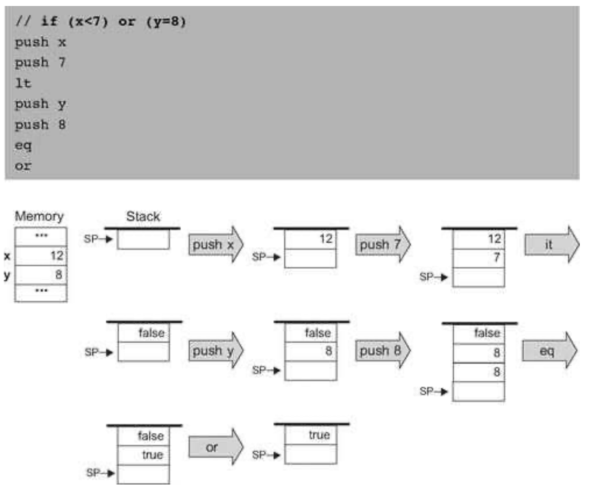
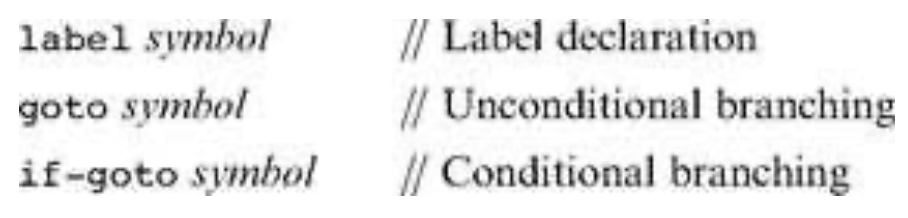
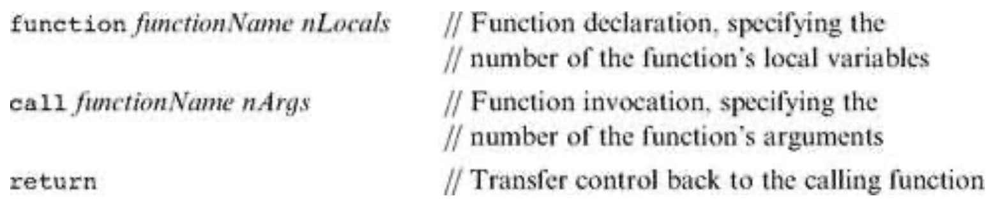
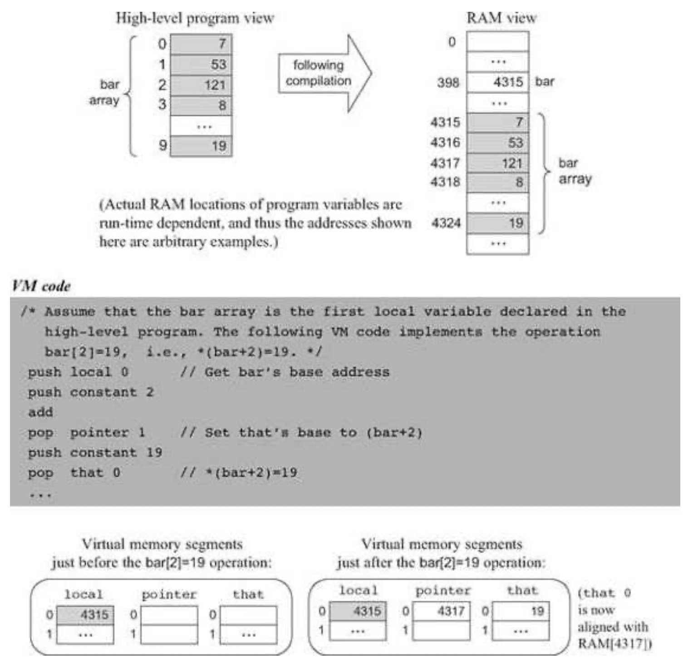

### 7.2 VM Specification, Part I
---

#### 7.2.1 General

&emsp;&emsp;The virtual machine is stack-based: all operations are done on a stack. It is also function-based: a complete VM program is organized in program units called functions, written in the VM language. Each function has its own stand-alone code and is separately handled. The VM language has a single 16-bit data type that can be used as an integer, a Boolean, or a pointer. The language consists of four types of commands:

  &emsp;&emsp;■ <em>Arithmetic commands</em> performarithmetic and logical operations on the stack

  &emsp;&emsp;■ <em>Memory access commands</em> transfer data between the stack and virtual memory segments.

  &emsp;&emsp;■ <em>Program flow commands</em> facilitate conditional and unconditional branching operations.

  &emsp;&emsp;■ <em>Function calling commands</em> call functions and return fromthem.

&emsp;&emsp;**Figure 7.3** Stack-based evaluation of arithmetic expressions. This example evaluates the expression d = (2 - x) * (y + 5), assuming the initial memory state x = 5, y = 9.

&emsp;&emsp;**Figure 7.4** Stack-based evaluation of logical expressions. This example evaluates the Boolean expression (x < 7) or (y = 8), assuming the initial memory state x = 12, y = 8.

&emsp;&emsp;Building a virtual machine is a complex undertaking, and so we divide it into two stages. In this chapter we specify the <em>arithmetic</em> and <em>memory access</em> commands and build a basic VM translator that implements them only. The next chapter specifies the program flow and function calling commands and extends the basic translator into a full-scale virtual machine implementation.

&emsp;&emsp;**Program and Command Structure** A VM <em>program</em> is a collection of one or more files with a .vm extension, each consisting of one or more functions. From a compilation standpoint, these constructs correspond, respectively, to the notions of <em>program</em>, <em>class</em>, and <em>method</em> in an object-oriented language.

&emsp;&emsp;Within a .vm file, each VM <em>command<em></em> appears in a separate line, and in one of the following formats: command (e.g., add), <em>command arg</em> (e.g., goto loop), or command <em>arg1 arg2</em> (e.g., push local 3). The arguments are separated from each other and from the <em>command</em> part by an arbitrary number of spaces. “//” comments can appear at the end of any line and are ignored. Blank lines are permitted and ignored.

#### 7.2.2 Arithmetic and Logical Commands

&emsp;&emsp;The VM language features nine stack-oriented arithmetic and logical commands. Seven of these commands are binary: They pop two items off the stack, compute a binary function on them, and push the result back onto the stack. The remaining two commands are unary: they pop a single item off the stack, compute a unary function on it, and push the result back onto the stack. We see that each command has the net impact of replacing its operand(s) with the command’s result, without affecting the rest of the stack. Figure 7.5 gives the details.

&emsp;&emsp;Three of the commands listed in figure 7.5 (eq, gt, lt) return Boolean values. The VM represents <em>true</em> and <em>false</em> as -1 (minus one, 0xFFFF) and 0 (zero, 0x0000), respectively.

#### 7.2.3 Memory Access Command

&emsp;&emsp;So far in the chapter, memory access commands were illustrated using the pseudo-commands <em>pop</em> and <em>push x</em>, where the symbol x referred to an individual location in some global memory. Yet formally, our VM manipulates eight separate virtual memory segments, listed in figure 7.6.

&emsp;&emsp;**Figure 7.5** Arithmetic and logical stack commands.

&emsp;&emsp;**Memory Access Commands** All the memory segments are accessed by the same two commands:
  * push <em>segment index</em> Push the value of segment[index] onto the stack.
  * pop <em>segment index</em> Pop the top stack value and store it in segment[index].

&emsp;&emsp;**Figure 7.6** The memory segments seen by every VM function.

&emsp;&emsp;**Figure 7.7** The virtual memory segments are maintained by the VM implementation.

&emsp;&emsp;Where segment is one of the eight segment names and index is a non-negative integer. For example, push argument 2 followed by pop local 1 will store the value of the function’s third argument in the function’s second local variable (each segment’s index starts at 0).

&emsp;&emsp;The relationship among VM files, VM functions, and their respective virtual memory segments is depicted in figure 7.7.

&emsp;&emsp;In addition to the eight memory segments, which are managed explicitly by VM push and pop commands, the VM implementation manages two implicit data structures called <em>stack</em> and <em>heap</em>. These data structures are never mentioned directly, but their states change in the background, as a side effect of VM commands.

&emsp;&emsp;**The Stack** Consider the commands sequence push argument 2 and pop local 1, mentioned before. The working memory of such VM operations is the stack. The data value did not simply jump from one segment to another—it went through the stack. Yet in spite of its central role in the VM architecture, the stack proper is never mentioned in the VM language.

&emsp;&emsp;**The Heap** Another memory element that exists in the VM’s background is the <em>heap</em>. The heap is the name of the RAM area dedicated for storing objects and arrays data. These objects and arrays can be manipulated by VM commands, as we will see shortly.

#### 7.2.4 Program Flow and Function Calling Commands

&emsp;&emsp;The VM features six additional commands that are discussed at length in the next chapter. For completeness, these commands are listed here.

&emsp;&emsp;**Program Flow Commands**

&emsp;&emsp;**Function Calling Commands**

&emsp;&emsp;(In this list of commands, <em>function Name</em> is a symbol and <em>nLocals</em> and <em>nArgs</em> are non-negative integers.)

#### 7.2.5 Program Elements in the Jack-VM-Hack Platform

&emsp;&emsp;We end the first part of the VM specification with a top-down view of all the program elements that emerge from the full compilation of a typical high-level program. At the top of figure 7.8 we see a Jack program, consisting of two classes (Jack, a simple Java-like language, is described in chapter 9). Each Jack class consists of one or more methods. When the Jack compiler is applied to a directory that includes n class files, it produces n VM files (in the same directory). Each Jack method xxx within a class Yyy is translated into one <em>VM function</em> called Yyy.xxx within the corresponding VM file.

&emsp;&emsp;**Figure 7.8** Program elements in the Jack-VM-Hack platform.

&emsp;&emsp;Next, the figure shows how the <em>VM translator</em> can be applied to the directory in which the VM files reside, generating a single assembly program. This assembly program does two main things. First, it emulates the virtual memory segments of each VM function and file, as well as the implicit stack. Second, it effects the VM commands on the target platform. This is done by manipulating the emulated VM data structures using machine language instructions—those translated from the VM commands. If all works well, that is, if the compiler and the VM translator and the assembler are implemented correctly, the target platform will end up effecting the behavior mandated by the original Jack program.

#### 7.2.6 VM Programming Examples

&emsp;&emsp;We end this section by illustrating how the VM abstraction can be used to express typical programming tasks found in high-level programs. We give three examples: (i) a typical arithmetic task, (ii) typical array handling, and (iii) typical object handling. These examples are irrelevant to the VM implementation, and in fact the entire section 7.2.6 can be skipped without losing the thread of the chapter.

&emsp;&emsp;The main purpose of this section is to illustrate how the compiler developed in chapters 10-11 will use the VM abstraction to translate high-level programs into VM code. Indeed, VM programs are rarely written by human programmers, but rather by compilers. Therefore, it is instructive to begin each example with a high-level code fragment, then show its equivalent representation using VM code. We use a C-style syntax for all the high-level examples.

&emsp;&emsp;**A Typical Arithmetic Task** Consider the multiplication algorithm shown at the top of figure 7.9. How should we (or more likely, the compiler) express this algorithm in the VM language? First, high-level structures like for and while must be rewritten using the VM’s simple “goto logic.” In a similar fashion, high-level arithmetic and Boolean operations must be expressed using stack-oriented commands. The resulting code is shown in figure 7.9. (The exact semantics of the VM commands function, label, goto, if- goto, and return are described in chapter 8, but their intuitive meaning is self-explanatory.)

&emsp;&emsp;Let us focus on the virtual segments depicted at the bottom of figure 7.9. We see that when a VM function starts running, it assumes that (i) the stack is empty, (ii) the argument values on which it is supposed to operate are located in the argument segment, and (iii) the local variables that it is supposed to use are initialized to 0 and located in the local segment.

&emsp;&emsp;Let us now focus on the VM representation of the algorithm. Recall that VM commands cannot use symbolic argument and variable names—they are limited to making 〈<em>segment index</em>〉 references only. However, the translation from the former to the latter is straightforward. All we have to do is map x, y, sum and j on argument 0, argument 1, local 0 and local 1, respectively, and replace all their symbolic occurrences in the pseudo code with corresponding 〈<em>segment index</em>〉 references.

&emsp;&emsp;To sum up, when a VM function starts running, it assumes that it is surrounded by a private world, all of its own, consisting of initialized argument and local segments and an empty stack, waiting to be manipulated by its commands. The agent responsible for staging this virtual worldview for every VM function just before it starts running is the VM implementation, as we will see in the next chapter.

&emsp;&emsp;**Figure 7.9** VM programming example.

&emsp;&emsp;**Array Handling** An array is an indexed collection of objects. Suppose that a high-level program has created an array of ten integers called bar and filled it with some ten numbers. Let us assume that the array’s base has been mapped (behind the scene) on RAM address 4315. Suppose now that the high-level program wants to execute the command bar[2]=19. How can we implement this operation at the VM level?

&emsp;&emsp;In the C language, such an operation can be also specified as *(bar+2)=19, meaning “set the RAM
location whose address is (bar+2) to 19.” As shown in figure 7.10, this operation lends itself perfectly well to the VM language.

&emsp;&emsp;It remains to be seen, of course, how a high-level command like bar [2]= 19 is translated in the first place into the VM code shown in figure 7.10. This transformation is described in section 11.1.1, when we discuss the code generation features of the compiler.

&emsp;&emsp;**Object Handling** High-level programmers view objects as entities that encapsulate data (organized as <em>fields</em>, or <em>properties</em>) and relevant code (organized as <em>methods</em>). Yet physically speaking, the data of each object instance is serialized on the RAM as a list of numbers representing the object’s field values. Thus the low-level handling of objects is quite similar to that of arrays.

&emsp;&emsp;For example, consider an animation program designed to juggle some balls on the screen. Suppose that each Ball object is characterized by the integer fields x, y, radius, and color. Let us assume that the program has created one such Ball object and called it b. What will be the internal representation of this object in the computer?

&emsp;&emsp;Like all other object instances, it will be stored in the RAM. In particular, whenever a program creates a new object, the compiler computes the object’s size in terms of words and the operating system finds and allocates enough RAM space to store it (the exact details of this operation are discussed in chapter 11). For now, let us assume that our b object has been allocated RAM addresses 3012 to 3015, as shown in figure 7.11.

&emsp;&emsp;**Figure 7.10** VM-based array manipulation using the pointer and that segments.

&emsp;&emsp;Suppose now that a certain method in the high-level program, say resize, takes a Ball object and an integer r as arguments, and, among other things, sets the ball’s radius to r. The VM representation of this logic is shown in figure 7.11.

&emsp;&emsp;When we set pointer 0 to the value of argument 0, we are effectively setting the base of the virtual this segment to the object’s base address. From this point on, VM commands can access any field in the object using the virtual memory segment this and an index relative to the object’s base-address in memory.

&emsp;&emsp;But how did the compiler translate b.radius=17 into the VM code shown in figure 7.11? And how did the compiler know that the radius field of the object corresponds to the third field in its actual representation? We return to these questions in section 11.1.1, when we discuss the code generation features of the compiler.
