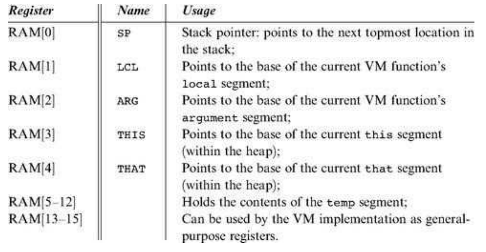
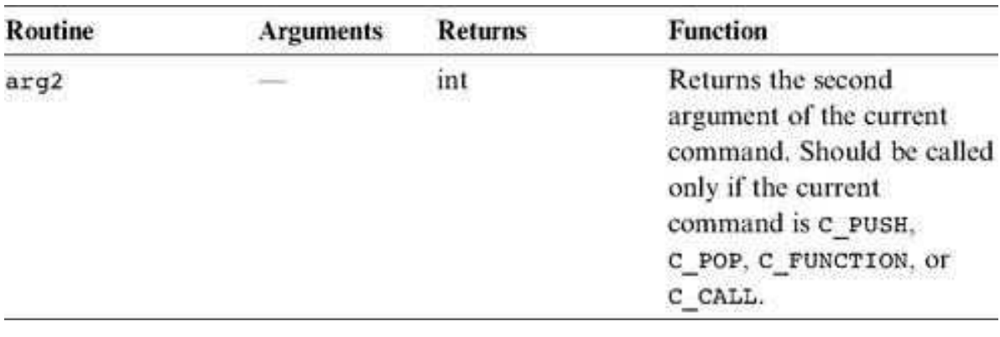

### 7.3 Implementation
---


&emsp;&emsp;The virtual machine that was described up to this point is an abstract artifact. If we want to use it for real, we must implement it on a real platform. Building such a VM implementation consists of two conceptual tasks. First, we have to emulate the VM world on the target platform. In particular, each data structure mentioned in the VM specification, namely, the stack and the virtual memory segments, must be represented in some way by the target platform. Second, each VM command must be translated into a series of instructions that effect the command’s semantics on the target platform.

&emsp;&emsp;This section describes how to implement the VM specification (section 7.2) on the Hack platform. We start by defining a “standard mapping” from VM elements and operations to the Hack hardware and machine language. Next, we suggest guidelines for designing the software that achieves this mapping. In what follows, we will refer to this software using the terms <em>VM</em> implementation or <em>VM</em> translator interchangeably.


#### 7.3.1 Standard VM Mapping on the Hack Platform, Part I

&emsp;&emsp;If you reread the virtual machine specification given so far, you will realize that it contains no assumption whatsoever about the architecture on which the VM can be implemented. When it comes to virtual machines, this platform independence is the whole point: You don’t want to commit to any one hardware platform, since you want your machine to potentially run on all of them, including those that were not built yet.

&emsp;&emsp;It follows that the VM designer can principally let programmers implement the VM on target platforms in any way they see fit. However, it is usually recommended that some guidelines be provided as to how the VM should map on the target platform, rather than leaving these decisions completely to the implementer’s discretion. These guidelines, called standard mapping, are provided for two reasons. First, they entail a public contract that regulates how VM-based programs can interact with programs produced by compilers that don’t use this VM (e.g., compilers that produce binary code directly). Second, we wish to allow the developers of the VM implementation to run standardized tests, namely, tests that conform to the standard mapping. This way, the tests and the software can be written by different people, which is always recommended. With that in mind, the remainder of this section specifies the standard mapping of the VM on a familiar hardware platform: the Hack computer.

&emsp;&emsp;**VM to Hack Translation** Recall that a VM program is a collection of one or more .vm files, each containing one or more VM functions, each being a sequence of VM commands. The VM translator takes a collection of .vm files as input and produces a single Hack assembly language .asm file as output (see figure 7.7). Each VM command is translated by the VM translator into Hack assembly code. The order of the functions within the .vm files does not matter.

&emsp;&emsp;**RAM Usage** The data memory of the Hack computer consists of 32K 16-bit words. The first 16K serve as general-purpose RAM. The next 16K contain memory maps of I/O devices. The VM implementation should use this space as follows:

<div align="center"></div>

&emsp;&emsp;Recall that according to the Hack Machine Language Specification, RAM addresses 0 to 15 can be referred to by any assembly program using the symbols R0 to R15, respectively. In addition, the specification states that assembly programs can refer to RAM addresses 0 to 4 (i.e., R0 to R4) using the symbols SP, LCL, ARG, THIS, and THAT. This convention was introduced into the assembly language with foresight, in order to promote readable VM implementations. The expected use of these registers in the VM context is described as follows:

<div align="center"></div>

&emsp;&emsp;**Memory Segments Mapping**

&emsp;&emsp;local, argument, this, that: Each one of these segments is mapped directly on the RAM, and its location is maintained by keeping its physical base address in a dedicated register (LCL, ARG, THIS, and THAT, respectively). Thus any access to the ith entry of any one of these segments should be translated to assembly code that accesses address (base + i) in the RAM, where base is the current value stored in the register dedicated to the respective segment.

&emsp;&emsp;pointer, temp: These segments are each mapped directly onto a fixed area in the RAM. The pointer segment is mapped on RAM locations 3-4 (also called THIS and THAT) and the temp segment on locations 5-12 (also called R5, R6,..., R12). Thus access to pointer i should be translated to assembly code that accesses RAM location 3 + i, and access to temp i should be translated to assembly code that accesses RAM location 5 + i.

&emsp;&emsp;constant: This segment is truly virtual, as it does not occupy any physical space on the target architecture. Instead, the VM implementation handles any VM access to 〈constant i〉 by simply supplying the constant i.

&emsp;&emsp;static: According to the Hack machine language specification, when a new symbol is encountered for the first time in an assembly program, the assembler allocates a new RAM address to it, starting at address 16. This convention can be exploited to represent each static variable number j in a VM file f as the assembly language symbol f.j. For example, suppose that the file Xxx.vm contains the command push static 3. This command can be translated to the Hack assembly commands@Xxx.3 and D=M, followed by
additional assembly code that pushes D’s value to the stack. This implementation of the static segment is
somewhat tricky, but it works.

&emsp;&emsp;**Assembly Language Symbols** We recap all the assembly language symbols used by VM implementation that conform to the standard mapping.

<div align="center"></div>


#### 7.3.2 Design Suggestion for the VM Implementation

&emsp;&emsp;The VM translator should accept a single command line parameter, as follows:

```
prompt> VMtranslator source
```

&emsp;&emsp;Where <em>source</em> is either a file name of the form Xxx.vm(the extension is mandatory) or a directory name containing one or more .vm files (in which case there is no extension). The result of the translation is always a single assembly language file named Xxx.asm, created in the same directory as the input Xxx. The translated code must conform to the standard VM mapping on the Hack platform.


#### 7.3.3 Program Structure

&emsp;&emsp;We propose implementing the VM translator using a main program and two modules: <em>parser</em> and <em>code writer</em>.

&emsp;&emsp;**The <em>Parser</em> Module**

&emsp;&emsp;**Parser:** Handles the parsing of a single .vm file, and encapsulates access to the input code. It reads VM commands, parses them, and provides convenient access to their components. In addition, it removes all white space and comments.

<div align="center"></div>

<div align="center"></div>

&emsp;&emsp;The <em>Code Writer</em> Module

&emsp;&emsp;**CodeWriter:** Translates VM commands into Hack assembly code.

<div align="center"></div>

&emsp;&emsp;**Main Program** The main program should construct a Parser to parse the VM input file and a CodeWriter to generate code into the corresponding output file. It should then march through the VM commands in the input file and generate assembly code for each one of them.

&emsp;&emsp;If the program’s argument is a directory name rather than a file name, the main program should process all the .vm files in this directory. In doing so, it should use a separate Parser for handling each input file and a single CodeWriter for handling the output.
