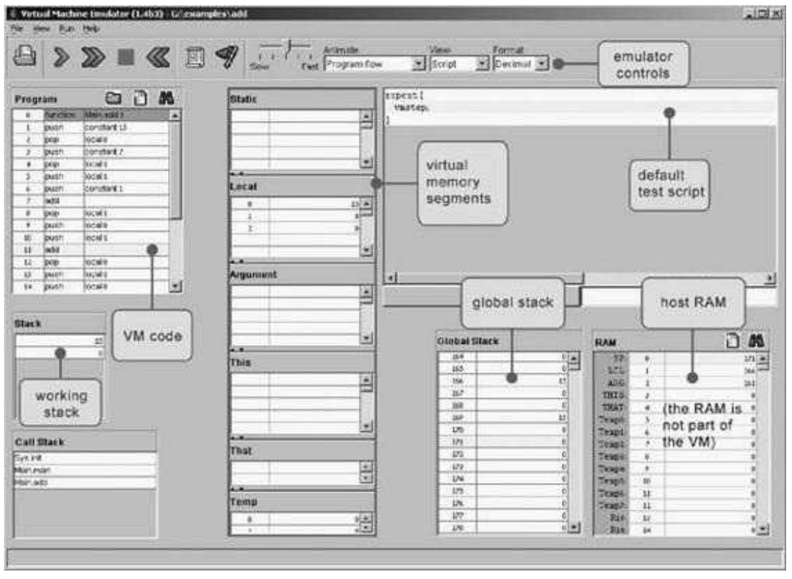

### 7.5 Project
---

&emsp;&emsp;This section describes how to build the VM translator presented in the chapter. In the next chapter we will extend this basic translator with additional functionality, leading to a full-scale VM implementation. Before you get started, two comments are in order. First, section 7.2.6 is irrelevant to this project. Second, since the VM translator is designed to generate Hack assembly code, it is recommended to refresh your memory about the Hack assembly language rules (section 4.2).

&emsp;&emsp;**Objective** Build the first part of the VM translator (the second part is implemented in Project 8), focusing on the implementation of the stack arithmetic and memory access commands of the VM language.

&emsp;&emsp;**Resources** You will need two tools: the programming language in which you will implement your VM translator, and the CPU emulator supplied with the book. This emulator will allow you to execute the machine code generated by your VM translator—an indirect way to test the correctness of the latter. Another tool that may come in handy in this project is the visual VM emulator supplied with the book. This program allows experimenting with a working VM implementation before you set out to build one yourself. For more information about this tool, refer to the VM emulator tutorial.

&emsp;&emsp;**Contract** Write a VM-to-Hack translator, conforming to the VM Specification, Part I (section 7.2) and to the Standard VM Mapping on the Hack Platform, Part I (section 7.3.1). Use it to translate the test VM programs supplied here, yielding corresponding programs written in the Hack assembly language. When executed on the supplied CPU emulator, the assembly programs generated by your translator should deliver the results mandated by the supplied test scripts and compare files.

&emsp;&emsp;**Proposed Implementation Stages**

&emsp;&emsp;We recommend building the translator in two stages. This will allow you to unit-test your implementation incrementally, using the test programs supplied here.

&emsp;&emsp;**Stage I: Stack Arithmetic Commands** The first version of your VM translator should implement the nine stack arithmetic and logical commands of the VM language as well as the push constant x command (which, among other things, will help in testing the nine former commands). Note that the latter is the generic push command for the special case where the first argument is constant and the second argument is some decimal constant.

&emsp;&emsp;**Stage II: Memory Access Commands** The next version of your translator should include a full implementation of the VM language’s push and pop commands, handling all eight memory segments. We suggest breaking this stage into the following substages:
  1. You have already handled the constant segment.
  2. Next, handle the segments local, argument, this, and that.
  3. Next, handle the pointer and temp segments, in particular allowing modification of the bases of the this and that segments.
  3. Finally, handle the static segment

&emsp;&emsp;**Test Programs**

&emsp;&emsp;The five VM programs listed here are designed to unit-test the proposed implementation stages just described.

&emsp;&emsp;**Stage I: Stack Arithmetic**

  &emsp;&emsp;■ SimpleAdd: Pushes and adds two constants

  &emsp;&emsp;■ StackTest: Executes a sequence of arithmetic and logical operations on the stack.

&emsp;&emsp;**Stage II: Memory Access**

  &emsp;&emsp;■ BasicTest: Executes pop and push operations using the virtual memory segments.

  &emsp;&emsp;■ PointerTest: Executes pop and push operations using the pointer, this, and that segments.

  &emsp;&emsp;■ StaticTest: Executes pop and push operations using the static segment.

  &emsp;&emsp;For each program Xxx we supply four files, beginning with the program’s code in Xxx.vm. The XxxVME.tst script allows running the program on the supplied VM emulator, so that you can gain familiarity with the program’s intended operation. After translating the program using your VM translator, the supplied Xxx.tst and Xxx.cmp scripts allow testing the translated assembly code on the CPU emulator

&emsp;&emsp;**Tips**

&emsp;&emsp;**Initialization** In order for any translated VM program to start running, it must include a preamble startup code that forces the VM implementation to start executing it on the host platform. In addition, in order for any VM code to operate properly, the VM implementation must anchor the base addresses of the virtual segments in selected RAM locations. Both issues—startup code and segments initializations—are implemented in the next project. The difficulty of course is that we need these initializations in place in order to execute the test programs given in this project. The good news is that you should not worry about these issues at all, since the supplied test scripts carry out all the necessary initializations in a manual fashion (for the purpose of this project only).

&emsp;&emsp;**Testing/Debugging** For each one of the five test programs, follow these steps:
  1. Run the Xxx.vm program on the supplied VM emulator, using the XxxVME.tst test script, to get acquainted with the intended program’s behavior.
  2. Use your partial translator to translate the .vm file. The result should be a text file containing a translated .asm program, written in the Hack assembly language.
  3. Inspect the translated .asm program. If there are visible syntax (or any other) errors, debug and fix you translator.
  4. Use the supplied .tst and .cmp files to run your translated .asm program on the CPU emulator. If there are run-time errors, debug and fix your translator.

&emsp;&emsp;The supplied test programs were carefully planned to test the specific features of each stage in your VM implementation. Therefore, it’s important to implement your translator in the proposed order and to test it using the appropriate test programs at each stage. Implementing a later stage before an early one may cause the test programs to fail.

&emsp;&emsp;**Figure 7.12** The VM emulator supplied with the book.

&emsp;&emsp;**Tools**

&emsp;&emsp;**The VM Emulator** The book’s software suite includes a Java-based VM implementation. This VM emulator allows executing VM programs directly, without having to translate them first into machine language. This practice enables experimentation with the VM environment before you set out to implement one yourself. Figure 7.12 is a typical screen shot of the VM emulator in action.
