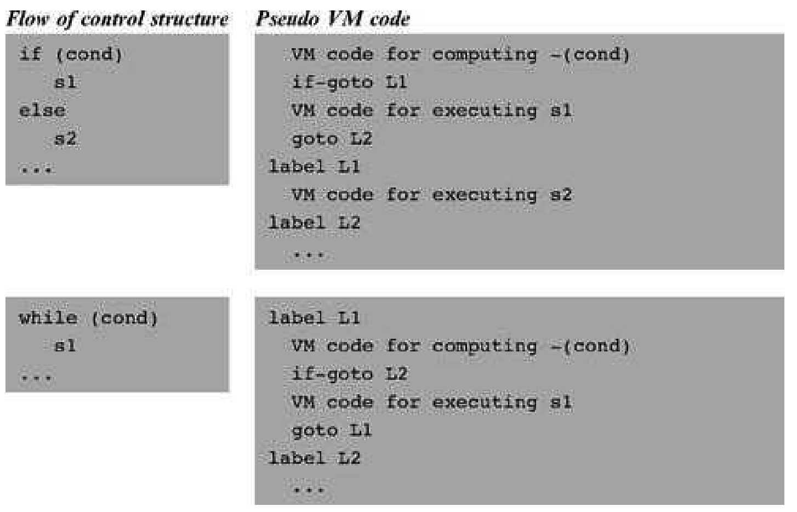
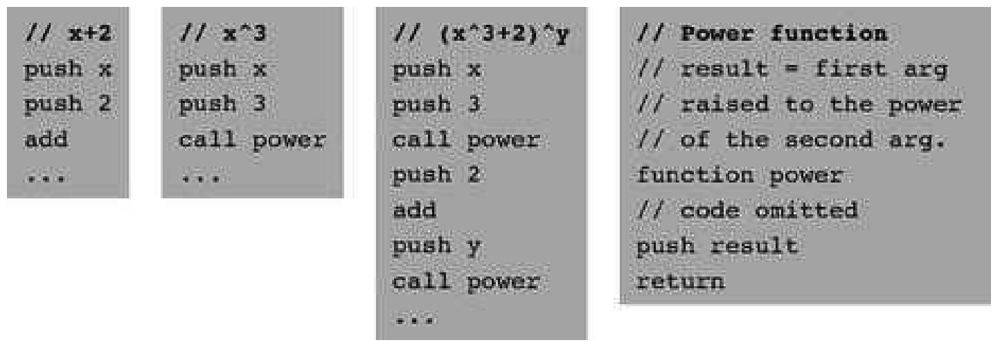

### 8.1 Background
---

&emsp;&emsp;High-level languages allow writing programs in high-level terms. For example,  can be expressed as x=-b+sqrt(power(b,2)-4&ast;a&ast;c), which is almost as descriptive as the real thing. High-level languages support this power of expression through three conventions. First, one is allowed to freely define high-level operations like sqrt and power, as needed. Second, one is allowed to freely use (call) these subroutines as if they were elementary operations like + and &ast;. Third, one is allowed to assume that each called subroutine will get executed—somehow—and that following its termination control will return—somehow—to the next command in one’s code. Flow of control commands take this freedom one step further, allowing writing, say, if ~(a=0) {x=(-b+sqrt(power(b,2)-4&ast;a&ast;c))/ (2&ast;a)} else {x=-c/b}.

&emsp;&emsp;The ability to compose such expressions freely permits us to write abstract code, closer to the world of algorithmic thought than to that of machine execution. Of course the more abstract the high level, the more work we have to do at the low level. In particular, the low level must manage the delicate interplay between the calling subroutine (the caller) and the called subroutines—the program units that implement system- and user-defined operations like sqrt and power. For each subroutine call during runtime, the low level must handle the following details behind the scene:

  &emsp;&emsp;• Passing parameters fromthe caller to the called subroutine

  &emsp;&emsp;• Saving the state of the caller before switching to execute the called subroutine

  &emsp;&emsp;• Allocating space for the local variables of the called subroutine

  &emsp;&emsp;• Jumping to execute the called subroutine

  &emsp;&emsp;• Returning values fromthe called subroutine back to the caller

  &emsp;&emsp;• Recycling the memory space occupied by the called subroutine, when it returns

  &emsp;&emsp;• Reinstating the state of the caller

  &emsp;&emsp;• Jumping to execute the code of the caller immediately following the spot where we left it

&emsp;&emsp;Taking care of these housekeeping chores is a major headache, and high-level programmers are fortunate that the compiler relieves them from this duty. So how does the compiler do it? Well, if we choose to base our low level implementation on a stack machine, the job will be surprisingly manageable. In fact, the stack structure lends itself perfectly well to supporting all the housekeeping tasks mentioned above.

&emsp;&emsp;With that in mind, the remainder of this section describes how program flow and subroutine calling commands can be implemented on a stack machine. We begin with the implementation of program flow commands, which is rather simple and requires no memory management, and continue to describe the more challenging implementation of subroutine calling commands.

#### 8.1.1 Program Flow

&emsp;&emsp;The default execution of computer programs is linear, one command after the other. This sequential flow is occasionally broken by branching commands, for example, embarking on a new iteration in a loop. In low-level programming, the branching logic is accomplished by instructing the machine to continue execution at some destination in the program other than the next instruction, using a goto destination command. The destination specification can take several forms, the most primitive being the physical address of the instruction that should be executed next. A slightly more abstract redirection command is established by describing the jump destination using a symbolic label. This variation requires that the language be equipped with some labeling directive, designed to assign symbols to selected points in the code.

&emsp;&emsp;This basic <em>goto</em> mechanism can easily be altered to effect conditional branching as well. For example, an if-goto destination command can instruct the machine to take the jump only if a given Boolean condition is true; if the condition is false, the regular program flow should continue, executing the next command in the code. How should we introduce the Boolean condition into the language? In a stack machine paradigm, the most natural approach is conditioning the jump on the value of the stack’s topmost element: if it’s not zero, jump to the specified destination; otherwise, execute the next command in the program.

&emsp;&emsp;In chapter 7 we saw how primitive VM operations can be used to compute any Boolean expression, leaving its truth-value at the stack’s topmost element. This power of expression, combined with the goto and if-goto commands just described, can be used to express any flow of control structure found in any programming language. Two typical examples appear in figure 8.1.

&emsp;&emsp;The low-level implementation of the VM commands label, goto label, and if-goto label is straightforward. All programming languages, including the “lowest” ones, feature branching commands of some sort. For example, if our low-level implementation is based on translating the VM commands into assembly code, all we have to do is reexpress these goto commands using the branching logic of the assembly language.

#### 8.1.2 Subroutine Calling

&emsp;&emsp;Each programming language is characterized by a fixed set of built-in commands. The key abstraction mechanism provided by modern languages is the freedom to extend this basic repertoire with high-level, programmer-defined operations. In procedural languages, the high-level operations are called subroutines, procedures, or functions, and in object-oriented languages they are usually called methods. Throughout this chapter, all these high-level programunits are referred to as subroutines.

&emsp;&emsp;**Figure 8.1** Low-level flow of control using goto commands.

&emsp;&emsp;In well-designed programming languages, the use of a high-level operation (implemented by a subroutine) has the same “look and feel” as that of built-in commands. For example, consider the functions add and raise to a power. Most languages feature the former as a built-in operation, while the latter may be written as a subroutine. In spite of these different implementations, both functions should ideally look alike from the caller’s perspective. This would allow the caller to weave the two operations together naturally, yielding consistent and readable code. A stack language implementation of this principle is illustrated in figure 8.2.

&emsp;&emsp;We see that the only difference between invoking a built-in command and calling a user-defined subroutine is the keyword call preceding the latter. Everything else is exactly the same: Both operations require the caller to set up their arguments, both operations are expected to remove their arguments from the stack, and both operations are expected to return a value which becomes the topmost stack element. The uniformity of this protocol has a subtle elegance that, we hope, is not lost on the reader.

&emsp;&emsp;**Figure 8.2** Subroutine calling. Elementary commands (like add) and high-level operations (like power) have the same look and feel in terms of argument handling and return values.

&emsp;&emsp;Subroutines like power usually use local variables for temporary storage. These local variables must be represented in memory during the subroutine’s lifetime, namely, from the point the subroutine starts executing until a return command is encountered. At this point, the memory space occupied by the subroutine’s local variables can be freed. This scheme is complicated by allowing subroutines to be arbitrarily nested: One subroutine may call another subroutine, which may then call another one, and so on. Further, subroutines should be allowed to call themselves recursively; each recursive call must be executed independently of all the other calls and maintain its own set of local and argument variables. How can we implement this nesting mechanismand the memory management tasks implied by it?

&emsp;&emsp;The property that makes this housekeeping task tractable is the hierarchical nature of the call-and-return logic. Although the subroutine calling chain may be arbitrarily deep as well as recursive, at any given point in time only one subroutine executes at the top of the chain, while all the other subroutines down the calling chain are waiting for it to terminate. This <em>Last-In-First-Out</em> (LIFO) processing model lends itself perfectly well to a stack data structure, which is also LIFO. When subroutine xxx calls subroutine yyy, we can push (save) xxx’s world on the stack and branch to execute yyy. When yyy returns, we can pop (reinstate) xxx’s world off the stack, and continue executing xxx as if nothing happened. This execution model is illustrated in figure 8.3.

&emsp;&emsp;We use the term <em>frame</em> to refer, conceptually, to the subroutine’s local variables, the arguments on which it operates, its working stack, and the other memory segments that support its operation. In chapter 7, the term stack referred to the working memory that supports operations like pop, push, add, and so on. From now on, when we say <em>stack</em> we mean <em>global stack</em>—-the memory area containing the frames of the current subroutine and all the subroutines waiting for it to return. These two stack notions are closely related, since the working stack of the current subroutine is located at the very tip of the global stack.

&emsp;&emsp;**Figure 8.3** Subroutine calls and stack states associated with three representative points in the program’s life cycle. All the layers in the stack are waiting for the current layer to complete its execution, at which point the stack becomes shorter and execution resumes at the level just below the current layer. (Following convention, the stack is drawn as if it grows downward.)

&emsp;&emsp;To recap, the low-level implementation of the call xxx operation entails saving the caller’s frame on the stack, allocating stack space for the local variables of the called subroutine (xxx), then jumping to execute its code. This last “mega jump” is not hard to implement. Since the name of the target subroutine is specified in the call command, the implementation can resolve the symbolic name to a memory address, then jump to execute the code starting at that address. Returning from the called subroutine via a return command is trickier, since the command specifies no return address. Indeed, the caller’s anonymity is inherent in the very notion of a subroutine call. For example, subroutines like power(x,y) or sqrt(x) are designed to serve any caller, implying that the return address cannot be part of their code. Instead, a return command should be interpreted as follows: Redirect the program’s execution to the command following the call command that called the current subroutine, wherever this command may be. The memory location of this command is called <em>return address</em>.

&emsp;&emsp;A glance at figure 8.3 suggests a stack-based solution to implementing this return logic. When we encounter a call xxx operation, we know exactly what the return address should be: It’s the address of the next command in the caller’s code. Thus, we can push this return address on the stack and proceed to execute the code of the called subroutine. When we later encounter a return command, we can pop the saved return address and simply goto it. In other words, the return address can also be placed in the caller’s frame.
