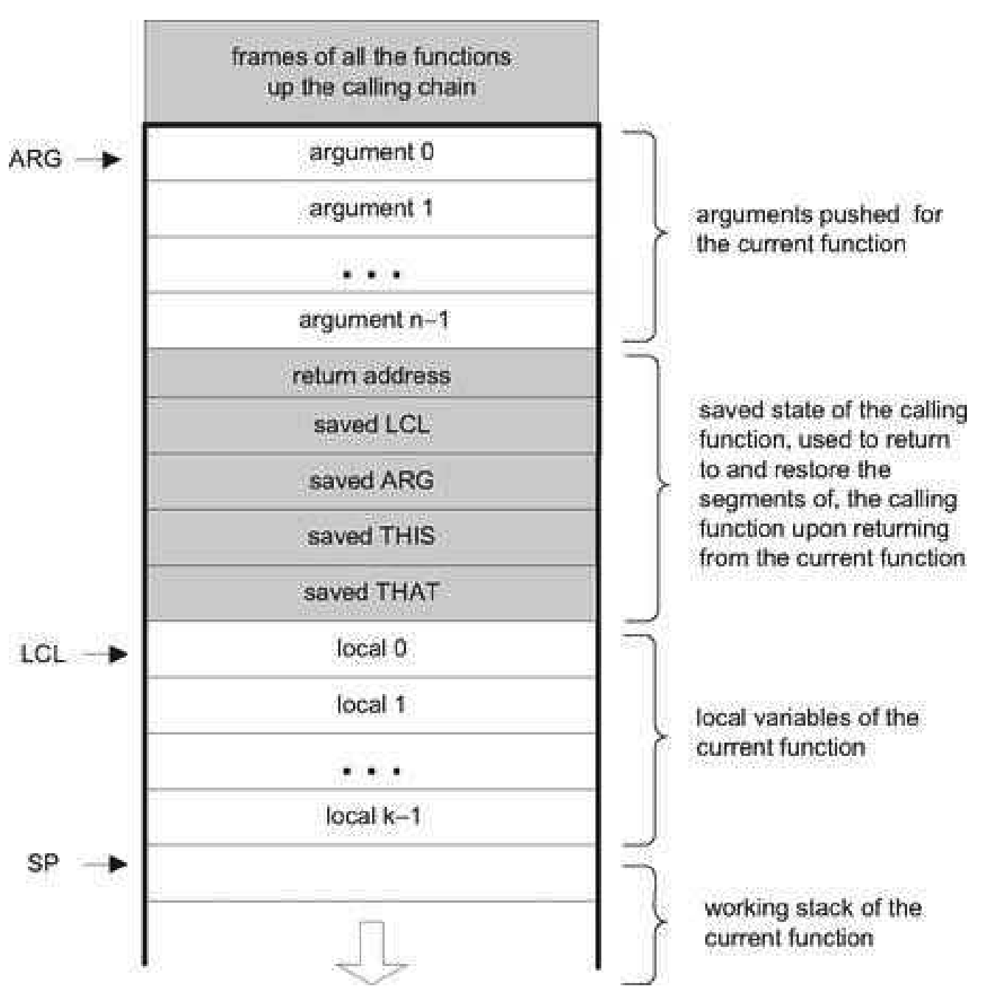
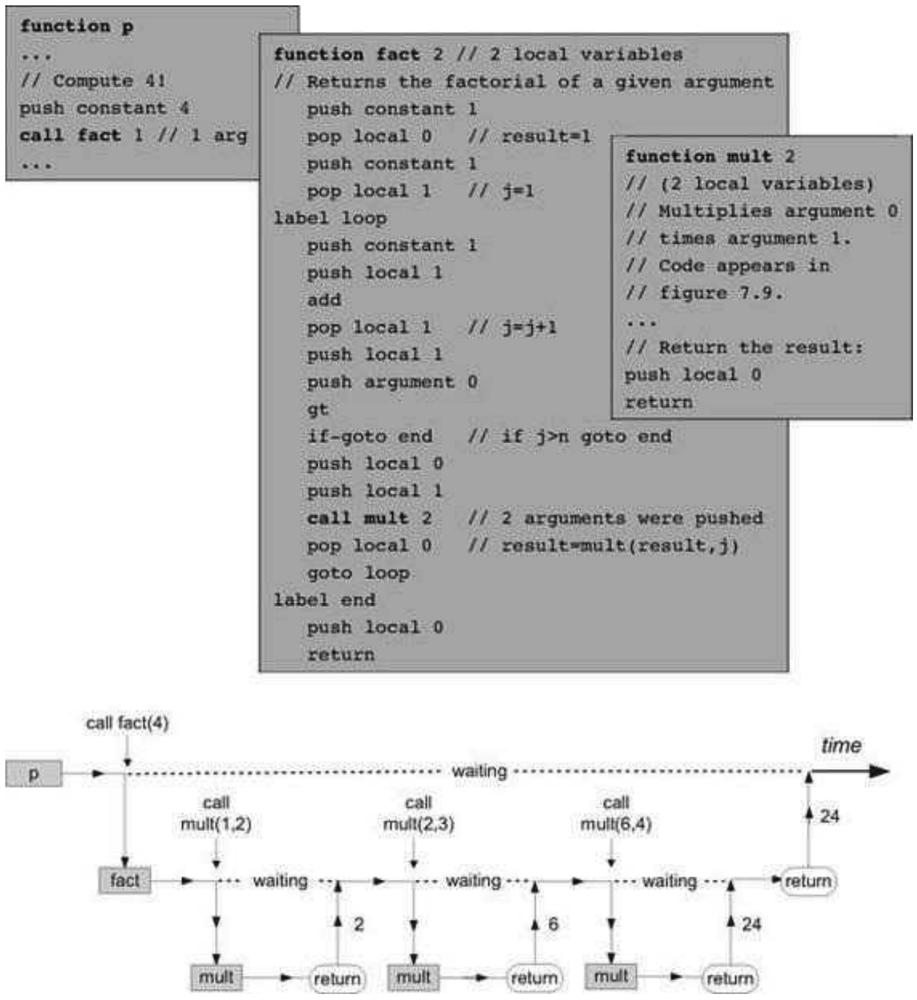

### 8.3 Implementation
---

&emsp;&emsp;This section describes how to complete the VM implementation that we started building in chapter 7, leading to a full-scale virtual machine implementation. Section 8.3.1 describes the stack structure that must be maintained, along with its standard mapping over the Hack platform. Section 8.3.2 gives an example, and section 8.3.3 provides design suggestions and a proposed API for actually building the VM implementation.

&emsp;&emsp;Some of the implementation details are rather technical, and dwelling on them may distract attention from the overall VM operation. This big picture is restored in section 8.3.2, which illustrates the VM implementation in action. Therefore, one may want to consult 8.3.2 for motivation while reading 8.3.1.

#### 8.3.1 Standard VM Mapping on the Hack Platform, Part II

&emsp;&emsp;**The Global Stack** The memory resources of the VM are implemented by maintaining a global stack. Each time a function is called, a new block is added to the global stack. The block consists of the arguments that were set for the called function, a set of pointers used to save the state of the calling function, the local variables of the called function (initialized to 0), and an empty working stack for the called function. Figure 8.4 shows this generic stack structure.

&emsp;&emsp;**Figure 8.4** The global stack structure.

&emsp;&emsp;Note that the shaded areas in figure 8.4 as well as the ARG, LCL, and SP pointers are never seen by VM functions. Rather, they are used by the VM implementation to implement the function call-and-return protocol behind the scene.

&emsp;&emsp;How can we implement this model on the Hack platform? Recall that the standard mapping specifies that the stack should start at RAM address 256, meaning that the VM implementation can start by generating assembly code that sets SP=256. From this point onward, when the VM implementation encounters commands like pop, push, add, and so forth, it can emit assembly code that effects these operations by manipulating SP and relevant words in the host RAM. All this was already done in chapter 7. Likewise, when the VM implementation encounters commands like call, function, and return, it can emit assembly code that maintains the stack structure shown in figure 8.4 on the host RAM. This code is described next.

&emsp;&emsp;**Function Calling Protocol Implementation** The function calling protocol and the global stack structure implied by it can be implemented on the Hack platform by effecting (in Hack assembly) the pseudo-code given in figure 8.5.

&emsp;&emsp;Recall that the VM implementation is a translator program, written in some high-level language. It accepts VM code as input and emits assembly code as output. Hence, each pseudo-operation described in the right column of figure 8.5 is actually implemented by emitting assembly language instructions. Note that some of these “instructions” entail planting label declarations in the generated code stream.

&emsp;&emsp;**Figure 8.5** VM implementation of function commands. The parenthetical (return address) and (f) are label declarations, using Hack assembly syntax convention.

&emsp;&emsp;**Assembly Language Symbols** As we have seen earlier, the implementation of program flow and function calling commands requires the VM implementation to create and use special symbols at the assembly level. These symbols are summarized in figure 8.6. For completeness of presentation, the first three rows of the table document the symbols described and implemented in chapter 7.

&emsp;&emsp;**Figure 8.6** All the special assembly symbols prescribed by the VM-on-Hack standard mapping.

&emsp;&emsp;**Bootstrap Code** When applied to a VM program (a collection of one or more .vm files), the VM-to-Hack translator produces a single .asm file, written in the Hack assembly language. This file must conform to certain conventions. Specifically, the standard mapping specifies that (i) the VM stack should be mapped on location RAM[256] onward, and (ii) the first VM function that starts executing should be Sys.init (see section 8.2.4).

&emsp;&emsp;How can we effect this initialization in the .asm file produced by the VM translator? Well, when we built the Hack computer hardware in chapter 5, we wired it in such a way that upon reset, it will fetch and execute the word located in ROM[0]. Thus, the code segment that starts at ROM address 0, called bootstrap code, is the first thing that gets executed when the computer “boots up.” Therefore, in view of the previous paragraph, the computer’s bootstrap code should effect the following operations (in machine language):

&emsp;&emsp;Sys.init is then expected to call the main function of the main program and then enter an infinite loop. This action should cause the translated VM programto start running.

&emsp;&emsp;The notions of “program,” “main program,” and “main function” are compilation-specific and vary from one high-level language to another. For example, in the Jack language, the default is that the first program unit that starts running automatically is the main method of a class named Main. In a similar fashion, when we tell the JVM to execute a given Java class, say Foo, it looks for, and executes, the Foo.main method. Each language compiler can effect such “automatic” startup routines by programming Sys.init appropriately.

#### 8.3.2 Example

&emsp;&emsp;The factorial of a positive number n can be computed by the iterative formula n! = 1 ·2·... ·(n - 1) · n. This algorithmis implemented in figure 8.7.

&emsp;&emsp;**Figure 8.7** The life cycle of function calls. An arbitrary function p calls function fact, which then calls mult several times. Vertical arrows depict transfer of control from one function to another. At any given point in time, only one function is running, while all the functions up the calling chain are waiting for it to return. When a function returns, the function that called it resumes its execution.

&emsp;&emsp;Let us focus on the call mult command highlighted in the fact function code from figure 8.7. Figure 8.8 shows three stack states related to this call, illustrating the function calling protocol in action.

&emsp;&emsp;**Figure 8.8** Global stack dynamics corresponding to figure 8.7, focusing on the call mult event. The pointers SP, ARG, and LCL are not part of the VM abstraction and are used by the VM implementation to map the stack on the host RAM.

&emsp;&emsp;If we ignore the middle stack instance in figure 8.8, we observe that fact has set up some arguments and called mult to operate on them(left stack instance). When mult returns (right stack instance), the arguments of the called function have been replaced with the function’s return value. In other words, when the dust clears from the function call, the calling function has received the service that it has requested, and processing resumes as if nothing happened: The drama of mult’s processing (middle stack instance) has left no trace whatsoever on the stack, except for the return value.

#### 8.3.3 Design Suggestions for the VM Implementation

&emsp;&emsp;The basic VM translator built in Project 7 was based on two modules: parser and code writer. This translator can be extended into a full-scale VM implementation by extending these modules with the functionality described here.

&emsp;&emsp;**The <em>Parser</em> Module** If the basic parser that you built in Project 7 does not already parse the six VM commands specified in this chapter, then add their parsing now. Specifically, make sure that the commandType method developed in Project 7 also returns the constants corresponding to the six VM commands described in this chapter: C_LABEL, C_GOTO, C_IF, C_FUNCTION, C_RETURN, and C_CALL.

&emsp;&emsp;**The <em>CodeWriter</em> Module** The basic CodeWriter specified in chapter 7 should be augmented with the following methods.

&emsp;&emsp;**CodeWriter:** Translates VM commands into Hack assembly code. The routines listed here should be added to the CodeWriter module API given in chapter 7.

