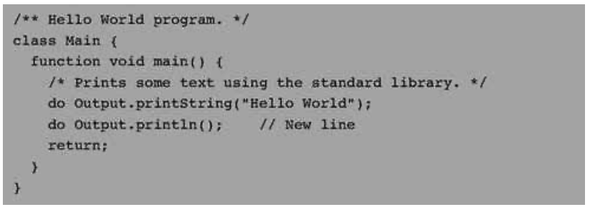
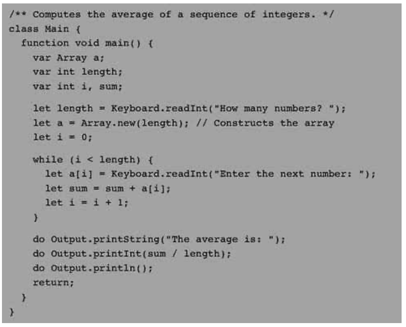
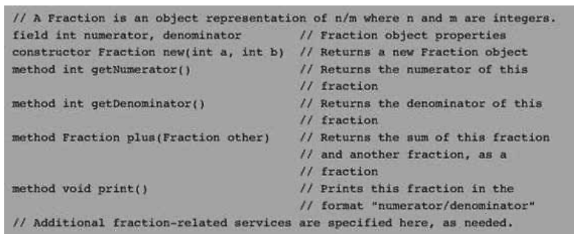
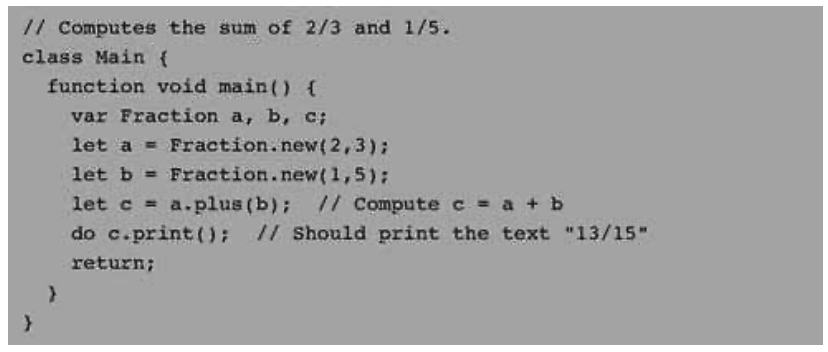
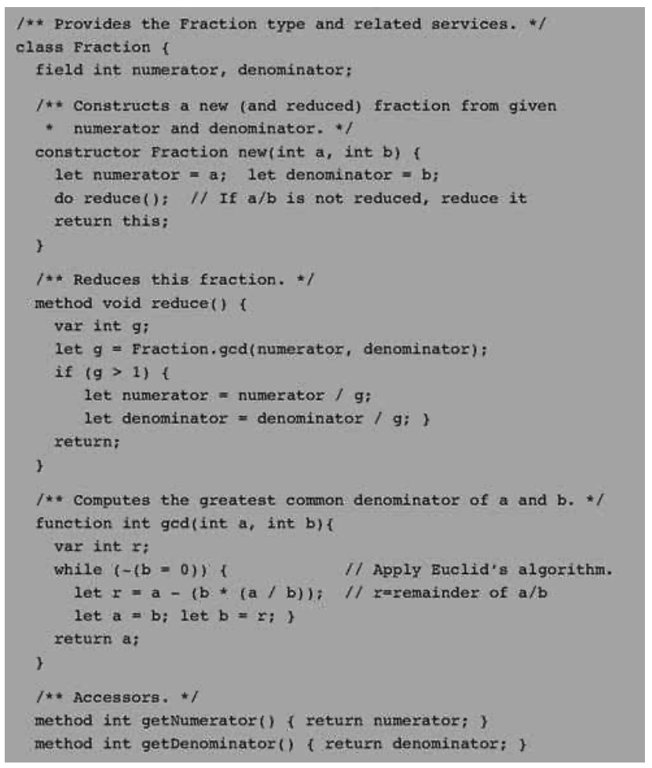
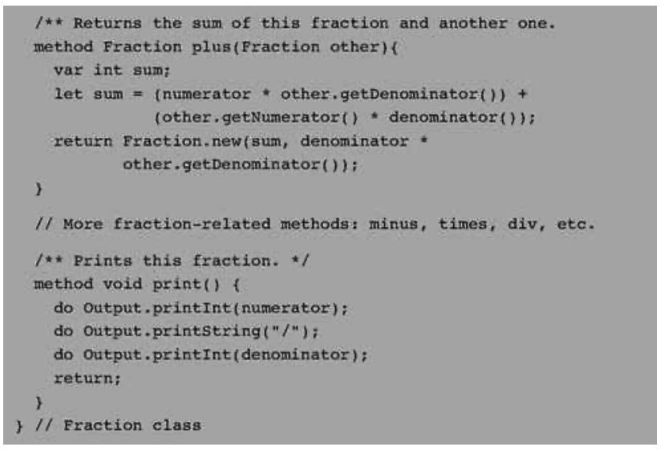
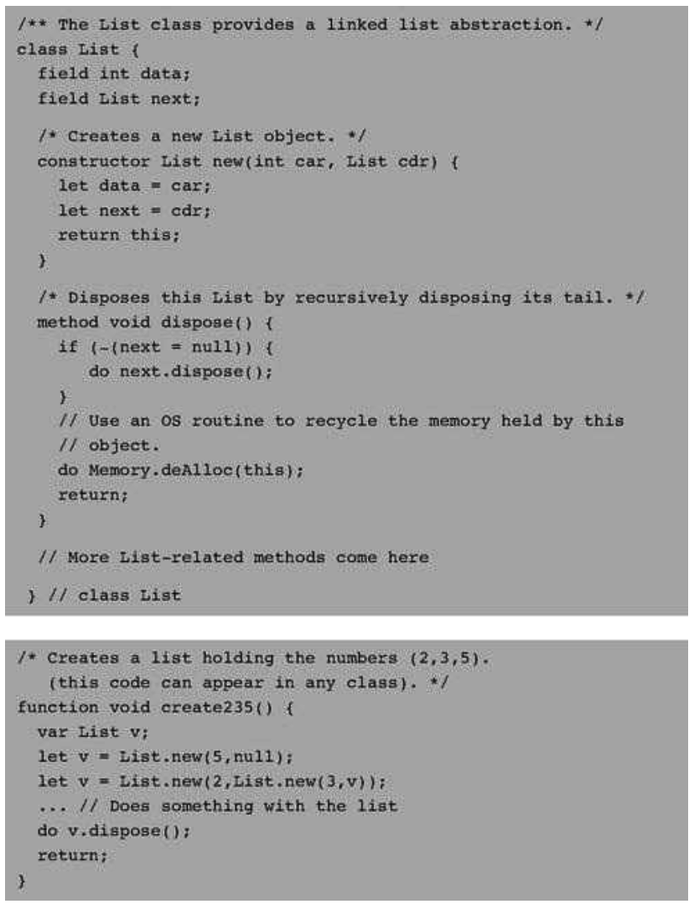

### 9.1 Background
---

&emsp;&emsp;Jack is mostly self-explanatory. Therefore, we defer the language specification to the next section, starting with some examples. We begin with the inevitable Hello World program. The second example illustrates procedural programming and array processing. The third example illustrates how the basic language can be extended with abstract data types. The fourth example illustrates a linked list implementation using the language’s object handling capabilities.

#### 9.1.1 Example 1: Hello World

&emsp;&emsp;When we tell the Jack run-time environment to run a given program, execution always starts with the Main.main function. Thus, each Jack program must include at least one class named Main, and this class must include at least one function named Main.main. This convention is illustrated in figure 9.1.

&emsp;&emsp;Jack is equipped with a standard library whose complete API is given in section 9.2.7. This library extends the basic language with various abstractions and services such as arrays, strings, mathematical functions, memory management, and input/output functions. Two such functions are invoked by the program in figure 9.1, effecting the “Hello world” printout. The program also demonstrates the three comment formats supported by Jack.

&emsp;&emsp;**Figure 9.1** Hello World.

#### 9.1.2 Example 2: Procedural Programming and Array Handling

&emsp;&emsp;Jack is equipped with typical language constructs for procedural programming. It also includes basic commands for declaring and manipulating arrays. Figure 9.2 illustrates both of these features, in the context of inputting and computing the average of a series of numbers.

&emsp;&emsp;Jack programs declare and construct arrays using the built-in Array class, which is part of the standard Jack library. Note that Jack arrays are not typed and can include anything—integers, objects, and so forth.

&emsp;&emsp;**Figure 9.2** Procedural programming and array handling.

#### 9.1.3 Example 3: Abstract Data Types

&emsp;&emsp;Every programming language has a fixed set of primitive data types, of which Jack supports three: int, char, and boolean. Programmers can extend this basic repertoire by creating new classes that represent abstract data types, as needed. For example, suppose we wish to endow Jack with the ability to handle rational numbers, namely, objects of the form <em>n/m</em> where <em>n</em> and <em>m</em> are integers. This can be done by creating a stand-alone class, designed to provide a fraction abstraction for Jack programs. Let us call this class Fraction.

&emsp;&emsp;**Defining a Class Interface** A reasonable way to get started is to specify the set of properties and services expected from a fraction abstraction. One such Application Program Interface (API), is given in figure 9.3a.

&emsp;&emsp;**Figure 9.3a** Fraction class API.

&emsp;&emsp;In Jack, operations on the current object (referred to as this) are represented by methods, whereas class-level operations (equivalent to static methods in Java) are represented by <em>functions</em>. Operations that create new objects are called constructors.

&emsp;&emsp;**Using Classes** APIs mean different things to different people. If you are the programmer who has to implement the fraction class, you can view its API as a contract that must be implemented, one way or another. Alternatively, if you are a programmer who needs to use fractions in your work, you can view the API as a documentation of a fraction server, designed to generate fraction objects and supply fraction-related operations. Taking this latter view, consider the Jack code listed in figure 9.3b.

&emsp;&emsp;Figure 9.3b illustrates an important software engineering principle: Users of any given abstraction don’t have to know anything about its underlying implementation. Rather, they can be given access only to the abstraction’s interface, or class API, and then use it as a black box server of abstraction-related operations.

&emsp;&emsp;**Figure 9.3b** Using the Fraction abstraction.

&emsp;&emsp;**Implementing** the Class We now turn to the other player in our story—the programmer who has to actually implement the fraction abstraction. A possible Jack implementation is given in figure 9.3c.

&emsp;&emsp;Figure 9.3c illustrates the typical Jack program structure: classes, methods, constructors, and functions. It also demonstrates all the statement types available in the language: let, do, if, while, and return.

&emsp;&emsp;**Figure 9.3c** A possible Fraction class implementation.

#### 9.1.4 Example 4: Linked List Implementation

&emsp;&emsp;A <em>linked list</em> (or simply <em>list</em>) is a chain of objects, each consisting of a data element and a reference (pointer) to the rest of the list. Figure 9.4 shows a possible Jack class implementation of the linked list abstraction. The purpose of this example is to illustrate typical object handling in the Jack language.

&emsp;&emsp;**Figure 9.4** Object handling in a linked list context.
