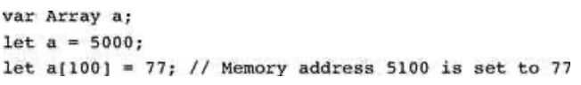
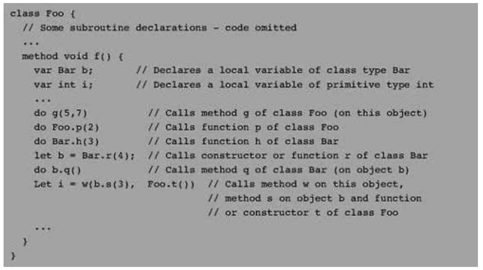

### 9.2 The Jack Language Specification
---


&emsp;&emsp;We now turn to a formal and complete description of the Jack language, organized by its syntactic elements, program structure, variables, expressions, and statements. This language specification should be viewed as a technical reference, to be consulted as needed.


#### 9.2.1 Syntactic Elements

&emsp;&emsp;A Jack program is a sequence of tokens separated by an arbitrary amount of white space and comments, which are ignored. Tokens can be symbols, reserved words, constants, and identifiers, as listed in figure 9.5.

<div align="center"></div>

&emsp;&emsp;**Figure 9.5** Jack syntactic elements.


#### 9.2.2 Program Structure

&emsp;&emsp;The basic programming unit in Jack is a class. Each class resides in a separate file and can be compiled separately. Class declarations have the following format:

<div align="center"></div>

&emsp;&emsp;Each class declaration specifies a name through which the class can be globally accessed. Next comes a sequence of zero or more field and static variable declarations. Then comes a sequence of one or more subroutine declarations, each defining a method, a function, or a constructor. Methods “belong to” objects and provide their functionality, while functions “belong to” the class in general and are not associated with a particular object (similar to Java’s static methods). A constructor “belongs to” the class and, when called, generates object instances of this class.

&emsp;&emsp;All subroutine declarations have the following format:

<div align="center"></div>

&emsp;&emsp;where subroutine is either constructor, method, or function. Each subroutine has a name through which it can be accessed, and a type describing the value returned by the subroutine. If the subroutine returns no value, the type is declared void; otherwise, it can be any of the primitive data types supported by the language, or any of the class types supplied by the standard library, or any of the class types supplied by other classes in the application. Constructors may have arbitrary names, but they must return an object of the class type. Therefore the type of a constructor must always be the name of the class to which it belongs.

&emsp;&emsp;Following its header specification, the subroutine declaration contains a sequence of zero or more local variable declarations, then a sequence of zero or more statements.

&emsp;&emsp;As in Java, a Jack program is a collection of one or more classes. One class must be named Main, and this class must include at least one function named main. When instructed to execute a Jack program that resides in some directory, the Jack run-time environment will automatically start running the Main.main function.


#### 9.2.3 Variables

&emsp;&emsp;Variables in Jack must be explicitly declared before they are used. There are four kinds of variables: field, static, local, and parameter variables, each with its associated scope. Variables must be typed.

&emsp;&emsp;**Data Types** Each variable can assume either a primitive data type (int, char, boolean), as predefined in the Jack language specification, or an object type, which is the name of a class. The class that implements this type can be either part of the Jack standard library (e.g., String or Array), or it may be any other class residing in the program directory.

&emsp;&emsp;**<em>Primitive Types</em>** Jack features three primitive data types:

  &emsp;&emsp;• int: 16-bit 2’s complement

  &emsp;&emsp;• boolean: false and true

  &emsp;&emsp;• char: unicode character

&emsp;&emsp;Variables of primitive types are allocated to memory when they are declared. For example, the declarations var int age; var boolean gender; cause the compiler to create the variables age and gender and to allocate memory space to them.

&emsp;&emsp;**<em>Object Types</em>** Every class defines an object type. As in Java, the declaration of an object variable only causes the creation of a reference variable (pointer). Memory for storing the object itself is allocated later, if and when the programmer actually <em>constructs</em> the object by calling a constructor. Figure 9.6 gives an example.

<div align="center"></div>

&emsp;&emsp;**Figure 9.6** Object types (example).

&emsp;&emsp;The Jack standard library provides two built-in object types (classes) that play a role in the language syntax: Array and String.

&emsp;&emsp;**<em>Arrays</em>** Arrays are declared using a built-in class called Array. Arrays are one-dimensional and the first index is always 0 (multi-dimensional arrays may be obtained as arrays of arrays). Array entries do not have a declared type, and different entries in the same array may have different types. The declaration of an array only creates a reference, while the actual construction of the array is done by calling the Array.new(length) constructor. Access to array elements is done using the a [j] notation. Figure 9.2 illustrates working with arrays.

&emsp;&emsp;**<em>Strings</em>** Strings are declared using a built-in class called String. The Jack compiler recognizes the syntax “xxx” and treats it as the contents of some String object. The contents of String objects can be accessed and modified using the methods of the String class, as documented in its API. Example:

<div align="center"></div>

&emsp;&emsp;**<em>Type Conversions</em>** The Jack language is weakly typed. The language specification does not define the results of attempted assignment or conversion from one type to another, and different Jack compilers may allow or forbid them. (This under-specification is intentional, allowing the construction of minimal Jack compilers that ignore typing issues.)

&emsp;&emsp;Having said that, all Jack compilers are expected to allow, and automatically perform, the following assignments:

&emsp;&emsp;■ Characters and integers are automatically converted into each other as needed, according to the Unicode specification. Example:

<div align="center"></div>

&emsp;&emsp;■ An integer can be assigned to a reference variable (of any object type), in which case it is treated as an address in memory. Example:

<div align="center"></div>

&emsp;&emsp;■ An object variable (whose type is a class name) may be converted into an Array variable, and vice versa. The conversion allows accessing the object fields as array entries, and vice versa. Example:

<div align="center"></div>

&emsp;&emsp;**<em>Variable Kinds and Scope</em>** Jack features four kinds of variables. Static variables are defined at the class level and are shared by all the objects derived from the class. For example, a BankAccount class may have a totalBalance static variable holding the sum of balances of all the bank accounts, each account being an object derived from the BankAccount class. Field variables are used to define the properties of individual objects of the class, for example, account owner and balance. Local variables, used by subroutines, exist only as long as the subroutine is running, and parameter variables are used to pass arguments to subroutines. For example, our BankAccount class may include the method signature method void transfer(BankAccount from, int sum), declaring the two parameters from and sum. Thus, if joeAccount and janeAccount were two variables of type BankAccount, the command joeAccount.transfer(janeAccount, 100) will effect a transfer of 100 from Jane to Joe.

&emsp;&emsp;**Figure 9.7** Variable kinds in the Jack language (throughout the table, <em>subroutine</em> is either <em>a function, a method, or a constructor</em>).

<div align="center"></div>

&emsp;&emsp;Figure 9.7 gives a formal description of all the variable kinds supported by the Jack language. The scope of a variable is the region in the program in which the variable name is recognized.


#### 9.2.4 Statements

&emsp;&emsp;The Jack language features five generic statements. They are defined and described in figure 9.8.

<div align="center"></div>

&emsp;&emsp;**Figure 9.8** Jack statements.


#### 9.2.5 Expressions

&emsp;&emsp;Jack expressions are defined recursively according to the rules given in figure 9.9.

<div align="center"></div>

&emsp;&emsp;**Figure 9.9** Jack expressions.

&emsp;&emsp;**Operator Priority and Order of Evaluation** Operator priority is not defined by the language, except that expressions in parentheses are evaluated first. Thus an expression like 2+3&ast;4 may yield either 20 or 14, whereas 2+(3&ast;4) is guaranteed to yield 14. The need to use parentheses in such expressions makes Jack programming a bit cumbersome. However, the lack of formal operator priority is intentional, since it simplifies the writing of Jack compilers. Of course, different language implementations (compilers) can specify an operator priority and add it to the language documentation, if so desired.


#### 9.2.6 Subroutine Calls

&emsp;&emsp;Subroutine calls invoke methods, functions, and constructors for their effect, using the general syntax <em>subroutineName(argument-list)</em>. The number and type of the arguments must match those of the subroutine’s parameters, as defined in its declaration. The parentheses must appear even if the argument list is empty. Each argument may be an expression of unlimited complexity. For example, the Math class, which is part of Jack’s standard library, contains a square root function whose declaration is function int sqrt(int n). Such a function can be invoked using calls like Math.sqrt (17), or Math.sqrt ((a &ast; Math.sqrt (c- 17) + 3), and so on.

<div align="center"></div>

&emsp;&emsp;**Figure 9.10** Subroutine call examples.

&emsp;&emsp;Within a class, methods are called using the syntax <em>methodName(argument-list)</em>, while functions and constructors must be called using their full names, namely, <em>className.subroutineName(argument-list)</em>. Outside a class, the class functions and constructors are also called using their full names, while methods are called using the syntax varName.methodName(argument-list), where varName is a previously defined object variable. Figure 9.10 gives some examples.

&emsp;&emsp;**Object Construction and Disposal** Object construction is a two-stage affair. When a program declares a variable of some object type, only a reference (pointer) variable is created and allocated memory. To complete the object’s construction (if so desired), the program must call a constructor from the object’s class. Thus, a class that implements a type (e.g., Fraction from figure 9.3c) must contain at least one constructor. Constructors may have arbitrary names, but it is customary to call one of them new. Constructors are called just like any other class function using the format:

```
  let varName = className.constructorName(parameter-list);
```

&emsp;&emsp;For example, let c = Circle.new(x,y,50) where x, y, and 50 are the screen location of the circle’s center and its radius. When a constructor is called, the compiler requests the operating system to allocate enough memory space to hold the new object in memory. The OS returns the base address of the allocated memory segment, and the compiler assigns it to this (in the circle example, the value of this is assigned to c). Next, the constructed object is typically initialized to some valid state, effected by the Jack commands found in the constructor’s body.

&emsp;&emsp;When an object is no longer needed in a program, it can be disposed. In particular, objects can be deallocated from memory and their space reclaimed using the Memory.deAlloc (object) function from the standard library. Convention calls for every class to contain a dispose() method that properly encapsulates this de-allocation. For example, see figure 9.4.


#### 9.2.7 The Jack Standard Library

&emsp;&emsp;The Jack language comes with a collection of built-in classes that extend the language’s capabilities. This standard library, which can also be viewed as a basic operating system, must be provided in every Jack language implementation. The standard library includes the following classes, all implemented in Jack:
  * <em>Math:</em> provides basic mathematical operations;
  * <em>String:</em> implements the String type and string-related operations;
  * <em>Array:</em> implements the Array type and array-related operations;
  * <em>Output:</em> handles text output to the screen;
  * <em>Screen:</em> handles graphic output to the screen;
  * <em>Keyboard:</em> handles user input from the keyboard;
  * <em>Memory:</em> handles memory operations;
  * <em>Sys:</em> provides some execution-related services.

&emsp;&emsp;**Math** This class enables various mathematical operations.
  * function void **init**(): for internal use only.
  * function int **abs**(int x): returns the absolute value of x.
  * function int **multiply**(int x, int y): returns the product of x and y.
  * function int **divide**(int x, int y): returns the integer part of x/y.
  * function int **min**(int x, int y): returns the minimum of x and y.
  * function int **max**(int x, int y): returns the maximum of x and y.
  * function int **sqrt**(int x): returns the integer part of the square root of x.

&emsp;&emsp;**String** This class implements the String data type and various string-related operations.
  * constructor String **new**(int maxLength): constructs a new empty string (of length zero) that can contain at most maxLength characters;
  * method void **dispose**(): disposes this string;
  * method int **length**(): returns the length of this string;
  * method char **charAt**(int j): returns the character at location j of this string;
  * method void **setCharAt**(int j, char c): sets the j-th element of this string to c;
  * method String **appendChar**(char c): appends c to this string and returns this string;
  * method void **eraseLastChar**(): erases the last character from this string;
  * method int **intValue**(): returns the integer value of this string (or of the string prefix until a non-digit character is detected);
  * method void **setInt**(int j): sets this string to hold a representation of j;
  * function char **backSpace**(): returns the backspace character;
  * function char **doubleQuote**(): returns the double quote (“) character;
  * function char **newLine**(): returns the newline character.

&emsp;&emsp;**Array** This class enables the construction and disposal of arrays.
  * function Array **new**(int size): constructs a new array of the given size;
  * method void **dispose**(): disposes this array.

&emsp;&emsp;**Output** This class allows writing text on the screen.
  * function void **init**(): for internal use only;
  * function void **moveCursor**(int i, int j): moves the cursor to the j-th column of the i-th row, and erases the character displayed there;
  * function void **printChar**(char c): prints c at the cursor location and advances the cursor one column forward;
  * function void **printString**(String s): prints s starting at the cursor location and advances the cursor appropriately;
  * function void **printInt**(int i): prints i starting at the cursor location and advances the cursor appropriately;
  * function void **println**(): advances the cursor to the beginning of the next line;
  * function void **backSpace**(): moves the cursor one column back.

&emsp;&emsp;**Screen** This class allows drawing graphics on the screen. Column indices start at 0 and are left-to-right. Row indices start at 0 and are top-to-bottom. The screen size is hardware-dependant (in the Hack platform: 256 rows by 512 columns).
  * function void **init**(): for internal use only;
  * function void **clearScreen**(): erases the entire screen;
  * function void **setColor**(boolean b): sets a color (white = false, black = true) to be used for all further drawXXX commands;
  * function void **drawPixel**(int x, int y): draws the (x,y) pixel;
  * function void **drawLine**(int x1, int y1, int x2, int y2): draws a line from pixel (x1,y1) to pixel (x2,y2);
  * function void **drawRectangle**(int x1, int y1, int x2, int y2): draws a filled rectangle whose top left corner is (x1,y1) and bottom right corner is (x2,y2);
  * function void **drawCircle**(int x, int y, int r): draws a filled circle of radius r <= 181 around (x,y).

&emsp;&emsp;**Keyboard** This class allows reading inputs from a standard keyboard.
  * function void **init**(): for internal use only;
  * function char **keyPressed**(): returns the character of the currently pressed key on the keyboard; if no key is currently pressed, returns 0;
  * function char **readChar**(): waits until a key is pressed on the keyboard and released, then echoes the key to the screen and returns the character of the pressed key;
  * function String **readLine**(String message): prints the message on the screen, reads the line (text until a newline character is detected) from the keyboard, echoes the line to the screen, and returns its value. This function also handles user backspaces;
  * function int **readInt**(String message): prints the message on the screen, reads the line (text until a newline character is detected) from the keyboard, echoes the line to the screen, and returns its integer value (until the first nondigit character in the line is detected). This function also handles user backspaces.

&emsp;&emsp;**Memory** This class allows direct access to the main memory of the host platform.
  * function void **init**(): for internal use only;
  * function int **peek**(int address): returns the value of the main memory at this address;
  * function void **poke**(int address, int value): sets the contents of the main memory at this address to value;
  * function Array **alloc**(int size): finds and allocates from the heap a memory block of the specified size and returns a reference to its base address;
  * function void **deAlloc**(Array o): De-allocates the given object and frees its memory space. Sys This class supports some execution-related services.
  * function void **init**(): calls the init functions of the other OS classes and then calls the Main.main () function. For internal use only;
  * function void **halt**(): halts the program execution;
  * function void **error**(int errorCode): prints the error code on the screen and halts;
  * function void **wait**(int duration): waits approximately duration milliseconds and returns.
