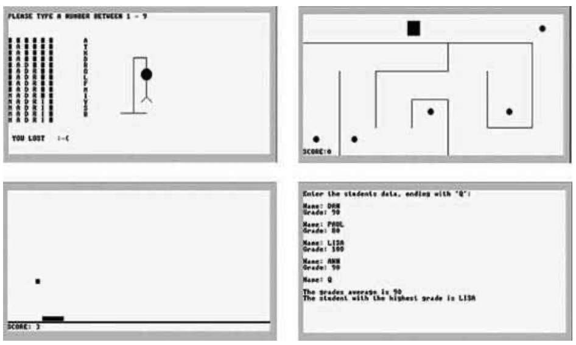

### 9.3 Writing Jack Applications
---

&emsp;&emsp;Jack is a general-purpose programming language that can be implemented over different hardware platforms. In the next two chapters we will develop a Jack compiler that ultimately generates binary Hack code, and thus it is natural to discuss Jack applications in the Hack context. This section illustrates briefly three such applications and provides general guidelines about application development on the Jack-Hack platform.

&emsp;&emsp;**Examples** Four sample applications are illustrated in figure 9.11. The Pong game, whose Jack code is supplied with the book, provides a good illustration of Jack programming over the Hack platform. The Pong code is not trivial, requiring several hundred lines of Jack code organized in several classes. Further, the program has to carry out some nontrivial mathematical calculations in order to compute the direction of the ball’s movements. The program must also animate the movement of graphical objects on the screen, requiring extensive use of the language’s graphics drawing services. And, in order to do all of the above quickly, the program must be efficient, meaning that it has to do as few real-time calculations and screen drawing operations as possible.

&emsp;&emsp;**Figure 9.11** Screen shots of sample Jack applications, running on the Hack computer. Hangman, Maze, Pong, and a simple data processing program.

&emsp;&emsp;**Application Design and Implementation** The development of Jack applications over a hardware platform like Hack requires careful planning (as always). First, the application designer must consider the physical limitations of the hardware, and plan accordingly. For example, the dimensions of the computer’s screen limit the size of the graphical images that the program can handle. Likewise, one must consider the language’s range of input/output commands and the platform’s execution speed, to gain a realistic expectation of what can and cannot be done.

&emsp;&emsp;As usual, the design process normally starts with a conceptual description of the application’s behavior. In the case of graphical and interactive programs, this may take the form of hand-written drawings of typical screens. In simple applications, one can proceed to implementation using procedural programming. In more complex tasks, it is advisable to first create an object-based design of the application. This entails the identification of classes, fields, and subroutines, possibly leading to the creation of some API document (e.g., figure 9.3a).

&emsp;&emsp;Next, one can proceed to implement the design in Jack and compile the class files using a Jack compiler. The testing and debugging of the code generated by the compiler depend on the details of the target platform. In the Hack platform supplied with the book, testing and debugging are normally done using the supplied VM emulator. Alternatively, one can translate the Jack program all the way to binary code and run it directly on the Hack hardware, or on the CPU emulator supplied with the book.

&emsp;&emsp;**The Jack OS** Jack programs make an extensive use of the various abstractions and services supplied by the language’s standard library, also called the Jack OS. This OS is itself implemented in Jack, and thus its executable version is a set of compiled .vm files—just like the user program (following compilation). Therefore, before running any Jack program, you must first copy into the program directory the .vm files comprising the Jack OS (supplied with the book). The chain of command is as follows: The computer is programmed to first run the Sys.init. This OS function, in turn, is programmed to start running your Main.main function. This function will then call various subroutines from both the user program and from the OS, and so on.

&emsp;&emsp;Although the standard library of the Jack language can be extended, readers will perhaps want to hone their programming skills elsewhere. After all, we don’t expect Jack to be part of your life beyond this book. Therefore, it is best to view the Jack/ Hack platform as a given environment and make the best out of it. That’s precisely what programmers do when they write software for embedded devices and dedicated processors that operate in restricted environments. Instead of viewing the constrains imposed by the host platform as a problem, professionals view it as an opportunity to display their resourcefulness and ingenuity. That’s why some of the best programmers in the trade were first trained on primitive computers.
