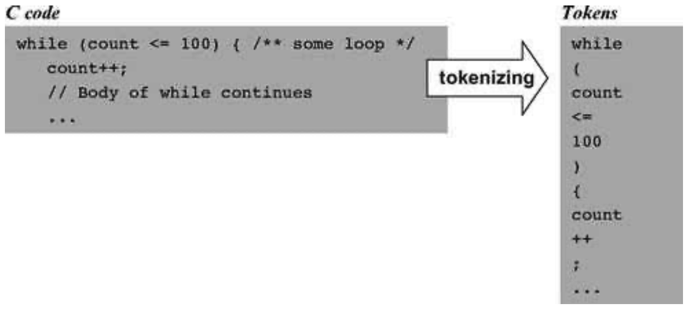

### 10.1 Background
---

&emsp;&emsp;A typical compiler consists of two main modules: syntax analysis and code generation. The syntax analysis task is usually divided further into two modules: tokenizing, or grouping of input characters into language atoms, and parsing, or attempting to match the resulting atoms stream to the syntax rules of the underlying language. Note that these activities are completely independent of the target language into which we seek to translate the source program. Since in this chapter we don’t deal with code generation, we have chosen to have the syntax analyzer output the parsed structure of the compiled program as an XML file. This decision has two benefits. First, the XML file can be easily viewed in any Web browser, demonstrating that the syntax analyzer is parsing source programs correctly. Second, the requirement to output this file explicitly forces us to write the syntax analyzer in a software architecture that can be later morphed into a full-scale compiler. In particular, in the next chapter we will simply replace the routines that generate the passive XML code with routines that generate executable VM code, leaving the rest of the compiler’s architecture intact (see figure 10.1).

&emsp;&emsp;**Figure 10.1** The Jack Compiler. The project in chapter 10 is an intermediate step, designed to localize the development and unit-testing of the <em>syntax analyzer</em> module.

&emsp;&emsp;In this chapter we focus only on the syntax analyzer module of the compiler, whose job is “understanding the structure of a program.” This notion needs some explanation. When humans read a computer program, they immediately recognize the program’s structure. They can identify where classes and methods begin and end, what are declarations, what are statements, what are expressions and how they are built, and so on. This understanding is not trivial, since it requires an ability to identify and classify nested patterns: In a typical program, classes contain methods that contain statements that contain other statements that contain expressions, and so on. In order to recognize these language constructs correctly, human cognition must recursively map them on the range of textual patterns permitted by the language syntax.

&emsp;&emsp;When it comes to understanding a natural language like English, the question of how syntax rules are represented in the human brain and whether they are innate or acquired is a subject of intense debate. However, if we limit our attention to formal languages—artifacts whose simplicity hardly justifies the title “language”—we know precisely how to formalize their syntactic structure. In particular, programming languages are usually described using a set of rules called context-free grammar. To understand—parse—a given program means to determine the exact correspondence between the program’s text and the grammar’s rules. In order to do so, we first have to transform the program’s text into a list of tokens, as we now describe.

#### 10.1.1 Lexical Analysis

&emsp;&emsp;In its plainest syntactic form, a program is simply a sequence of characters, stored in a text file. The first step in the syntax analysis of a program is to group the characters into tokens (as defined by the language syntax), while ignoring white space and comments. This step is usually called lexical analysis, scanning, or tokenizing. Once a program has been tokenized, the tokens (rather than the characters) are viewed as its basic atoms, and the tokens stream becomes the main input of the compiler. Figure 10.2 illustrates the tokenizing of a typical code fragment, taken from a C or Java program.

&emsp;&emsp;**Figure 10.2** Lexical analysis.

&emsp;&emsp;As seen in figure 10.2, tokens fall into distinct categories, or types: <em>while</em> is a keyword, <em>count</em> is an identifier, <em><=</em> is an operator, and so on. In general, each programming language specifies the types of tokens it allows, as well as the exact syntax rules for combining them into valid programmatic structures. For example, some languages may specify that “++” is a valid operator token, while other languages may not. In the latter case, an expression containing two consecutive “+” characters will be rendered invalid by the compiler.

#### 10.1.2 Grammars

&emsp;&emsp;Once we have lexically analyzed a program into a stream of tokens, we now face the more challenging task of parsing the tokens stream into a formal structure. In other words, we have to figure out how to group the tokens into language constructs like variable declarations, statements, expressions, and so on. These grouping and classification tasks can be done by attempting to match the tokens stream on some predefined set of rules known as a grammar.

&emsp;&emsp;Almost all programming languages, as well as most other formal languages used for describing the syntax of complex file types, can be specified using formalisms known as context-free grammars. A context-free grammar is a set of rules specifying how syntactic elements in some language can be formed from simpler ones. For example, the Java grammar allows us to combine the atoms 100,count, and <= into the expression count <= 100. In a similar fashion, the Java grammar allows us to ascertain that the text count <= 100 is a valid Java expression. Indeed, each grammar has a dual perspective. From a declarative standpoint, the grammar specifies allowable ways to combine tokens, also called terminals, into higher-level syntactic elements, also called non-terminals. From an analytic standpoint, the grammar is a prescription for doing the reverse: parsing a given input (set of tokens resulting from the tokenizing phase) into non-terminals, lower-level non-terminals, and eventually terminals that cannot be decomposed any further. Figure 10.3 gives an example of a typical grammar.

&emsp;&emsp;**Figure 10.3** A subset of the C language grammar (left) and a sample code segment accepted by this grammar (right).

&emsp;&emsp;In this chapter we specify grammars using the following notation: Terminal elements appear in bold text enclosed in single quotes, and non-terminal elements in regular font. When there is more than one way to parse a non-terminal, the “|” notation is used to list the alternative possibilities. Thus, figure 10.3 specifies that a statement can be either a whileStatement, or an ifStatement, and so on. Typically, grammar rules are highly recursive, and figure 10.3 is no exception. For example, statementSequence is either null, or a single statement followed by a semicolon and a statementSequence. This recursive definition can accommodate a sequence of 0, 1, 2, or any other positive number of semicolon-separated statements. As an exercise, the reader may use figure 10.3 to ascertain that the text appearing in the right side of the figure constitutes a valid C code. You may start by trying to match the entire text with statement, and work your way from there.

#### 10.1.3 Parsing

&emsp;&emsp;The act of checking whether a grammar “accepts” an input text as valid is called parsing. As we noted earlier, parsing a given text means determining the exact correspondence between the text and the rules of a given grammar. Since the grammar rules are hierarchical, the output generated by the parser can be described in a tree-oriented data structure called a parse tree or a derivation tree. Figure 10.4 gives a typical example.

&emsp;&emsp;**Figure 10.4** Parse tree of a program segment according to a grammar segment. Solid triangles represent lower-level parse trees.

&emsp;&emsp;Note that as a side effect of the parsing process, the entire syntactic structure of the input text is uncovered. Some compilers represent this tree by an explicit data structure that is further used for code generation and error reporting. Other compilers (including the one that we will build) represent the program’s structure implicitly, generating code and reporting errors on the fly. Such compilers don’t have to hold the entire program structure in memory, but only the subtree associated with the presently parsed element. More about this later.

&emsp;&emsp;**Recursive Descent Parsing** There are several algorithms for constructing parse trees. The top-down approach, also called recursive descent parsing, attempts to parse the tokens stream recursively, using the nested structure prescribed by the language grammar. Let us consider how a parser program that implements this strategy can be written. For every rule in the grammar describing a non-terminal, we can equip the parser program with a recursive routine designed to parse that non-terminal. If the non-terminal consists of terminal atoms only, the routine can simply process them. Otherwise, for every non-terminal building block in the rule’s right-hand side, the routine can recursively call the routine designed to parse this non-terminal. The process will continue recursively, until all the terminal atoms have been reached and processed.

&emsp;&emsp;To illustrate, suppose we have to write a recursive descent parser that follows the grammar from figure 10.3. Since the grammar has five derivation rules, the parser implementation can consist of five major routines: parseStatement(), parseWhileStatement (), parseIfStatement(), parseStatementSequence(), and parseExpression(). The parsing logic of these routines should follow the syntactic patterns appearing in the right-hand sides of the corresponding grammar rules. Thus parseStatement() should probably start its processing by determining what is the first token in the input. Having established the token’s identity, the routine could determine which statement we are in, and then call the parsing routine associated with this statement type.

&emsp;&emsp;For example, if the input stream were that depicted in figure 10.4, the routine will establish that the first token is while, then call the parseWhileStatement() routine. According to the corresponding grammar rule, this routine should next attempt to read the terminals “while” and “(”, and then call parseExpression() to parse the non-terminal expression. After parseExpression() would return (having parsed the “count<=100” sequence in our example), the grammar dictates that parseWhileStatement() should attempt to read the terminal “)” and then recursively call parseStatement(). This call would continue recursively, until at some point only terminal atoms are read. Clearly, the same logic can also be used for detecting syntax errors in the source program. The better the compiler, the better will be its error diagnostics.

&emsp;&emsp;**LL(0) Grammars** Recursive parsing algorithms are simple and elegant. The only possible complication arises when there are several alternatives for parsing non-terminals. For example, when parseStatement() attempts to parse a statement, it does not know in advance whether this statement is a while-statement, an if-statement, or a bunch of statements enclosed in curly brackets. The span of possibilities is determined by the grammar, and in some cases it is easy to tell which alternative we are in. For example, consider figure 10.3. If the first token is “while,” it is clear that we are faced with a while statement, since this is the only alternative in the grammar that starts with a “while” token. This observation can be generalized as follows: whenever a non-terminal has several alternative derivation rules, the first token suffices to resolve without ambiguity which rule to use. Grammars that have this property are called <em>LL(0)</em>. These grammars can be handled simply and neatly by recursive descent algorithms.

&emsp;&emsp;When the first token does not suffice to resolve the element’s type, it is possible that a “look ahead” to the next token will settle the dilemma. Such parsing can obviously be done, but as we need to look ahead at more and more tokens down the stream, things start getting complicated. The Jack language grammar, which we now turn to present, is almost <em>LL(0)</em>, and thus it can be handled rather simply by a recursive descent parser. The only exception is the parsing of expressions, where just a little look ahead is necessary.
