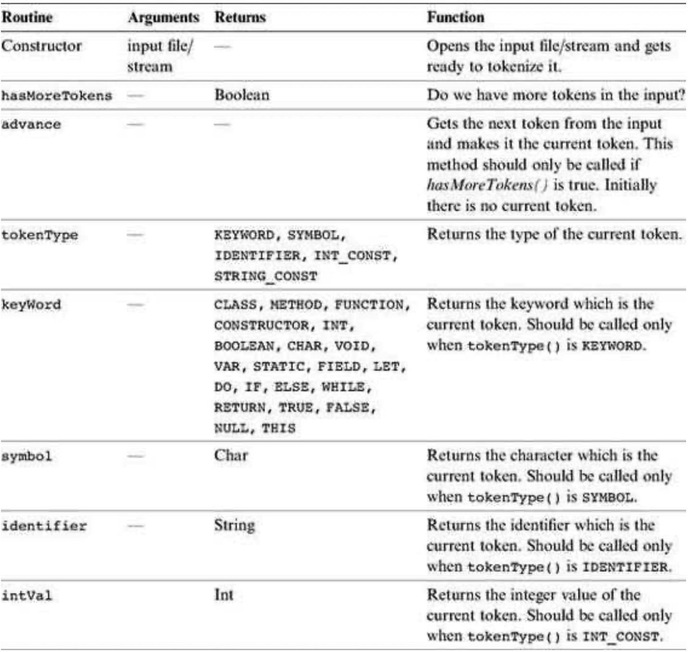
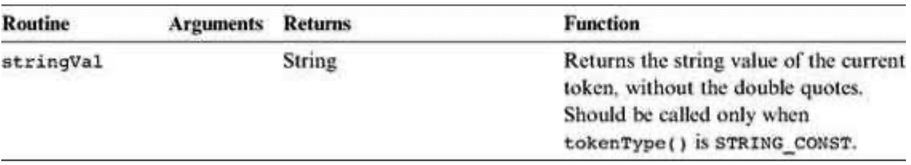
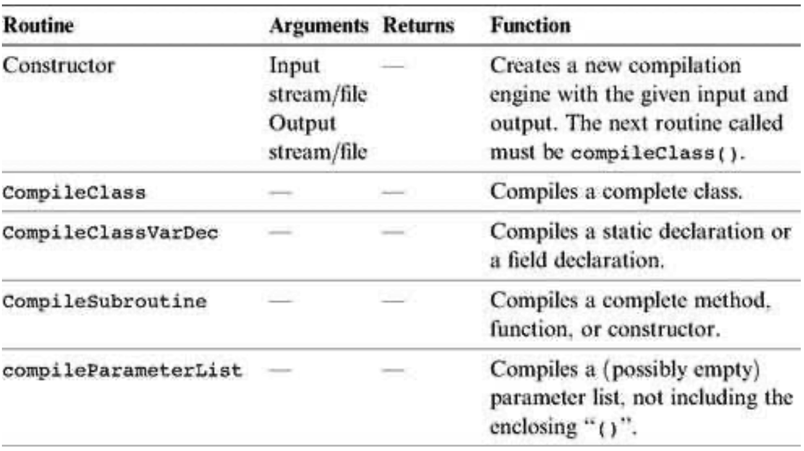
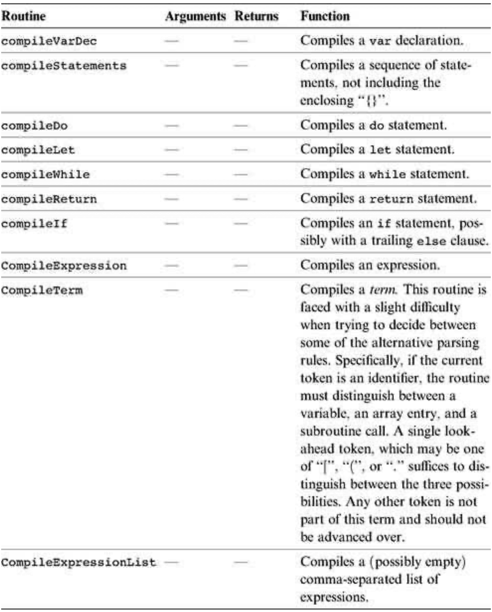

### 10.3 Implementation
---

&emsp;&emsp;Section 10.2 gave all the information necessary to build a syntax analyzer for the Jack language, without any implementation details. This section describes a proposed software architecture for the syntax analyzer. We suggest arranging the implementation in three modules:
  * JackAnalyzer: top-level driver that sets up and invokes the other modules;
  * JackTokenizer: tokenizer;
  * CompilationEngine: recursive top-down parser.

&emsp;&emsp;These modules are designed to handle the language’s syntax. In the next chapter we extend this architecture with two additional modules that handle the language’s semantics: a symbol table and a <em>VM-code writer</em>. This will complete the construction of a full-scale compiler for the Jack language. Since the module that drives the parsing process in this project will also drive the overall compilation in the next project, we call it CompilationEngine.

#### 10.3.1 The <em>JackAnalyzer</em> Module

&emsp;&emsp;The analyzer program operates on a given source, where source is either a file name of the form Xxx.jack or a directory name containing one or more such files. For each source Xxx.jack file, the analyzer goes through the following logic:

&emsp;&emsp;1. Create a <em>JackTokenizer</em> from the Xxx.jack input file.

&emsp;&emsp;2. Create an <em>output file</em> called Xxx.xml and prepare it for writing.

&emsp;&emsp;3. Use the <em>CompilationEngine</em> to compile the input JackTokenizer into the <em>output file</em>.

#### 10.3.2 The <em>JackTokenizer</em> Module

&emsp;&emsp;**JackTokenizer:** Removes all comments and white space from the input stream and breaks it into Jack- language tokens, as specified by the Jack grammar.

#### 10.3.3 The <em>CompilationEngine</em> Module

&emsp;&emsp;**CompilationEngine:** Effects the actual compilation output. Gets its input from a JackTokenizer and emits its parsed structure into an output file/stream. The output is generated by a series of compilexxx() routines, one for every syntactic element xxx of the Jack grammar. The contract between these routines is that each compilexxx() routine should read the syntactic construct xxx from the input, advance() the tokenizer exactly beyond xxx, and output the parsing of xxx. Thus, compilexxx() may only be called if indeed xxx is the next syntactic element of the input.

&emsp;&emsp;In the first version of the compiler, described in chapter 10, this module emits a structured printout of the code, wrapped in XML tags. In the final version of the compiler, described in chapter 11, this module generates executable VM code. In both cases, the parsing logic and module API are exactly the same.

