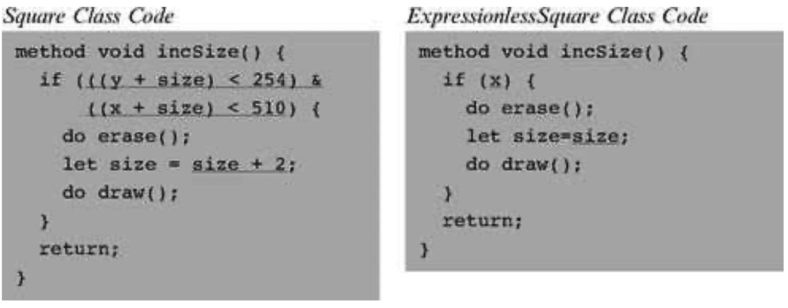
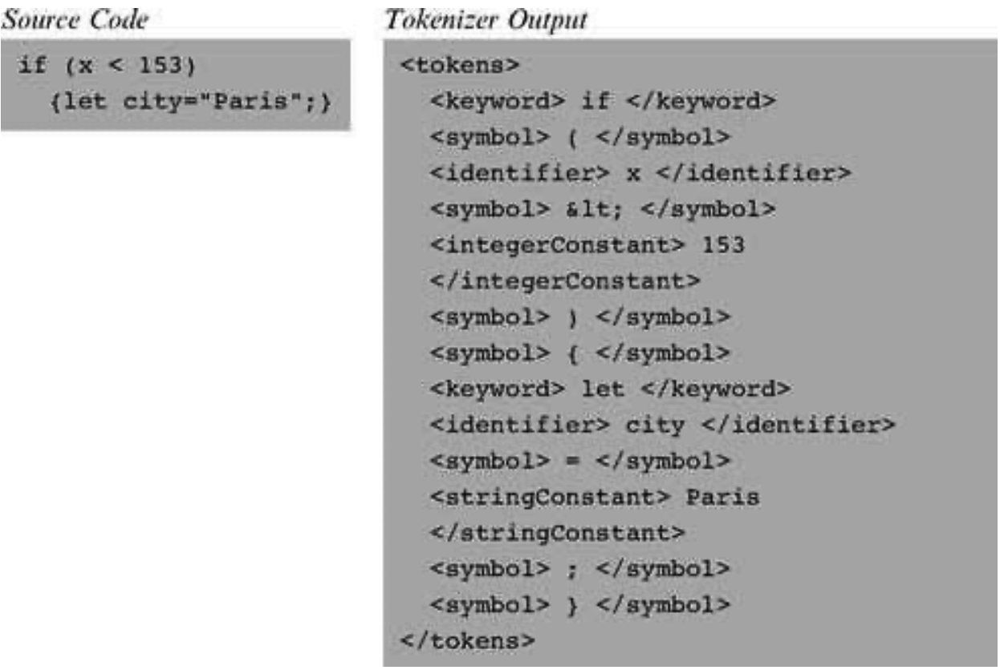

### 10.5 Project
---

&emsp;&emsp;The compiler construction spans two projects: 10 and 11. This section describes how to build the syntax analyzer described in this chapter. In the next chapter we extend this analyzer into a full-scale Jack compiler.

&emsp;&emsp;**Objective** Build a syntax analyzer that parses Jack programs according to the Jack grammar. The analyzer’s output should be written in XML, as defined in the specification section.

&emsp;&emsp;**Resources** The main tool in this project is the programming language in which you will implement the syntax analyzer. You will also need the supplied TextComparer utility, which allows comparing the output files generated by your analyzer to the compare files supplied by us. You may also want to inspect the generated and supplied output files using an XML viewer (any standard Web browser should do the job).

&emsp;&emsp;**Contract** Write the syntax analyzer program in two stages: tokenizing and parsing. Use it to parse all the . jack files mentioned here. For each source . jack file, your analyzer should generate an .xml output file. The generated files should be identical to the .xml compare-files supplied by us.

&emsp;&emsp;**Test Programs**

&emsp;&emsp;The syntax analyzer’s job is to parse programs written in the Jack language. Thus, a reasonable way to test your analyzer it is to have it parse several representative Jack programs. We supply two such test programs, called Square Dance and Array Test. The former includes all the features of the Jack language except for array processing, which appears in the latter. We also provide a simpler version of the Square Dance program, as explained in what follows.

&emsp;&emsp;For each one of the three programs, we supply all the Jack source files comprising the program. For each such Xxx.jack file, we supply two compare files named XxxT.xml and Xxx.xml. These files contain, respectively, the output that should be produced by a tokenizer and by a parser applied to Xxx .jack.

&emsp;&emsp;■ <em>Square Dance</em> (projects/10/Square): A trivial interactive “game” that enables moving a black square around the screen using the keyboard’s four arrow keys.

&emsp;&emsp;■ </em>Expressionless Square Dance</em> (projects/10/ExpressionlessSquare): An identical copy of Square Dance, except that each expression in the original program is replaced with a single identifier (some variable name in scope). For example, the Square class has a method that increases the size of the graphical square object by 2 pixels, as long as the new size does not cause the square image to spill over the screen’s boundaries. The code of this method is as follows.

&emsp;&emsp;Note that the replacement of expressions with variables has resulted in a nonsensical program that cannot be compiled by the supplied Jack compiler. Still, it follows all the Jack grammar rules. The expressionless class files have the same names as those of the original files, but they are located in a separate directory.

&emsp;&emsp;■ Array test (projects/10/ArrayTest): A single-class Jack program that computes the average of a user- supplied sequence of integers using array notation and array manipulation.

&emsp;&emsp;**Experimenting with the Test Programs** If you want, you can compile the Square Dance and Array Test programs using the supplied Jack compiler, then use the supplied VM emulator to run the compiled code. These activities are completely irrelevant to this project, but they serve to highlight the fact that the test programs are not just plain text (although this is perhaps the best way to think about them in the context of this project).

&emsp;&emsp;**Stage 1: Tokenizer**

&emsp;&emsp;First, implement the JackTokenizer module specified in section 10.3. When applied to a text file containing Jack code, the tokenizer should produce a list of tokens, each printed in a separate line along with its classification: symbol, keyword, identifier, integer constant, or string constant. The classification should be recorded using XML tags. Here is an example:

&emsp;&emsp;Note that in the case of string constants, the tokenizer throws away the double quote characters. That’s intentional.

&emsp;&emsp;The tokenizer’s output has two “peculiarities” dictated by XML conventions. First, an XML file must be enclosed in some begin and end tags, and that’s why the <tokens> and </tokens> tags were added to the output. Second, four of the symbols used in the Jack language (<, >, “, &) are also used for XML markup, and thus they cannot appear as data in XML files. To solve the problem, we require the tokenizer to output these tokens as &lt;, &gt;, &quot;, and &amp;, respectively. For example, in order for the text “<symbol> < </symbol>” to be displayed properly in a Web browser, the source XML should be written as “<symbol> &lt; </symbol>.”

&emsp;&emsp;**Testing Your Tokenizer**

&emsp;&emsp;■ Test your tokenizer on the Square Dance and Test Array programs. There is no need to test it on the expressionless version of the former.

&emsp;&emsp;■ For each source file Xxx.jack, have your tokenizer give the output file the name XxxT.xml. Apply your tokenizer to every class file in the test programs, then use the supplied TextComparer utility to compare the generated output to the supplied .xml compare files.

&emsp;&emsp;■ Since the output files generated by your tokenizer will have the same names and extensions as those of the supplied compare files, we suggest putting them in separate directories.

&emsp;&emsp;**Stage 2: Parser**

&emsp;&emsp;Next, implement the CompilationEngine module specified in section 10.3. Write each method of the engine, as specified in the API, and make sure that it emits the correct XML output. We recommend to start by writing a compilation engine that handles everything except expressions, and test it on the expressionless Square Dance program only. Next, extend the parser to handle expressions as well, and proceed to test it on the <em>Square Dance and Array Test</em> programs.

&emsp;&emsp;**Testing Your Parser**

&emsp;&emsp;■ Apply your CompilationEngine to the supplied test programs, then use the supplied TextComparer utility to compare the generated output to the supplied . xml compare files.

&emsp;&emsp;■ Since the output files generated by your analyzer will have the same names and extensions as those of the supplied compare files, we suggest putting them in separate directories.

&emsp;&emsp;■ Note that the indentation of the XML output is only for readability. Web browsers and the supplied TextComparer utility ignore white space.
