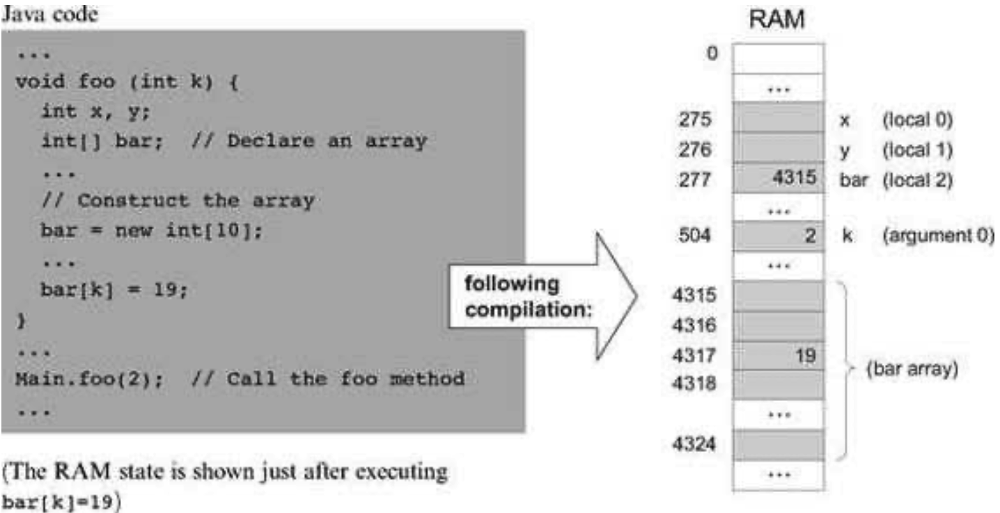
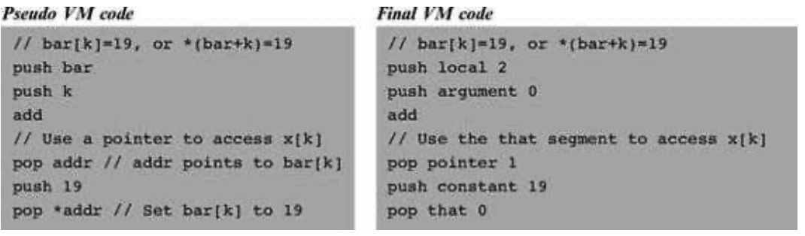
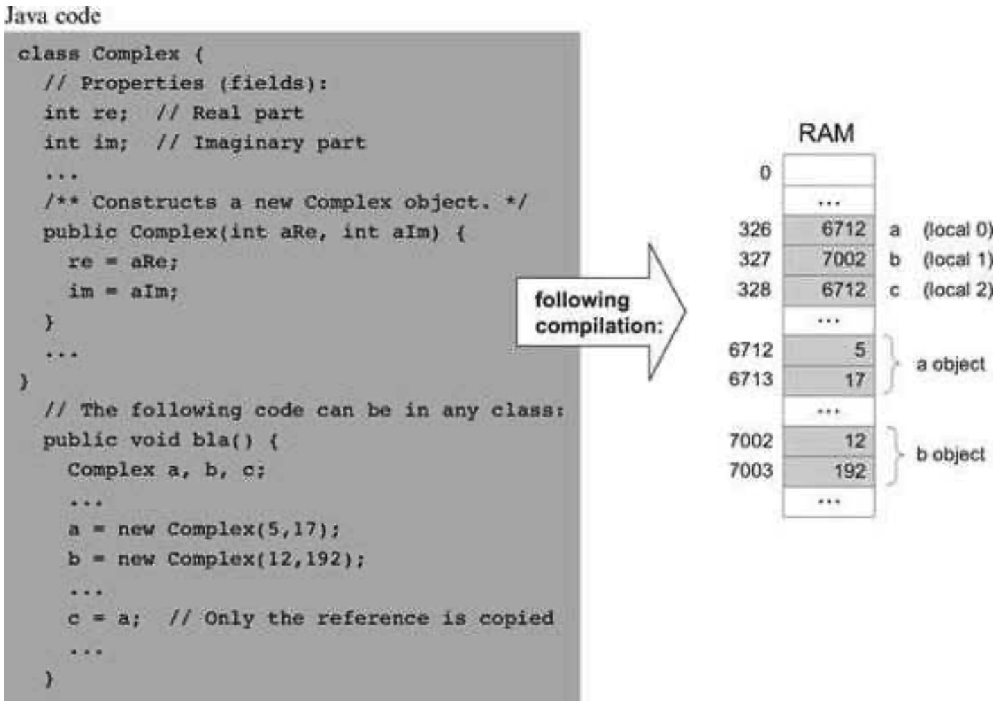
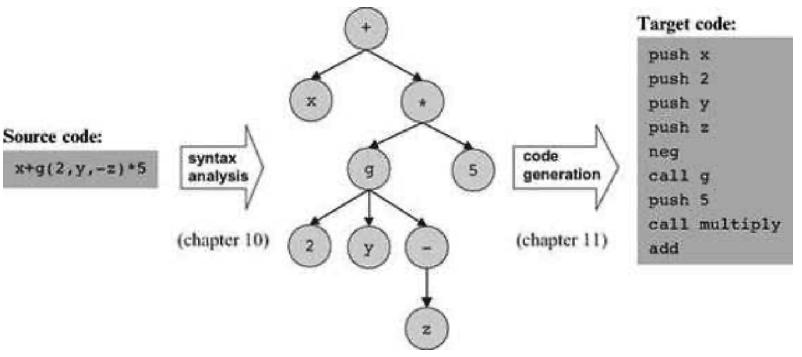
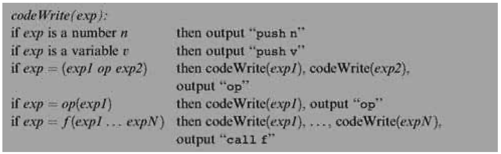

### 11.1 Background
---

&emsp;&emsp;A program is essentially a series of operations that manipulate data. Thus, the compilation of high-level programs into a low-level language focuses on two main issues: data translation and command translation.

&emsp;&emsp;The overall compilation task entails translation all the way to binary code. However, since we are focusing on a two-tier compiler architecture, we assume throughout this chapter that the compiler generates VM code. Therefore, we do not touch low-level issues that have already been dealt with at the Virtual Machine level (chapters 7 and 8).


#### 11.1.1 Data Translation

&emsp;&emsp;Programs manipulate many types of variables, including simple types like integers and booleans and complex types like arrays and objects. Another dimension of interest is the variables’ kind of life cycle and scope—namely, whether it is local, global, an argument, an object field, and so forth.

&emsp;&emsp;For each variable encountered in the program, the compiler must map the variable on an equivalent representation suitable to accommodate its type in the target platform. In addition, the compiler must manage the variable’s life cycle and scope, as implied by its kind. This section describes how compilers handle these tasks, beginning with the notion of a symbol table.

&emsp;&emsp;**Symbol Table** High-level programs introduce and manipulate many identifiers. Whenever the compiler encounters an identifier, say xxx, it needs to know what xxx stands for. Is it a variable name, a class name, or a function name? If it’s a variable, is xxx a field of an object, or an argument of a function? What type of variable is it—an integer, a boolean, a char, or perhaps some class type? The compiler must resolve these questions before it can represent xxx’s semantics in the target language. Further, all these questions must be answered (for code generation) each time xxx is encountered in the source code.

&emsp;&emsp;Clearly, there is a need to keep track of all the identifiers introduced by the program, and, for each one, to record what the identifier stands for in the source program and on which construct it is mapped in the target language. Most compilers maintain this information using a symbol table abstraction. Whenever a new identifier is encountered in the source code for the first time (e.g., in a variable declaration), the compiler adds its description to the table. Whenever an identifier is encountered elsewhere in the code, the compiler looks it up in the symbol table and gets all the necessary information about it. Here is a typical example:

| Name      | Type    | Kind     | # |
| --------- | ------- | -------- | - |
| nAccounts | int     | static   | 0 |
| id        | int     | field    | 0 |
| name      | string  | field    | 1 |
| balance   | int     | field    | 2 |
| sum       | int     | argument | 0 |
| status    | boolean | local    | 0 |

&emsp;&emsp;**Symbol table** (of some hypothetical subroutine)

&emsp;&emsp;The symbol table is the “Rosetta stone” that the compiler uses when translating high-level code involving identifiers. For example, consider the statement balance= balance+sum. Using the symbol table, the compiler can translate this statement into code reflecting the facts that balance is field number 2 of the current object, while sum is argument number 0 of the running subroutine. Other details of this translation will depend on the target language.

&emsp;&emsp;The basic symbol table abstraction is complicated slightly due to the fact that most languages permit different program units to use the same identifiers to represent completely different things. In order to enable this freedom of expression, each identifier is implicitly associated with a scope, namely, the region of the program in which the identifier is recognized. The scopes are typically nested, the convention being that inner-scoped definitions hide outer ones. For example, if the statement x++ appears in some C function, the C compiler first checks whether the identifier x is declared locally in the current function, and if so, generates code that increments the local variable. Otherwise, the compiler checks whether x is declared globally in the file, and if so, generates code that increments the global variable. The depth of this scoping convention is potentially unlimited, since some languages permit defining variables which are local only to the block of code in which they are declared.

&emsp;&emsp;Thus, we see that in addition to all the relevant information that must be kept about each identifier, the symbol table must also record in some way the identifier’s scope. The classic data structure for this purpose is a list of hash tables, each reflecting a single scope nested within the next one in the list. When the compiler fails to find the identifier in the table associated with the current scope, it looks it up in the next table in the list, from inner scopes outward. Thus if x appears undeclared in a certain code segment (e.g., a method), it may be that x is declared in the code segment that owns the current segment (e.g., a class), and so on.

&emsp;&emsp;**Handling Variables** One of the basic challenges faced by every compiler is how to map the various types of variables declared in the source program onto the memory of the target platform. This is not a trivial task. First, different types of variables require different sizes of memory chunks, so the mapping is not one-to-one. Second, different kinds of variables have different life cycles. For example, a single copy of each static variable should be kept alive during the complete duration of the program’s run-time. In contrast, each object instance of a class should have a different copy of all its instance variables (fields), and, when disposed, the object’s memory should be recycled. Also, each time a subroutine is being called, new copies of its local and argument variables must be created—a need that is clearly seen in recursion.

&emsp;&emsp;That’s the bad news. The good news is that we have already handled all these difficulties. In our two-tier compiler architecture, memory allocation of variables was delegated to the VM back-end. In particular, the virtual machine that we built in chapters 7-8 includes built-in mechanisms for accommodating the standard kinds of variables needed by most high-level languages: static, local, and argument variables, as well as fields of objects. All the allocation and de-allocation details of these variables were already handled at the VM level, using the global stack and the virtual memory segments.

&emsp;&emsp;Recall that this functionality was not achieved easily. In fact, we had to work rather hard to build a VM implementation that maps the global stack and the virtual memory segments on the ultimate hardware platform. Yet this effort was worth our while: For any given language L, any L-to-VM compiler is now completely relieved from low-level memory management. The only thing required from the compiler is mapping the variables found in the source program on the virtual memory segments and expressing the high-level commands that manipulate them using VM commands—a rather simple translation task.

&emsp;&emsp;**Handling Arrays** <em>Arrays</em> are almost always stored as sequences of consecutive memory locations (multi-dimensional arrays are flattened into one-dimensional ones). The array name is usually treated as a pointer to the base address of the RAM block allocated to store the array in memory. In some languages like Pascal, the entire memory space necessary to represent the array is allocated when the array is declared. In other languages like Java, the array declaration results in the allocation of a single pointer only, which, eventually, may point to the array’s base address. The array proper is created in memory later, if and when the array is actually constructed at run-time. This type of dynamic memory allocation is done from the heap, using the memory management services of the operating system. Typically, the OS has an alloc(size) function that knows how to find an available memory block of size and return its base address to the caller. Thus, when compiling a high-level statement like bar=new int [10], the compiler generates low-level code that effects the operation bar=alloc(10). This results in assigning the base-address of the array’s memory block to bar, which is exactly what we want. Figure 11.1 offers a snapshot of this practice.

<div align="center"></div>

&emsp;&emsp;**Figure 11.1** Array handling. Since memory allocations are run-time dependent, all the shown addresses are arbitrary examples.

&emsp;&emsp;Let us consider how the compiler translates the statement bar[k]=19. Since the symbol bar points to the array’s base-address, this statement can be also expressed using the C-language notation *(bar+k)=19, that is, “store 19 in the memory cell whose address is bar+k.” In order to implement this operation, the target language must be equipped with some sort of an indirect addressing mechanism. Specifically, instead of storing a value in some memory location y, we need to be able to store the value in the memory location whose address is the current contents of y. Different languages have different means to carry out this pointer arithmetic, and figure 11.2 shows two possibilities.

<div align="center"></div>

&emsp;&emsp;**Figure 11.2** Array processing. The Hack VM code (right) follows the conventions described in section 7.2.6.

&emsp;&emsp;**Handling Objects** Object instances of a certain class, say Employee, are said to encapsulate data items like name and salary, as well as a set of operations (methods) that manipulate them. The data and the operations are handled quite differently by the compiler. Let’s start with the data.

&emsp;&emsp;The low-level handling of object data is quite similar to that of arrays, storing the fields of each object instance in consecutive memory locations. In most object-oriented languages, when a class-type variable is declared, the compiler only allocates a pointer variable. The memory space for the object proper is allocated later, if and when the object is actually created via a call to a class constructor. Thus, when compiling a constructor of some class Xxx, the compiler first uses the number and type of the class fields to determine how many words—say n—are necessary to represent an object instance of type Xxx on the host RAM. Next, the compiler generates the code necessary for allocating memory for the newly constructed object, for example, this=alloc(n). This operation sets the this pointer to the base address of the memory block that represents the new object, which is exactly what we want. Figure 11.3 illustrates these operations in a Java context.

<div align="center"></div>

&emsp;&emsp;**Figure 11.3** Objects handling. Since memory allocations are run-time dependent, all the shown addresses are arbitrary examples.

&emsp;&emsp;Since each object is represented by a pointer variable that contains its base-address, the data encapsulated by the object can be accessed linearly, using an index relative to its base. For example, suppose that the Complex class includes the following method:

```
  public void mult (int c) {
    re = re * c;
    im = im * c;
  }
```

&emsp;&emsp;How should the compiler handle the statement im = im &ast; c? Well, an inspection of the symbol table will tell the compiler that im is the second field of this object and that c is the first argument of the mult method. Using this information, the compiler can translate im = im &ast; c into code effecting the operation * (this + 1) = *(this + 1) times (argument 0). Of course, the generated code will have to accomplish this operation using the target language.

&emsp;&emsp;Suppose now that we wish to apply the mult method to the b object, using a method call like b.mult(5). How should the compiler handle this method call? Unlike the fields data (e.g., re and im), of which different copies are kept for each object instance, only one copy of each method (e.g., mult) is actually kept at the target code level for all the object instances derived from this class. In order to make it look as if each object encapsulates its own code, the compiler must force this single method to always operate on the desired object. The standard compilation trick that accomplishes this abstraction is to pass a reference to the manipulated object as a hidden argument of the called method, compiling b.mult(5) as if it were written as mult(b, 5). In general then, each object-based method call foo.bar(v1, v2, ...) is translated into the VM code push foo, push v1, push v2, ... , call bar. This way, the compiler can force the same method to operate on any desired object for instance, creating the high-level perception that each object encapsulates its own code.

&emsp;&emsp;However, the compiler’s job is not done yet. Since the language allows different methods in different classes to have the same name, the compiler must ensure that the right method is applied to the right object. Further, due to the possibility of method overriding in a subclass, compilers of object-oriented languages must do this determination at run-time. When run-time typing is out of the picture, for example, in languages like Jack, this determination can be done at compile-time. Specifically, in each method call like x.m(y), the compiler must ensure that the called method m() belongs to the class from which the x object was derived.


#### 11.1.2 Commands Translation

&emsp;&emsp;We now describe how high-level commands are translated into the target language. Since we have already discussed the handling of variables, objects, and arrays, there are only two more issues to consider: expression evaluation and flow control.

&emsp;&emsp;**Evaluating Expressions** How should we generate code for evaluating high-level expressions like x+g(2,y,-z)*5? First, we must “understand” the syntactic structure of the expression, for example, convert it into a parse tree like the one depicted in figure 11.4. This parsing was already handled by the syntax analyzer described in chapter 10. Next, as seen in the figure, we can traverse the parse tree and generate from it the equivalent VM code.

<div align="center"></div>

&emsp;&emsp;**Figure 11.4** Code generation.

&emsp;&emsp;The choice of the code generation algorithm depends on the target language into which we are translating. For a stack-based target platform, we simply need to print the tree in postfix notation, also known as Right Polish Notation (RPN). In RPN syntax, an operation like f(x, y) is expressed as x, y, f (or, in the VM language syntax, push x, push y, call f). Likewise, an operation like x + y, which is +(x, y) in prefix notation, is stated as x, y, + (i.e., push x, push y, add). The strategy for translating expressions into stack-based VM code is straightforward and is based on recursive post-order traversal of the underlying parse tree, as follows:

<div align="center"></div>

&emsp;&emsp;The reader can verify that when applied to the tree in figure 11.4, this algorithm generates the stack-machine code shown in the figure.

&emsp;&emsp;**Translating Flow Control** High-level programming languages are equipped with a variety of control flow structures like if, while, for, switch, and so on. In contrast, low-level languages typically offer two basic control primitives: conditional goto and unconditional goto. Therefore, one of the challenges faced by the compiler writer is to translate structured code segments into target code utilizing these primitives only. As shown in figure 11.5, the translation logic is rather simple.

&emsp;&emsp;Two features of high-level languages make the compilation of control structures slightly more challenging than that shown in figure 11.5. First, a program normally contains multiple instances of if and while statements. The compiler can handle this multiplicity by generating and using unique label names. Second, control structures can be nested, for example, if within while within another while and so on. This complexity can be dealt with easily using a recursive compilation strategy.
