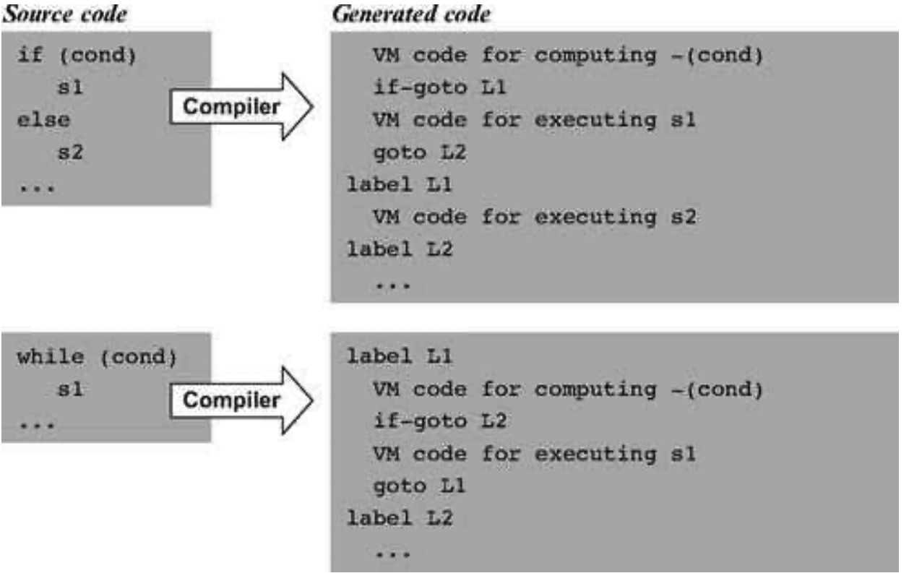
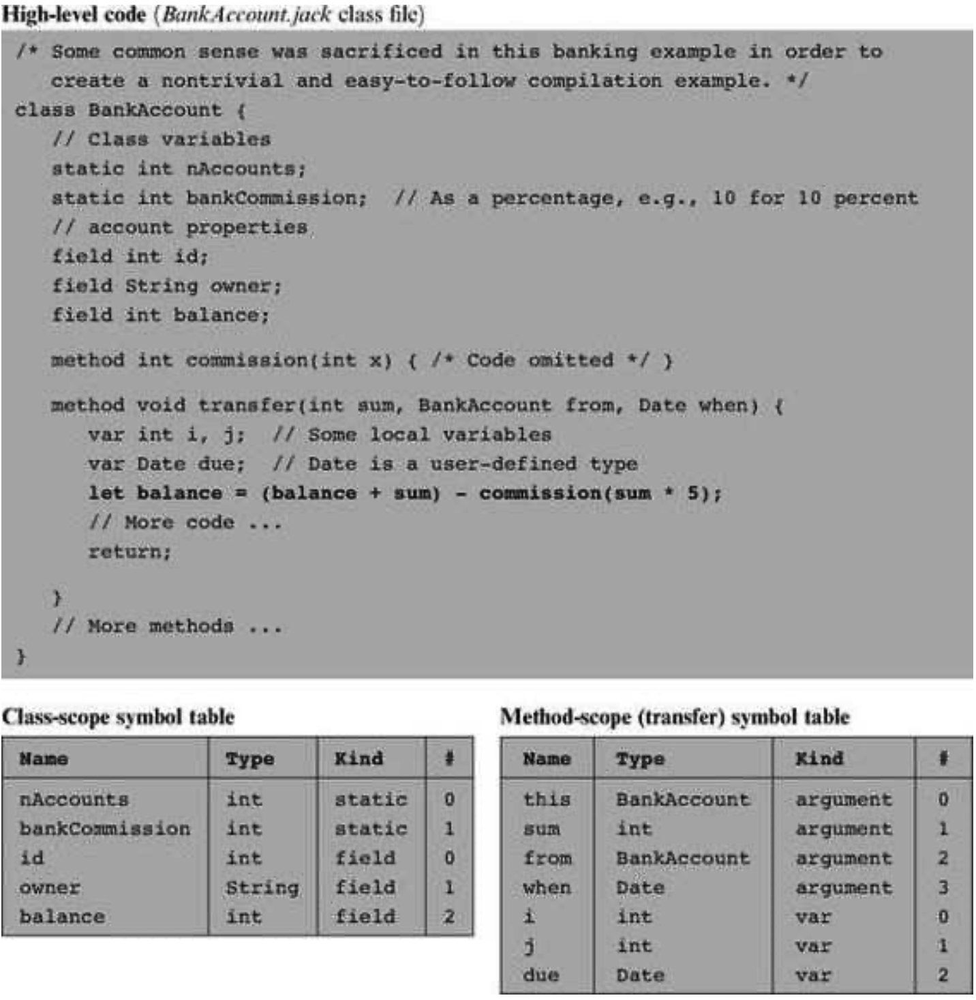
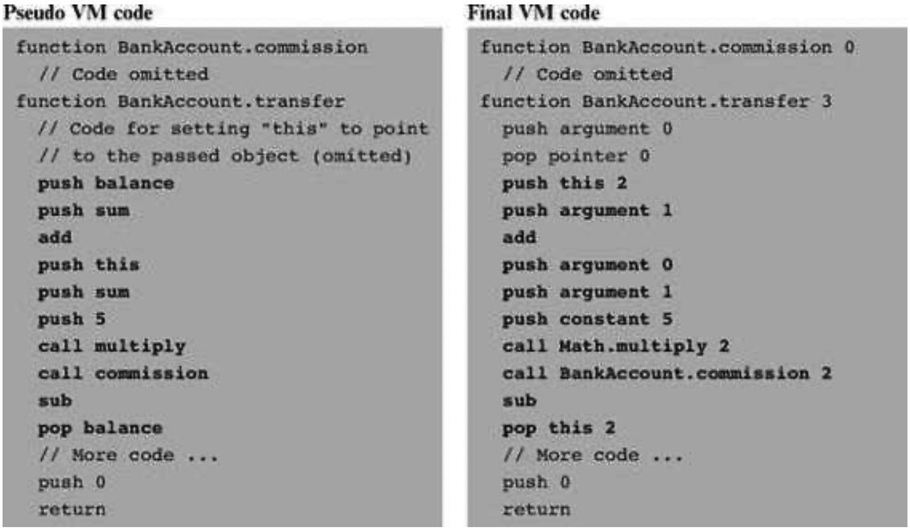

### 11.2 Specification
---


&emsp;&emsp;Usage The Jack compiler accepts a single command line parameter, as follows:

```
  prompt> JackCompiler source
```

<div align="center"></div>

&emsp;&emsp;**Figure 11.5** Compilation of control structures.

&emsp;&emsp;Where <em>source</em> is either a file name of the form Xxx.jack (the extension is mandatory) or a directory name containing one or more .jack files (in which case there is no extension). The compiler compiles each Xxx.jack file into a file named Xxx.vm, created in the same directory in which the source file is located. If source is a directory name, each .jack file located in it is compiled, creating a corresponding .vm file in the same directory.


#### 11.2.1 Standard Mapping over the Virtual Machine

&emsp;&emsp;The compiler translates each .jack file into a .vm file containing one VM function for each constructor, function, and method found in the . jack file (see figure 7.8). In doing so, every Jack-to-VM compiler must follow the following code generation conventions.

&emsp;&emsp;**File and Function** Naming Each .jack class file is compiled into a separate .vm file. The Jack subroutines (functions, methods, and constructors) are compiled into VM functions as follows:

  &emsp;&emsp;■ A Jack subroutine xxx() in a Jack class Yyy is compiled into a VM function called Yyy.xxx.

  &emsp;&emsp;■ A Jack <em>function or constructor</em> with k arguments is compiled into a VM function that operates on k arguments.

  &emsp;&emsp;■ A Jack <em>method</em> with k arguments is compiled into a VM function that operates on k + 1 arguments. The first argument (argument number 0) always refers to the this object.

&emsp;&emsp;**Memory Allocation and Access**

  &emsp;&emsp;■ The <em>local variables</em> of a Jack subroutine are allocated to, and accessed via, the virtual local segment.

  &emsp;&emsp;■ The <em>argument variables</em> of a Jack subroutine are allocated to, and accessed via, the virtual argument segment.

  &emsp;&emsp;■ The <em>static variables</em> of a .jack class file are allocated to, and accessed via, the virtual static segment of the corresponding .vm file.

  &emsp;&emsp;■ Within a VM function corresponding to a Jack method or a Jack constructor, access to the fields of the this object is obtained by first pointing the virtual this segment to the current object (using pointer 0) and then accessing individual fields via this index references, where index is an non-negative integer.

  &emsp;&emsp;■ Within a VM function, access to array entries is obtained by first pointing the virtual that segment (using pointer 1) to the address of the desired array entry and then accessing the array entry via that 0 references.

&emsp;&emsp;**Subroutine Calling**

  &emsp;&emsp;■ Before calling a VM function, the caller (itself a VM function) must push the function’s arguments onto the stack. If the called VM function corresponds to a Jack method, the first pushed argument must be a reference to the object on which the method is supposed to operate.

  &emsp;&emsp;■ When compiling a Jack method into a VM function, the compiler must insert VM code that sets the base of the this segment properly. Similarly, when compiling a Jack constructor, the compiler must insert VM code that allocates a memory block for the new object and then sets the base of the this segment to point at its base.

&emsp;&emsp;**Returning from Void Methods and Functions** High-level void subroutines don’t return values. This abstraction is handled as follows:

  &emsp;&emsp;■ VM functions corresponding to <em>void</em> Jack methods and functions must return the constant 0 as their return value.

  &emsp;&emsp;■ When translating a do sub statement where sub is a void method or function, the caller of the corresponding VM function must pop (and ignore) the returned value (which is always the constant 0).

&emsp;&emsp;**Constants**

  &emsp;&emsp;■ null and false are mapped to the constant 0. True is mapped to the constant -1 (this constant can be obtained via push constant 1 followed by neg).

&emsp;&emsp;**Use of Operating System Services** The basic Jack OS is implemented as a set of VM files named Math . vm, Array . vm, Output . vm, Screen . vm, Keyboard . vm, Memory . vm, and Sys.vm (the API of these compiled class files was given in chapter 9). All these files must reside alongside the VM files generated by the compiler. This way, any VM function can call any OS VM function for its effect. In particular, when needed, the compiler should generate code that uses the following OS functions:

  &emsp;&emsp;■ Multiplication and division are handled using the OS functions Math.multiply() and Math.divide().

  &emsp;&emsp;■ String constants are created using the OS constructor String.new(length). String assignments like x=“cc...c” are handled using a series of calls to the OS routine String . appendChar (nextChar).

  &emsp;&emsp;■ Constructors allocate space for new objects using the OS function Memory.alloc(size).


#### 11.2.2 Compilation Example

&emsp;&emsp;Compiling a Jack program (one or more . jack class files) involves two main tasks: parsing the code using the compilation engine developed in the previous chapter, and generating code according to the guidelines and specifications given above. Figure 11.6 gives a “live example” of many of the code generation issues mentioned in this chapter.

<div align="center"></div>

&emsp;&emsp;**Figure 11.6** Code generation example focusing on the translation of the statement let balance = (balance + sum) - commission(sum * 5).

<div align="center"></div>
