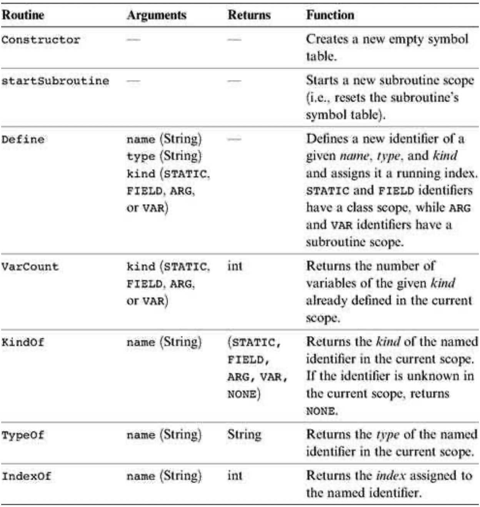
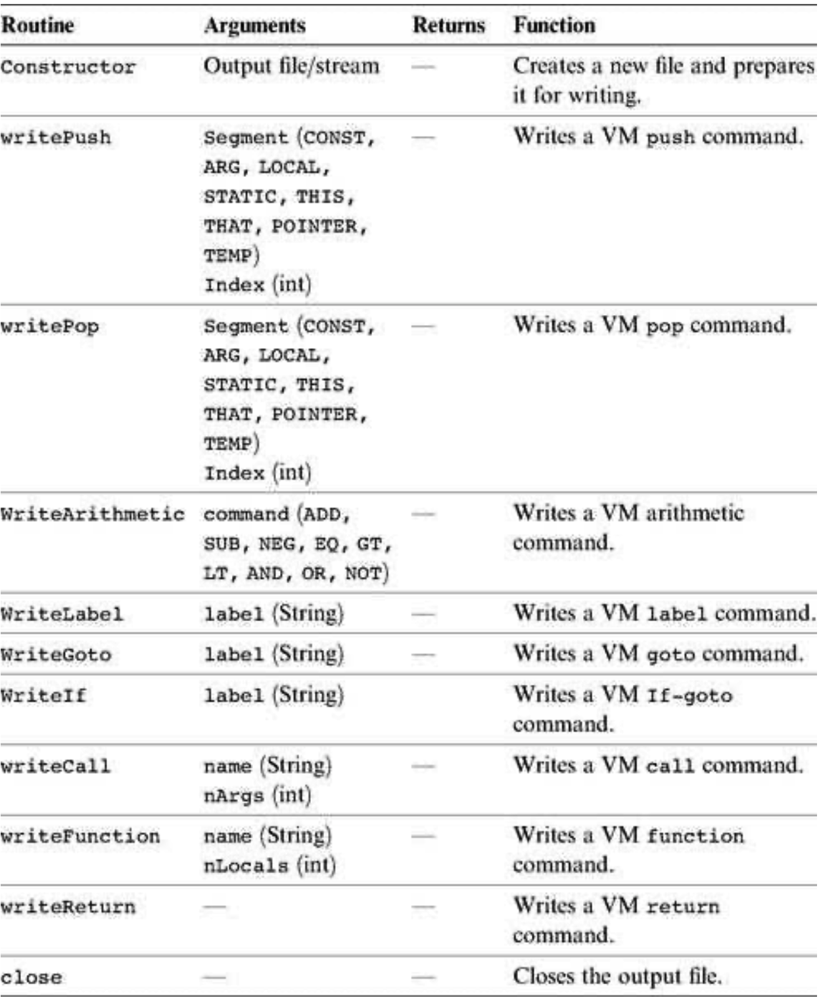

### 11.3 Implementation
---

&emsp;&emsp;We now turn to propose a software architecture for the overall compiler. This architecture builds upon the syntax analyzer described in chapter 10. In fact, the current architecture is based on gradually evolving the syntax analyzer into a full-scale compiler. The overall compiler can thus be constructed using five modules:
  * JackCompiler: top-level driver that sets up and invokes the other modules;
  * JackTokenizer: tokenizer;
  * SymbolTable: symbol table;
  * VMWriter: output module for generating VM code;
  * CompilationEngine: recursive top-down compilation engine.

#### 11.3.1 The <em>JackCompiler</em> Module

&emsp;&emsp;The compiler operates on a given source, where source is either a file name of the form Xxx.jack or a directory name containing one or more such files. For each Xxx.jack input file, the compiler creates a JackTokenizer and an output Xxx.vm file. Next, the compiler uses the <em>CompilationEngine</em>, SymbolTable, and VMWriter modules to write the output file.

#### 11.3.2 The <em>JackTokenizer</em> Module

&emsp;&emsp;The tokenizer API was given in section 10.3.2.

#### 11.3.3 The <em>SymbolTable</em> Module

&emsp;&emsp;This module provides services for creating and using a symbol table. Recall that each symbol has a scope from which it is visible in the source code. The symbol table implements this abstraction by giving each symbol a running number (index) within the scope. The index starts at 0, increments by 1 each time an identifier is added to the table, and resets to 0 when starting a new scope. The following kinds of identifiers may appear in the symbol table:

&emsp;&emsp;<em>Static:</em> Scope: class.

&emsp;&emsp;<em>Field:</em> Scope: class.

&emsp;&emsp;<em>Argument:</em> Scope: subroutine (method/function/constructor).

&emsp;&emsp;<em>Var:</em> Scope: subroutine (method/function/constructor).

&emsp;&emsp;When compiling error-free Jack code, any identifier not found in the symbol table may be assumed to be a subroutine name or a class name. Since the Jack language syntax rules suffice for distinguishing between these two possibilities, and since no “linking” needs to be done by the compiler, there is no need to keep these identifiers in the symbol table.

&emsp;&emsp;**SymbolTable:** Provides a symbol table abstraction. The symbol table associates the identifier names found in the program with identifier properties needed for compilation: type, kind, and running index. The symbol table for Jack programs has two nested scopes (class/subroutine).

&emsp;&emsp;**Implementation Tip** The symbol table abstraction and API can be implemented using two separate hash tables: one for the class scope and another one for the subroutine scope. When a new subroutine is started, the subroutine scope table can be cleared.

#### 11.3.4 The <em>VMWriter</em> Module

&emsp;&emsp;**VMWriter:** Emits VM commands into a file, using the VM command syntax.

#### 11.3.5 The <em>CompilationEngine</em> Module

&emsp;&emsp;This class does the compilation itself. It reads its input from a JackTokenizer and writes its output into a VMWriter. It is organized as a series of compilexxx( ) routines, where xxx is a syntactic element of the Jack language. The contract between these routines is that each compilexxx( ) routine should read the syntactic construct xxx from the input, advance( ) the tokenizer exactly beyond xxx, and emit to the output VM code effecting the semantics of xxx. Thus compilexxx( ) may only be called if indeed xxx is the next syntactic element of the input. If xxx is a part of an expression and thus has a value, the emitted code should compute this value and leave it at the top of the VM stack.

&emsp;&emsp;The API of this module is identical to that of the syntax analyzer’s <em>compilation-Engine</em> module from chapter 10, and thus we suggest gradually morphing the syntax analyzer into a full compiler. Section 11.5 provides step-by-step instructions and test programs for this construction.
