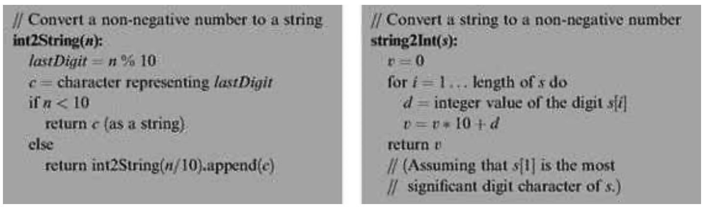
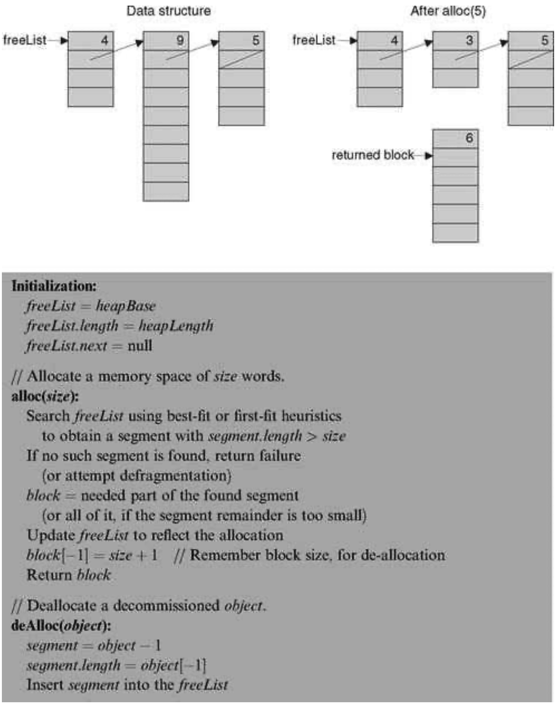
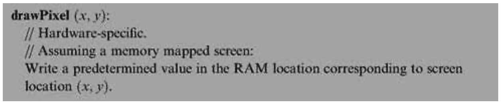
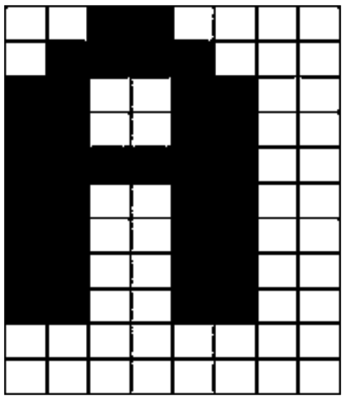
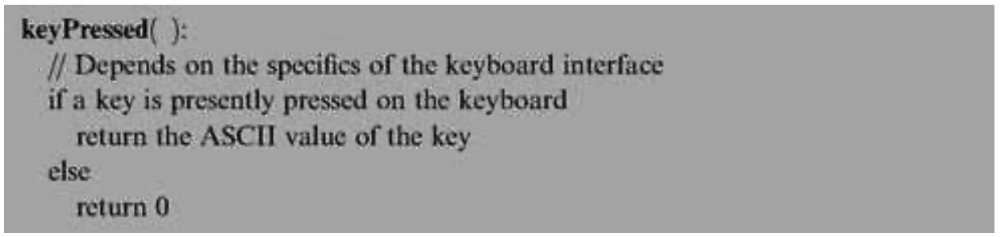
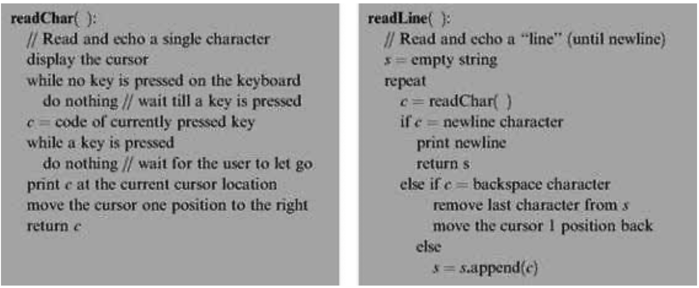

### 12.1 Background
---


#### 12.1.1 Mathematical Operations

&emsp;&emsp;Computer systems must support mathematical operations like addition, multiplication, and division. Normally, addition is implemented in hardware, at the ALU level, as we have done in chapter 3. Other operations like multiplication and division can be handled by either hardware or software, depending on the computer’s cost/performance requirements. This section shows how multiplication, division, and square root operations can be implemented efficiently in software, at the OS level. We note in passing that hardware implementations of these mathematical operations can be based on the same algorithms presented here.

&emsp;&emsp;**Efficiency First** Mathematical algorithms operate on <em>n</em>-bit binary numbers, with typical computer architectures having <em>n</em> = 16, 32, or 64. As a rule, we seek algorithms whose running time is proportional (or at least polynomial) in this parameter <em>n</em>. Algorithms whose running time is proportional to the value of <em>n</em>-bit numbers are unacceptable, since these values are exponential in <em>n</em>. For example, suppose we implement the multiplication operation x · y using the repeated addition algorithm for i = 1 ... y {result = result +x}. Well, the problem is that in a 64-bit computer, y can be greater than 18,000,000,000,000,000,000, implying that this naïve algorithm may run for years even on the fastest computers. In sharp contrast, the running time of the multiplication algorithm that we present below is proportional not to the multiplicands’ value, which may be as large as 2<sup>n</sup>, but rather to n. Therefore, it will require only c·n elementary operations for any pair of multiplicands, where c is a small constant representing the number of elementary operations performed in each loop iteration.

&emsp;&emsp;We use the standard “Big-Oh” notation, <em>O(n)</em>, to describe the running time of algorithms. Readers who are not familiar with this notation can simply read <em>O(n)</em> as “in the order of magnitude of <em>n</em>.” With that in mind, we now turn to present an efficient multiplication x · y algorithm for <em>n</em>-bit numbers whose running time is <em>O(n)</em> rather than <em>O(x)</em> or <em>O(y)</em>, which are exponentially larger.

&emsp;&emsp;**Multiplication** Consider the standard multiplication method taught in elementary school. To compute 356 times 27, we line up the two numbers one on top of the other. Next, we multiply each digit of 356 by 7. Next, we “shift to the left” one position, and multiply each digit of 356 by 2. Finally, we sum up the columns and obtain the result. The binary version of this technique—figure 12.1—follows exactly the same logic.

&emsp;&emsp;The algorithm in figure 12.1 performs <em>O(n)</em> addition operations on <em>n</em>-bit numbers, where n is the number of bits in x and y. Note that <em>shiftedX</em> * 2 can be efficiently obtained by either left-shifting its bit representation or by adding <em>shiftedX</em> to itself. Both operations can be easily performed using primitive ALU operations. Thus this algorithm lends itself naturally to both software and hardware implementations.

<div align="center"></div>

&emsp;&emsp;**Figure 12.1** Multiplication of two <em>n</em>-bit numbers.

&emsp;&emsp;**A Comment about Notation** The algorithms in this chapter are written using a self-explanatory pseudocode syntax. The only non-obvious convention is that we use indentation to represent blocks of code (avoiding curly brackets or begin/end keywords). For example, in figure 12.1, <em>sum = sum + shiftedX</em> belongs to the single-statement body of the if statement whereas <em>shiftedX</em> = <em>shiftedX * 2</em> ends the two-statement body of the <em>for</em> statement.

&emsp;&emsp;**Division** The naïve way to compute the division of two n-bit numbers x/y is to repeatedly subtract y from x until it is impossible to continue (i.e., until x < y). The running time of this algorithm is clearly proportional to the quotient, and may be as large as <em>O(x)</em>, that is, exponential in the number of bits <em>n</em>. To speed up this algorithm, we can try to subtract large chunks of y’s from x in each iteration. For example, if x = 891 and y = 5, we can tell right away that we can deduct a hundred 5’s from x and the remainder will still be greater than 5, thus shaving 100 iterations from the naïve approach. Indeed, this is the rationale behind the school method for long division x/y. Formally, in each iteration we try to subtract from x the largest possible shift of y, namely, y · T where T is the largest power of 10 such that y · T ≤ x. The binary version of this opportunistic algorithm is identical, except that T is a power of 2 instead of 10.

<div align="center"></div>

&emsp;&emsp;**Figure 12.2** Division

&emsp;&emsp;Writing down this long division algorithm as we have done for multiplication is an easy exercise. We find it more illuminating to formulate the same logic as a recursive program that is probably easier to implement, shown in figure 12.2.

&emsp;&emsp;The running time of this algorithm is determined by the depth of the recursion. Since in each level of recursion the value of y is multiplied by 2, and since we terminate once y > x, it follows that the recursion depth is bounded by n, the number of bits in x. Each recursion level involves a constant number of addition, subtraction, and multiplication operations, implying a total running time of <em>O(n)</em> such operations.

&emsp;&emsp;This algorithm may be considered suboptimal since each multiplication operation also requires <em>O(n)</em> addition and subtraction operations. However, careful inspection reveals that the product 2 · q · y can be computed without any multiplication. Instead, we can rely on the value of this product in the previous recursion level, and use addition to establish its current value.

&emsp;&emsp;**Square Root** Square roots can be computed efficiently in a number of different ways, for example, by using the Newton-Raphson method or a Taylor series expansion. For our purpose though, a simpler algorithm will suffice. The square root function y = √x has two convenient properties. First, it is monotonically increasing. Second, its inverse function, x = y<sup>2</sup>, is something that we already know how to compute (multiplication). Taken together, these properties imply that we have all we need to compute square roots using binary search. Figure 12.3 gives the details.

&emsp;&emsp;Note that each loop iteration takes a constant number of arithmetic operations. Since the number of iterations is bound by <em>n/2</em>, the algorithm’s running time is <em>O(n)</em> arithmetic operations.

<div align="center"></div>

&emsp;&emsp;**Figure 12.3** Square root computation using binary search.


#### 12.1.2 String Representation of Numbers

&emsp;&emsp;Computers represent numbers internally using binary codes. Yet humans are used to dealing with numbers in a decimal notation. Thus, when humans have to read or input numbers, and only then, a conversion to or from decimal notation must be performed. Typically, this service is implicit in the character handling routines supplied by the operating system. We now turn to describe how these OS services are actually implemented.

&emsp;&emsp;Of course the only subset of characters which is of interest here are the ten digit symbols that represent actual numbers. The ASCII codes of these characters are as follows:

```
  Character: '0', '1', '2', '3', '4', '5', '6', '7', '8', '9'
  ASCII code: 48   49   50   51   52   53   54   55   56   57
```

&emsp;&emsp;As gleaned from the ASCII code, single digit characters can be easily converted into their numeric representation, and vice versa, as follows. To compute the ASCII code of a given digit 0 ≤ x ≤ 9, we can simply add x to 48—the code of ‘0’. Conversely, the numeric value represented by an ASCII code 48 ≤ c ≤ 57 is obtained by c—48. And once we know how to convert single digits, we can proceed to convert any given integer. These conversion algorithms can be based on either iterative or recursive logic, so we present one of each in figures 12.4 and 12.5, respectively.


#### 12.1.3 Memory Management

&emsp;&emsp;**Dynamic Memory Allocation** Computer programs declare and use all sorts of variables, including simple data items like integers and booleans and complex ones like arrays and objects. One of the greatest virtues of high-level languages is that pro-grammers don’t have to worry about the details of allocating RAM space to these variables and recycling the space when it is no longer needed. Instead, all these memory management chores are done behind the scene by the compiler, the operating system, and the virtual machine implementation. This section describes the role of the operating system in this joint effort.

<div align="center"></div>

&emsp;&emsp;**Figure 12.4 and 12.5** String-numeric conversions.

&emsp;&emsp;Different variables are allocated memory at different points of time during the program’s life cycle. For example, static variables may be allocated by the compiler at compile time, while local variables are allocated on the stack each time a subroutine starts running. Other memory is dynamically allocated during the program’s execution, and that’s where the OS enters the picture. For example, each time a Java program creates a new array or a new object, a memory block whose size can be determined only during run-time should be allocated. And when the array or the object is no longer needed, its RAM space may be recycled. In some languages like C++ and Jack, de-allocation of un-needed space is the responsibility of the programmer, while in others, like Java, “garbage collection” occurs automatically. The RAM segment from which memory is dynamically allocated is called heap, and the agent responsible for managing this resource is the operating system.

&emsp;&emsp;Operating systems use various techniques for handling dynamic memory allocation and de-allocation. These techniques are implemented in two functions traditionally called alloc() and deAlloc(). We present two versions of these algorithms: a basic one and an improved one.

&emsp;&emsp;**Basic Memory Allocation Algorithm** The data structure that this algorithm manages is a single pointer, called free, which points to the beginning of the heap segment that was not yet allocated. Figure 12.6a gives the details.

<div align="center"></div>

&emsp;&emsp;**Figure 12.6a** Basic memory allocation scheme (wasteful).

&emsp;&emsp;This algorithm is clearly wasteful, as it does not reclaim the space of decommissioned objects.

&emsp;&emsp;**Improved Memory Allocation Algorithm** This algorithm manages a linked list of available memory segments, called <em>freeList</em>. Each segment contains two housekeeping fields: the segment’s length and a pointer to the next segment in the list. These fields can be physically kept in the segment’s first two memory locations. For example, the implementation can use the convention segment.length==segment[0] and segment.next==segment[1]. Figure 12.6b (top left) illustrates a typical <em>freeList</em> state.

&emsp;&emsp;When asked to allocate a memory block of some given size, the algorithm has to search the <em>freeList</em> for a suitable segment. There are two well-known heuristics for doing this search. Best-fit finds the segment whose length is the closest (from above) to the required size, while first-fit finds the first segment that is long enough. Once a suitable segment has been found, the required memory block is taken from it (the location just before the beginning of the returned block, block [-1], is reserved to hold its length, to be used during de-allocation). Next, this segment is updated in the <em>freeList</em>, becoming the part that remained after the allocation. If no memory was left in the block, or if the remaining part is practically too small, the entire segment is eliminated from the <em>freeList</em>.

&emsp;&emsp;When asked to reclaim the memory block of an unused object, the algorithm appends the de-allocated block to the <em>freeList</em>. The details are given in figure 12.6b.

&emsp;&emsp;After a while, dynamic memory allocation schemes like the algorithm in figure 12.6b may create a block fragmentation problem. Hence, some kind of “defrag” operation should be considered, namely, merging memory areas that are physically consecutive in memory but logically split into different segments in the <em>freeList</em>. The defragmentation operation can be done each time an object is de-allocated, or when alloc() fails to find an appropriate block, or according to some other intermediate or ad-hoc condition.

<div align="center"></div>

&emsp;&emsp;**Figure 12.6b** Improved memory allocation scheme (with recycling).


#### 12.1.4 Variable-length Arrays and Strings

&emsp;&emsp;Suppose we want to use high-level operations like s1=“New York” or s2= readLine (“enter a city”). How can we implement these variable-length abstractions? The common approach in modern languages is to use a String class that supplies services for creating and manipulating string objects. The string object can be physically realized using an array. Normally, when the string is created, this array is allocated to hold some maximum possible length. The actual length of the string at each point of time may be shorter than this maximum, and must be maintained throughout the string object’s life cycle. For example, if we issue a command like s1.eraseLastChar(), the actual length of s1 should decrease from 8 to 7 (although the length of the initially created array does not change). In general then, array locations beyond the current length are not considered part of the string contents.

&emsp;&emsp;Most programming languages feature string types, as well as other data types of variable lengths. The string objects are usually provided by the language’s standard library, for example, the String and StringBuffer classes in Java or the strXXX functions in C.


#### 12.1.5 Input/Output Management

&emsp;&emsp;Computers are typically connected to a variety of input/output devices such as keyboard, screen, mouse, disk, network card, etc. Each of these I/O devices has its own electromechanical and physical idiosyncrasies, and thus reading and writing data on them involves many technical details. High-level languages abstract these details away from the programmer using high-level operations like c=readChar() and printChar(c). These operations are implemented by OS routines that carry out the actual I/O.

&emsp;&emsp;Hence, an important function of the operating system is handling the various I/O devices connected to the computer. This is done by encapsulating the details of interfacing the device and by providing convenient access to its basic functionality, using a set of O/S routines collectively known as the device driver. In this book we describe the basic elements of handling the two most prevalent I/O devices: a screen and a keyboard. We divide the handling of the screen into two logically separate modules: handling graphics output and handling character output.

&emsp;&emsp;**Graphics Output**

&emsp;&emsp;**<em>Pixel Drawing</em>** Most computers today use raster, also called bitmap, display technologies. The only primitive operation that can be physically performed in a bitmap screen is drawing an individual <em>pixel</em>—a single “dot” on the screen specified by (<em>column, row</em>) coordinates. The usual convention is that columns are numbered from left to right (like the conventional <em>x</em>-axis) while rows are numbered from the top down (opposite of the conventional <em>y</em>-axis). Thus the screen coordinates of the top left pixel are (0,0).

&emsp;&emsp;The low-level drawing of a single pixel is a hardware-specific operation that depends on the particular interface of the screen and the underlying graphics card. If the screen interface is based on a RAM-resident memory map, as in Hack, then drawing a pixel is achieved by writing the proper binary value into the RAM location that represents the required pixel in memory (see figure 12.7).

&emsp;&emsp;The memory map interface of the Hack screen was described in section 5.2.4. Formulating a drawPixel algorithm that follows this contract is a simple task left to the reader as an exercise. So, now that we know how to draw a single pixel, let us turn to describing how to draw lines and circles.

&emsp;&emsp;**<em>Line Drawing</em>** When asked to draw a line between two locations on a bitmap screen, the best that we can possibly do is approximate the line by drawing a series of pixels along the imaginary line connecting the two points. Note that the “pen” that we use can move in four directions only: up, down, left, and right. Thus the drawn line is bound to be jagged, and the only way to make it look good is to use a high-resolution screen. Since the receptor cells in the human eye’s retina also form a grid of “input pixels,” there is a limit to the image granularity that the human eye can resolve anyway. Thus, high-resolution screens and printers can fool the human eye to believe that the lines drawn by pixels or printed dots are visibly smooth. In fact they are always jagged.

<div align="center"></div>

&emsp;&emsp;**Figure 12.7** Drawing a pixel.

&emsp;&emsp;The procedure for drawing a line from location (x1, y1) to location (x2, y2) starts by drawing the (x1, y1) pixel and then zigzagging in the direction of (x2, y2), until this pixel is reached. See figure 12.8a for the details.

&emsp;&emsp;To extend this algorithm to a general-purpose line drawing routine, one also has to take care of the possibilities dx, dy < 0, dx > 0, dy < 0, and dx < 0, dy > 0. To complete the picture, note that the special cases dx = 0 or dy = 0, required for drawing vertical and horizontal lines, are not handled by this algorithm. These widely used cases should probably benefit from a separate and optimized treatment anyway.

&emsp;&emsp;An annoying feature of the algorithm in figure 12.8a is the use of division operations in each loop iteration. Not only are these division operations time-consuming, but they also require floating point operations rather than simple integer arithmetic. The first obvious solution is to replace the a/dx < b/dy condition with the equivalent a · dy < b · dx, which requires only integer multiplication. Further, careful inspection of the algebraic structure of the latter condition reveals that it may be checked without using any multiplication at all. As shown in figure 12.8b, this may be done efficiently by maintaining a variable that updates the value of a · dy - b · dx each time either a or b are modified.

<div align="center"></div>

&emsp;&emsp;**Figure 12.8a** Line drawing.

<div align="center"></div>

&emsp;&emsp;**Figure 12.8b** Efficient testing using addition operations only.

&emsp;&emsp;**<em>Circle Drawing</em>** There are several ways to draw a circle on a bitmap screen. We present an algorithm (figure 12.9) that uses three routines already implemented in this chapter: multiplication, square root, and line drawing.

<div align="center"></div>

&emsp;&emsp;**Figure 12.9** Circle drawing.

&emsp;&emsp;The algorithm is based on drawing a series of horizontal lines (like the typical line ab in figure 12.9), one for each row in the range y - r to y + r. Since r is specified in pixels, the algorithm ends up drawing a line in every screen row along the circle’s north-south axis, resulting in a completely filled circle. A trivial tweaking of this algorithm can yield an empty circle as well.

&emsp;&emsp;Note that the algorithm is somewhat inefficient, since the square root computation in each iteration is an expensive operation. There exist many more efficient circle-drawing algorithms, including ones that involve addition operations only, in the same spirit of our line-drawing algorithm.

&emsp;&emsp;**Character Output** All the output that we have described so far is graphical: pixels, lines, and circles. We now describe how characters are printed on the screen, pixel by pixel, using the good services of the operating system. Here are the details.

&emsp;&emsp;To develop a capability to write text on a bitmap screen, we first have to divide the physical pixel-oriented screen into a logical, character-oriented screen suitable for writing complete characters. For example, consider a screen that is 256 rows by 512 columns. If we allocate a grid of 11 * 8 pixels for drawing a single character (11 rows, 8 columns), then our screen can show 23 lines of 64 characters each (with 3 extra rows of pixels left unused).

&emsp;&emsp;Next, for each character that we want to display on the screen, we can design a good-looking font, and then implement the font using a series of character bitmaps. For example, figure 12.10 gives a possible bitmap for the letter ‘A’.

<div align="center"></div>

&emsp;&emsp;**Figure 12.10** Character bitmap of the letter “A”.

&emsp;&emsp;Note that in order for our display scheme to account for the requisite inter-character spacing, we must make sure that the 11 * 8 bitmap of each character includes at least a 1-pixel space before the next character and at least a 1-pixel space between adjacent lines (the exact spacing may vary with the size of the individual characters).

&emsp;&emsp;Characters are usually drawn on the screen one after the other, from left to right. For example, the two commands print(“a”) and print(“b”) probably mean that the programmer wants to see the image “ab” drawn on the screen. Thus the character-writing package must maintain a “cursor” object that keeps track of the screen location where the next character should be drawn. The cursor information consists of line and column counts. For example, the character screen described at the section’s beginning is characterized (excuse the pun) by 0 ≤ line ≤ 22 and 0 ≤ column ≤ 63. Drawing a single character at location (line, column) is achieved by writing the character’s bitmap onto the box of pixels at rows line · 11 ...line · 11 + 10 and columns column · 8 ...column · 8 + 7. After the character has been drawn, the cursor should be moved one step to the right (i.e., column = column + 1), and, when a new line is requested, row should be increased by 1 and column reset to 0. When the bottom of the screen is reached, there is a question of what to do next, the common solution being to effect a “scrolling” operation. Another possibility is starting over at the top left corner, namely, setting the cursor to (0,0).

&emsp;&emsp;To conclude, we know how to write characters on the screen. Writing other types of data follows naturally from this basic capability: strings are written character by character, numbers are first converted to strings and then written as strings, and so on.

&emsp;&emsp;**Keyboard Handling** Handling user-supplied text input is more involved than meets the eye. For example, consider the command name=readLine (“enter your name:”). The low-level implementation of this command is not trivial, since it involves an unpredictable event: A human user is supposed to press some keys on the keyboard before this code can terminate properly. And the problem, of course, is that human users press keyboard keys for variable durations of time. Hence, the trick is to encapsulate the handling of all these messy low-level details in OS routines like readLine, freeing high-level programs from this tedium.

&emsp;&emsp;This section describes how the operating system manages text-oriented input in three increasing levels of abstraction: (i) detecting which key is currently pressed on the keyboard, (ii) capturing single-character inputs, and (iii) capturing multi-character inputs, that is, strings.

&emsp;&emsp;**<em>Detecting Keyboard Input</em>** In the lowest-level form of capturing keyboard input, the program gets data directly from the hardware, indicating which key is currently pressed by the user. The access to this raw data depends on the specifics of the keyboard interface. For example, if the interface is a memory map that is continuously refreshed from the keyboard, as in Hack, we can simply inspect the contents of the relevant RAM area to determine which key is presently pressed. The details of this inspection can then be incorporated into the implementation of the algorithm in figure 12.11.

<div align="center"></div>

&emsp;&emsp;**Figure 12.11** Capturing “raw” keyboard input.

&emsp;&emsp;For example, if you know the RAM address of the keyboard memory map in the host computer, the implementation of this algorithm entails nothing more than a memory lookup.

&emsp;&emsp;**<em>Reading a Single Character</em>** The elapsed time between “key pressed” and “key released” events is unpredictable. Hence, we have to write code that neutralizes this variation. Also, when users press keys on the keyboard, we usually want to give a visual feedback as to which keys have been pressed (something that you have probably grown to take for granted). Typically, we want to display some graphical cursor at the screen location where the next input “goes” and, after some key has been pressed, we typically want to echo the inputted character by displaying its bitmap on the screen at the cursor location. This logic is implemented in figure 12.12.

&emsp;&emsp;**<em>Reading a String</em>** Usually, a multi-key input typed by the user is considered final only after the enter key has been pressed, yielding the newline character. And, until the enter key is pressed, the user should be allowed to backspace and erase previously typed characters. The code that implements this logic and renders its visual effect is given in figure 12.13.

<div align="center"></div>

&emsp;&emsp;**Figure 12.12 and 12.13** Capturing “cooked” keyboard input.

&emsp;&emsp;As usual, our input handling solutions are based on a cascading series of abstractions: The high-level program relies on the readLine abstraction, which relies on the readChar abstraction, which relies on the keyPressed abstraction, which relies on the hardware.
