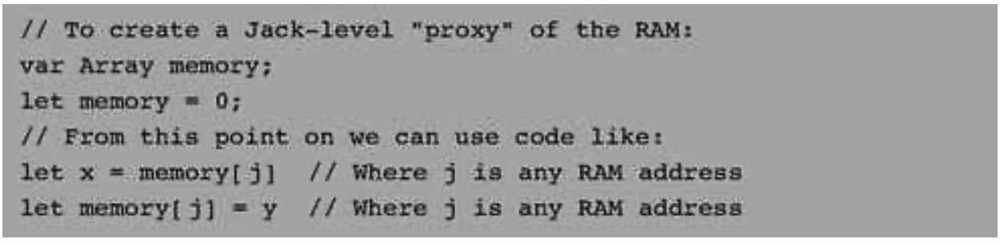

### 12.3 Implementation
---

&emsp;&emsp;The operating system described in the previous section can be implemented as a collection of Jack classes. Each OS subroutine can be implemented as a Jack constructor, function, or method. The API of all these subroutines was given in section 12.2, and key algorithms were presented in section 12.1. This section provides some additional hints and suggestions for completing this implementation. Final technical details and test programs for unit-testing all the OS services are given in section 12.5. Note that most of the subroutines specified in the OS API are rather simple, requiring straightforward Jack programming. Thus we focus here only on the implementation of selected OS subroutines.

&emsp;&emsp;Some OS classes require class-level initialization. For example, some mathematical functions can run more quickly if they can use previously calculated values, kept in some static array, constructed once and for all in the Math class. As a rule, when an OS class Xxx needs some initialization code, this code should be embedded in a single function called Xxx.init(). Later in this section we explain how these init() functions are activated when the computer boots up and the OS starts running.

#### 12.3.1 Math

&emsp;&emsp;**Math.multiply(), Math.divide():** The algorithms in figures 12.1 and 12.2 are designed to operate on non-negative integers only. A simple way of handling negative numbers is applying the algorithms on absolute values and then setting the sign appropriately. For the multiplication algorithm, this is not really needed: it turns out that if the multiplicands are given in 2’s complement, their product will be correct with no further ado.

&emsp;&emsp;Note that in each iteration j of the algorithm in figure 12.1, the j-th bit of the second number is extracted. We suggest encapsulating this operation in the following function:

&emsp;&emsp;**bit(x, j):** Returns true if the j-th bit of the integer x is 1 and false otherwise.

&emsp;&emsp;The bit(x, j) function can be easily implemented using shifting operations. Alas, Jack does not support shifting. Instead, to speed up this function implementation in Jack, it may be convenient to define a fixed static array of length 16, say twoToThe[j], whose j-th location holds the value 2 to the power of j. This array may be initialized once (in Math.init), and then used, via bitwise Boolean operations, in the implementation of bit (x, j).

&emsp;&emsp;In figure 12.2, y is multiplied by a factor of 2 until y > x. A detail that needs to be taken into account is that y can overflow. The overflow can be detected by noting when y becomes negative.

&emsp;&emsp;**Math.sqrt():** Since the calculation of (y + 2j)2 in figure 12.3 can overflow, the result may be an abnormally negative number. This problem can be addressed by (efficiently) changing the algorithm’s if logic to if ((y + 2j)2 ≤ x) and ((y + 2j)2 > 0) then y = y + 2j

#### 12.3.2 String

&emsp;&emsp;As explained in section 12.1.4, string objects can be implemented as arrays. In a similar vein, all the string related services can be implemented as operations on arrays. An important implementation detail is that the actual length of the string must be maintained throughout these operations and that array entries beyond this length are not considered part of the string.

&emsp;&emsp;**String.intValue(), String.setInt():** These functions can be implemented using the algorithms from figures 12.4 and 12.5, respectively. Note that both algorithms don’t handle negative numbers—a detail that must be handled by the implementation.

&emsp;&emsp;All other subroutines in this class are straightforward. Note that the ASCII codes of newline, backspace, and doubleQuote are 128, 129, and 34, respectively.

#### 12.3.3 Array

&emsp;&emsp;Note that **Array.new()** is not a constructor, but rather a function (despite its name). Therefore, memory space for a new array should be explicitly allocated using a call to Memory.alloc(). Similarly, de-allocation of arrays must be done explicitly using Memory.deAlloc().

#### 12.3.4 Output

&emsp;&emsp;Character Bitmaps We suggest using character bitmaps of 11 rows by 8 columns, leading to 23 lines of 64 characters each. Since designing and building bitmaps for all the printable ASCII characters is quite a burden, we supply predefined bitmaps (except for one or two characters, left to you as an exercise). Specifically, we supply a skeletal Output class containing Jack code that defines, for each printable ASCII character, an array that holds its bitmap (implementing a font that we created). The array consists of 11 entries, each corresponding to a row of pixels. In particular, the value of entry j is a binary number whose bits represent the 8 pixels that render the character’s image in the j-th row of its bitmap.

#### 12.3.5 Screen

&emsp;&emsp;**Screen.drawPixel():** Drawing a pixel on the screen is done by directly accessing the screen’s memory map using Memory.peek() and Memory.poke(). Recall that the memory map of the screen on the Hack platform specifies that the pixel at column c and row r (0 ≤ c ≤ 511, 0 ≤ r ≤ 255) is mapped to the c%16 bit of memory location 16384 + r · 32 + c/16. Notice that drawing a single pixel requires changing a single bit in the accessed word, a task that can be achieved in Jack using bit-wise operations.

&emsp;&emsp;**Screen.drawLine():** The algorithm from figure 12.8a can potentially lead to overflow. However, the efficiency improvement suggested in figure 12.8b also eliminates the overflow problem.

&emsp;&emsp;**Screen.drawCircle():** Likewise, the algorithm from figure 12.9 can potentially lead to overflow. Limiting circle radii to be at most 181 avoids this problem.

#### 12.3.6 Keyboard

&emsp;&emsp;In the Hack platform, the memory map of the keyboard is a single 16-bit word located at memory address 24576.

&emsp;&emsp;**Keyboard.keyPressed():** This function provides “raw” (direct) access to this memory location and can be implemented easily using Memory.peek().

&emsp;&emsp;**Keyboard.readChar, Keyboard.readString:** These functions provide “cooked” access to single character inputs and to string inputs, respectively. Proposed cooking instructions appear in figures 12.12 and 12.13.

#### 12.3.7 Memory

&emsp;&emsp;**Memory.peek(), Memory.poke():** These functions are supposed to provide direct access to the underlying memory. How can this be accomplished in a high-level language? As it turns out, the Jack language includes a trapdoor that enables programmers to gain complete control of the computer’s memory. This hacking trick can be exploited to implement peek and poke using plain Jack programming.

&emsp;&emsp;The trick is based on an anomalous use of reference variables (pointers). Specifically, the Jack language does not prevent the programmer from assigning a constant to a reference variable. This constant can then be treated as an absolute memory address. In particular, when the reference variable happens to be an array, this trick can give convenient and direct access to the entire computer memory. Figure 12.4 gives the details.

&emsp;&emsp;Following the first two lines of figure 12.14, the base of the memory array points to the first address in the computer’s RAM. To set or get the value of the RAM location whose physical address is j, all we have to do is manipulate the array entry memory[j]. This will cause the compiler to manipulate the RAM location whose address is 0+j, which is precisely what is desired.

&emsp;&emsp;**Figure 12.14** A trapdoor enabling complete control of the RAM from Jack.

&emsp;&emsp;As we have pointed out earlier, Jack arrays are not allocated space on the heap at compile-time, but rather at run-time, when the array’s new function is called. Here, however, a new initialization will defeat the purpose, since the whole idea is to anchor the array in a selected address rather then let the OS allocate it to an address in the heap that we don’t control. In short, this hacking trick works because we use the array variable without allocating it “properly,” as we would do in normal usage of arrays.

&emsp;&emsp;**Memory.alloc(), Memory.deAlloc():** These functions can be implemented by either the basic algorithm from figure 12.6a on the improved algorithm from figure 12.6b using either best-fit or first-fit. Recall that the standard implementation of the VM over the Hack platform specifies that the heap resides at RAM locations 2048-16383.

#### 12.3.8 Sys

&emsp;&emsp;**Sys.init():** An application program written in Jack is a set of classes. One class must be named Main, and this class must include a function named main. In order to start running the application program, the Main.main() function should be invoked. Now, it should be understood that the operating system is itself a program (set of classes). Thus, when the computer boots up, we want to start running the operating system program first, and then we want the OS to start running the main program.

&emsp;&emsp;With that in mind, the chain of command is implemented as follows. First, the VM (chapter 8) includes bootstrap code that automatically invokes a function called Sys.init(). This function, which is assumed to exist in the OS’s Sys class, should then call all the init() functions of the other OS classes, and then call Main.main(). This latter function is assumed to exist in the application program.

&emsp;&emsp;**Sys.wait():** This function can be implemented pragmatically, under the limitations of the simulated Hack platform. In particular, you can use a loop that runs approximately n milliseconds before it (and the function) returns. You will have to time your specific computer to obtain a one millisecond wait, as this constant varies from one CPU to another. As a result, your Sys.wait() function will not be portable, but that’s life.

&emsp;&emsp;**Sys.halt():** This function can be implemented by entering an infinite loop.
