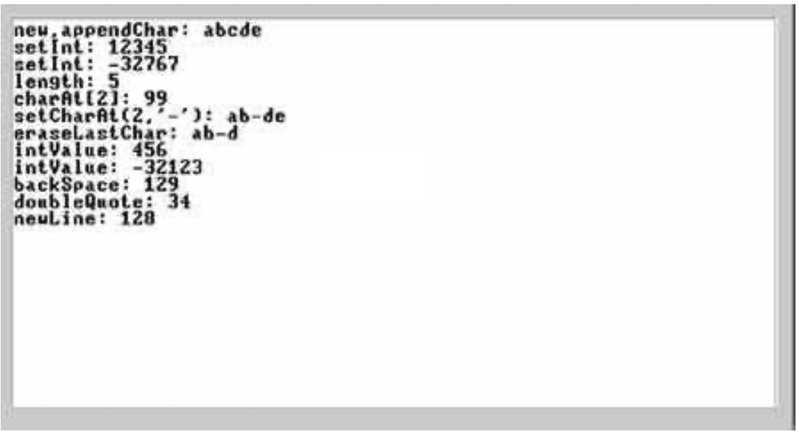
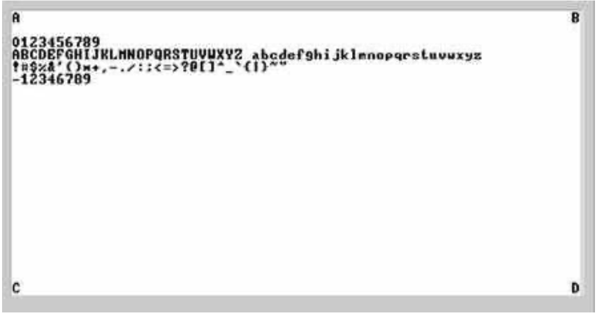
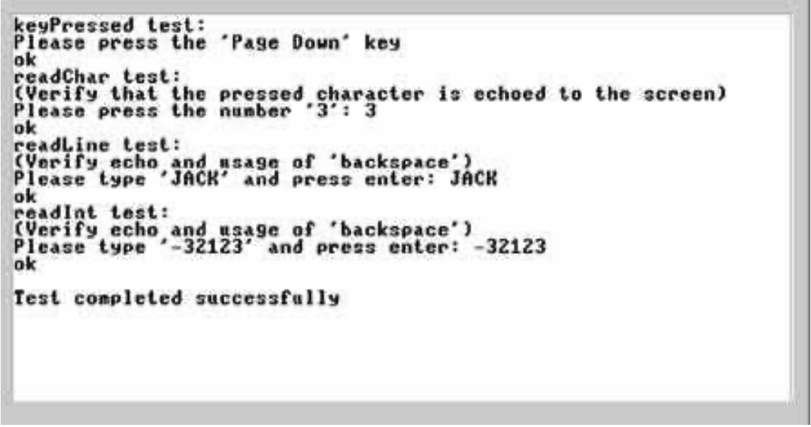

### 12.5 Project
---

&emsp;&emsp;**Objective** Implement the operating system described in the chapter. Each of the OS classes can be implemented and unit-tested in isolation, and in any particular order.

&emsp;&emsp;**Resources** The main tool that you need for this project is Jack—the language in which you will develop the OS. Therefore, you also need the supplied Jack compiler to compile your OS implementation as well as the supplied test programs. In order to facilitate partial testing of the OS, you also need the complete compiled version of our OS, consisting of a collection of .vm files (one for each OS class). Finally, you need the supplied VM emulator. This program will be used as the platform on which the actual test takes place.

&emsp;&emsp;**Contract** Write a Jack OS implementation and test it using the programs and testing scenarios described here. Each test program uses a certain subset of OS services.

&emsp;&emsp;Testing Strategy

&emsp;&emsp;We suggest developing and unit-testing each OS class in isolation. This can be done by compiling the OS class that you write and then putting the resulting .vm file in a directory that contains the supplied .vm files of the rest of the OS. In particular, to develop, compile, and test each OS class Xxx.jack in isolation, we recommend following this routine:

&emsp;&emsp;1. Put, in the same directory, the following items: the OS class Xxx.jack that you are developing, all the supplied OS .vm files, and the relevant supplied test program (a collection of one or more .jack files).

&emsp;&emsp;2. Compile the directory using the supplied Jack compiler. This will result in compiling your Xxx.jack OS class as well as the class files of the test program. In the process, a new Xxx.vm file will be created, replacing the originally supplied OS class. That’s exactly what we want: the directory now contains the executable test program, the complete OS minus the original Xxx.vm OS class, plus your version of Xxx.vm.

&emsp;&emsp;3. Load the directory’s code (OS + test program) into the VM emulator.

&emsp;&emsp;4. Execute the code and check that the OS services are working properly, according to the guidelines given below.

&emsp;&emsp;**OS Classes and Test Programs**

&emsp;&emsp;There are eight OS classes: Memory, Array, Math, String, Output, Screen, Keyboard, and Sys. For each OS class Xxx we supply a skeletal Xxx.jack class file with all the required subroutine signatures, a corresponding test class named Main.jack, and related test scripts.

&emsp;&emsp;**Memory, Array, Math** To test your implementation of every one of these OS classes, compile the relevant directory, execute the supplied test script on the VM emulator, and make sure that the comparison with the compare file ends successfully.

&emsp;&emsp;Note that the supplied test programs don’t comprise a full test of the Memory.alloc and Memory.deAlloc functions. A complete test of these memory management functions requires inspecting internal implementation details not visible in user-level testing. Thus it is recommended that you test these two functions using step-by-step debugging in the VM emulator.

&emsp;&emsp;**String** Execution of the corresponding test program should yield the following output:

&emsp;&emsp;**Output** Execution of the corresponding test program should yield the following output:

&emsp;&emsp;**Screen** Execution of the corresponding test program should yield the following output:

&emsp;&emsp;**Keyboard** This OS class is tested using a test program that effects some user-program interaction. For each function in the Keyboard class (keyPressed, readChar, readLine, readInt), the program requests the user to press some keyboard keys. If the function is implemented correctly and the requested keys are pressed, the program prints the text “ok” and proceeds to test the next function. If not, the program repeats the request for the same function. If all requests end successfully, the program prints ‘Test ended successfully’, at which point the screen may look like this:

&emsp;&emsp;**Sys** Only two functions in this class can be tested: Sys.init and Sys.wait. The supplied test program tests the Sys.wait function by requesting the user to press any key, then waiting for two seconds (using Sys.wait), and then printing another message on the screen. The time that elapses from the moment the key is released until the next message is printed should be two seconds.

&emsp;&emsp;The Sys.init function is not tested explicitly. However, recall that it performs all the necessary OS initializations and then calls the Main.main function of each test program. Therefore, we can assume that nothing would work properly unless Sys.init is implemented correctly. A simple way to test Sys.init in isolation is to run the Pong game using your Sys.vm file.

&emsp;&emsp;**Complete Test** After testing successfully each OS class in isolation, test your entire OS implementation using the Pong game, whose source code is available in projects/12/Pong. Put all your OS .jack files in the Pong directory, compile the directory, and execute the game in the VM emulator. If the game works, then Mazel Tov! You are the proud owner of an operating system written entirely by you.
